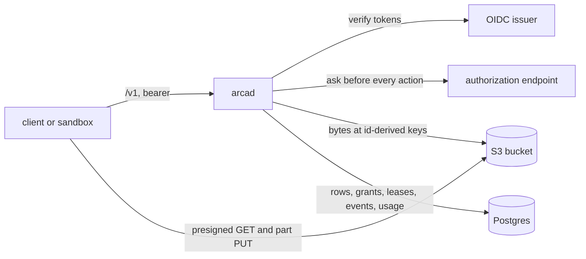
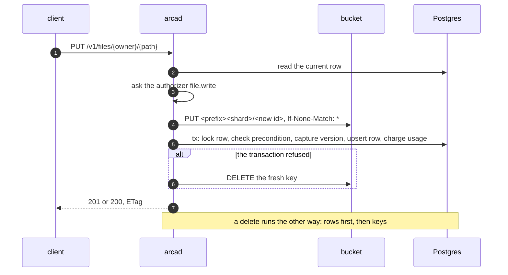

# Architecture

How `arcad` is put together, for someone about to change it. The user's view
of the same system is the [API guide](../api.md); the reasoning behind each
decision is in the design records under [`specs/`](../../specs/README.md),
starting with the architecture record, `specs/001-architecture.md`.

## Two stores, one stateless process



`arcad` keeps nothing on local disk. What it holds in memory is a cache it
can rebuild: the rate-limit buckets, the authorizer's decision cache, and
the issuers' key sets.
Every replica serves every request. The bucket holds bytes and nothing
else; the database holds every fact about them: which path an object is at,
who wrote it, its versions, who may read it, which sandbox holds a
workspace, what a space holds, and what happened to it.

The database is the authority on whether an object exists. A key in the
bucket that no row names is garbage, and a row whose key is missing is an
alarm.

## The write and delete order

Two orders, chosen so that every failure between the two stores leaves
bytes nothing points at, which the reconciler can remove, and never a row
that points at nothing.



- **A write goes to the bucket first**, at a key derived from a freshly
  minted id (`object.NewID`, a UUIDv7). Nothing else can reference that key
  yet, so a failure after the bucket write leaves an orphan and nothing
  worse. The row is written in one transaction that repeats the
  precondition in SQL, so two writers of one path cannot both commit.
- **A delete goes to the database first.** Trashing a file sets
  `deleted_at` and leaves the bytes. A purge, a permanent delete, or a
  pruned version removes the row, then the key; a failure between the two
  leaves an orphan.
- **Keys never derive from paths.** `object.ID.Key(prefix)` is
  `<prefix><shard>/<id>`, where the shard is the id's last two characters,
  which are random and spread writes over 256 prefixes. A move is a row
  update. An overwrite writes a new key and keeps the old one for the
  version it becomes, so capturing a version copies no bytes.

The S3 client in `internal/blob` sends every put with `If-None-Match: *`.
A store that answers `NotImplemented` to it is remembered for the life of
the process, logged once, and written to without the header; keys are fresh
ids, so the guard is a second line and not the only one.

## The request path

```
request id -> observation (metrics, one log line) -> verifier -> per-subject rate limit -> route handler
```

The route table is a declaration. `internal/api/routes.go` holds the rows
the frame answers itself (events and the three public link routes), and
each owning package declares its own rows through `Table()`:
`internal/files`, `internal/uploads`, `internal/shares`,
`internal/workspaces`, and `internal/admin`. `cmd/arcad` concatenates them
and hands them to `api.New`, which builds the mux and the OpenAPI document
from the same list, so a route cannot be registered without being
described or described without being registered. `tools/apidoc` renders
the same list to `api/openapi.yaml`, and a test fails when the committed
file differs.

Every row names the one action it asks. The handler resolves the target,
asks `internal/auth`, and only then reads or writes. A route mounted under
the base path that no row registers still passes the verifier first, so an
unauthenticated caller gets 401 before it can learn that a path is unknown.
The three public link routes are registered outside the verifier, charge
the per-address rate limit instead, and ask `link.read` with an empty
subject.

`ARCA_BASE_PATH` is applied in one place, `api.under`, which swaps the
declared leading `/v1` for the configured base. The mux and the served
document both call it.

## Identity

`internal/auth` holds the verifier, the authorizer, and the owner policy.

- **The verifier** fetches each issuer's discovery document and key set at
  start and verifies every bearer (`latere.ai/x/pkg/authkit/jwt`). An
  issuer that does not answer at start is retried in the background and
  fails readiness until it does; the replica still starts.
- **The authorizer** is either the client of `latere.ai/x/pkg/authz`
  pointed at `ARCA_AUTHORIZER_URL`, or the owner policy. Both receive the
  same question. Before asking, `internal/auth` looks up the rung the
  caller holds through Arca's own grants table and puts it on the resource
  as `grant`, so an external endpoint can honor Arca's shares without
  reading its database.
- **The owner policy** (`policy.go`) allows the owner, the subjects in
  `ARCA_ADMIN_SUBJECTS`, a grantee whose rung reaches the action on the
  permission ladder, and a live link for `link.read`. It always denies the
  probe id.

Arca reads no claim for meaning. Claims are passed to the authorizer
verbatim; a plan, a team, or a role is the endpoint's to interpret.

A decision's `limits.quota_bytes` travels to the write path (`files.LimitOf`)
and is enforced inside the write's transaction against `space_usage`. A
`filter` on a list action narrows that list's query.

## The packages

| Package | What it holds |
|---|---|
| `cmd/arcad` | wiring only: configuration, the two listeners, the subcommands, and the adapters that bind one package's seam to another's (the ledger, the restorer, the lease pass) |
| `internal/config` | every `ARCA_*` variable, read once, with one error naming every problem |
| `internal/api` | the router, the error envelope and code table, the list envelope, ETags and preconditions, the request id, the two rate limits, the base path, and the served OpenAPI document |
| `internal/apidocs` | the OpenAPI document built as Go values, so the server needs no YAML library |
| `internal/auth` | the verifier, the authorizer client, the owner policy, and the grant lookup |
| `internal/blob` | the bucket: the S3 client, an in-memory store for tests, server-side copy, and presigning (five minutes for a read, 24 hours for an upload part) |
| `internal/store` | Postgres: one query set per table, the transaction helper, and the migrations |
| `internal/files` | the files plane: put, get, head, list, move, delete, versions, trash, stars, and materialize |
| `internal/uploads` | multipart sessions: open, complete, abort, and the expiry sweep |
| `internal/shares` | grants and links, token minting, the public-object stamp, and the expired-grant sweep |
| `internal/workspaces` | workspaces, attachments and the writer lease, materialize and sync, and the tombstone purge |
| `internal/events` | the event log, the usage ledger, and `GET /v1/events` |
| `internal/reaper` | the reconciler and its passes |
| `internal/admin` | the overview across spaces and the cross-space restore |
| `internal/check` | the `arcad check` requirements |
| `internal/metrics` | every metric name and the bucket decorator that counts and times each call |
| `internal/version` | the build identity, set by `-ldflags` |
| `object` | exported: object ids, keys, planes, and checksum kinds |
| `authorizer` | exported: the action vocabulary and the resource shapes an authorization endpoint is written against |
| `test/conformance` | exported: the black-box suite that drives any installation over HTTP |

The two exported root packages promise additive change within a module
major: an action string, a resource field, or a key shape never changes
meaning. `internal/` promises nothing to anyone outside the module.

`tools/` holds commands that are not part of the server: `apidoc` renders
`api/openapi.yaml`, `rules` renders the alert rules, `smoke` holds the
release pipeline's smoke script, and `migrate-drive` and `move-objects`
are the one-time migration tools described in
[Migrating from Drive](drive-migration.md).

## The schema

Five forward-only migrations under `internal/store/migrations`, applied by
`arcad migrate` through `latere.ai/x/pkg/pgxmigrate`. A server refuses to
start against a database behind its own migrations, and readiness fails
while the schema is behind.

| Table | What a row is |
|---|---|
| `subjects` | a subject Arca has seen, with a display name and when it was last seen |
| `files` | the live content at one `(owner, path)`: its object id, size, checksum and kind, content type, public flag, and `deleted_at` when trashed |
| `file_versions` | a superseded content of a path, numbered per path, pointing at the object id it had |
| `stars` | one subject's star on one `(owner, path)` |
| `upload_sessions` | an open multipart upload: the object id it will land at, the store's upload id, the declared size, and its expiry |
| `shares` | a grant: owner, path prefix, grantee kind (`subject`, `link`, or `public`), grantee or token, permission, status, and expiry. Constraints keep a token grant at `read` |
| `workspaces` | a workspace: owner, slug, the writer lease holder and its expiry, `last_sync`, and `deleted_at` |
| `workspace_attachments` | one sandbox's session on a workspace: mode, status (`active`, `released`, `reaped`), the manifest pinned at attach, and its expiry |
| `space_usage` | the bytes one space holds |
| `events` | the log: owner, path, action, actor, detail, and time, with a serial id that is the cursor |

## Uploads

`POST /v1/uploads` mints the object id first, opens a multipart upload in
the bucket at that id's key, records the session, and presigns one `PUT`
URL per 16 MiB part. The client sends the parts straight to the bucket.
`complete` asks the bucket to assemble the parts, then commits the row
through the same `files.Commit` a `PUT` uses, so preconditions, version
capture, and the usage charge behave identically. The object's checksum is
then the store's composite ETag, recorded with `checksum_kind: etag`.

An incomplete multipart upload's parts do not appear in a bucket listing,
so the session row is the only pointer to them. The reconciler treats the
session table as a set of referenced keys, and a session past its 24 hour
expiry is aborted.

## Workspaces and the lease

A workspace is a row plus the subtree `workspaces/<slug>/` of the files
plane. Its files are ordinary `files` rows; what the workspace adds is the
writer lease and the attachment record.

A `rw` attach is a conditional update on the workspace row, succeeding only
when no lease is held or the held one has expired, in the same transaction
as the attachment insert. A second writer matches no row and gets
`writer_held`. The attachment pins a manifest of the subtree at attach, so
materialize serves a consistent snapshot even while a sync is in progress.

Sync is declarative. The writer sends the whole post-state; rows under the
root the manifest omits are deleted (rows, then keys); a named path with no
row fails the whole sync with `manifest_incomplete`. A successful sync
rewrites the attachment's pinned manifest and stamps `last_sync`.

Deletes under `workspaces/` are hard, because a trashed row would come back
as a phantom file at the next materialize. Deleting a workspace itself is
soft; the tombstone pass purges it after `ARCA_TRASH_RETENTION`.

## Events and usage

`internal/events` holds two things written from other packages through
seams `cmd/arcad` binds:

- **The log.** One row per change, with an action from a closed
  vocabulary; an append with an unknown action is refused. Grant and
  workspace mutations append inside their own transaction, so the change
  and its event commit together. File-plane mutations append after their
  commit, best effort, and a failed append is logged rather than returned.
  `GET /v1/events` reads the log by keyset on the serial id. Rows older
  than 30 days are pruned.
- **The usage ledger.** `space_usage` is charged inside each write's
  transaction. A charge that would cross the authorizer's
  `limits.quota_bytes` is refused and rolls the write back. The reconciler
  recomputes the ledger from the rows and corrects drift.

## The reconciler

`internal/reaper` runs ten passes in order. Every pass is idempotent and
conditional on the state it read, so several replicas may run it at once
without a lease. A pass that fails does not stop the run; the run reports
failure at the end.

| Pass | What it does |
|---|---|
| 1 | removes keys under the prefix that no row, version, or open session references, after a 24 hour grace |
| 2 | reports rows whose key the bucket does not hold (`missing_bytes`); deletes nothing |
| 3 | ends writer leases past their expiry and marks their attachments `reaped` |
| 4 | aborts upload sessions past their expiry |
| 5 | purges trash past `ARCA_TRASH_RETENTION`, rows then keys, with the ledger delta in the same transaction |
| 6 | purges soft deleted workspaces past the same window |
| 7 | removes grants that expired longer ago than that window |
| 8 | prunes stars whose file no longer exists at all |
| 9 | prunes events older than 30 days |
| 10 | recomputes `space_usage` and corrects rows that disagree |

`arcad serve` runs the passes every `ARCA_REAP_INTERVAL`. `arcad reap` runs
them as a process of its own, except pass 3, which needs the workspace
service a serving replica builds. `-dry-run` reports every finding and
changes nothing. Each finding is counted on
`arca_reaper_findings_total{kind, outcome}`.

## Observability

`internal/metrics` declares every metric name, and every one is on
`/metrics` from the first scrape. No label carries a subject, an owner, or a
path; those go on spans. Traces, log records and the request metrics leave
through `latere.ai/x/pkg/otel` over OTLP when an endpoint is configured. Each
listener's handler is wrapped in that package's `Handler`, outside the
verifier, so every request but the probes and the scrape is one SERVER span
and one measurement of `http.server.request.duration`. Both are named by the
row of the route table the request matches, read from the router before the
request is served (`api.API.Route`), and a bucket call is a child of the
request's span because the handler passes the request's context down. The
span's `url.path` is the path as sent, with a link's token replaced by
`{token}` (`api.API.SpanPath`). Each request writes one JSON log line with
the route pattern (never the raw path), the status, the error code, the
duration, the subject, the request id, and the trace id.
