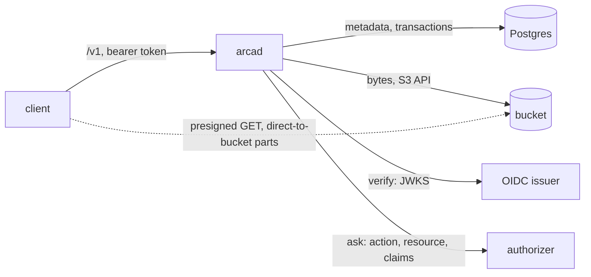
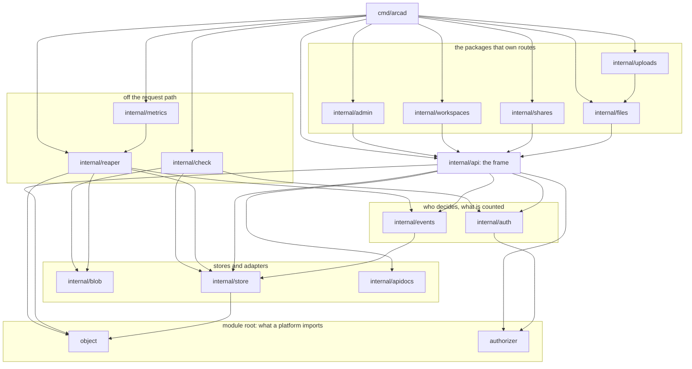

# Architecture

## Overview

Arca is durable storage as an infrastructure component. A platform that
runs people, agents, and sandboxes needs a place for what is neither a
commit nor a sandbox's local disk: the file a person uploads, the
artifact an agent produces, the working tree a sandbox needs back
tomorrow, the object an application serves. A git host holds commits and
a sandbox's volume dies with the sandbox. Arca is the third place, and
it is the only one of the three that knows who owns a byte, who may
read it, how much a space holds, and what happened to it last week.

Arca is one server, `arcad`, in front of two stores it does not own: an
S3 compatible bucket for bytes and a Postgres database for meaning. The
server is stateless. Any replica serves any request, and scaling is a
replica count. This spec fixes the shape every other spec assumes: the
two stores and the order writes reach them, the addressing of spaces and
planes, the packages and who imports them, the identity model, and the
invariants a later spec may not break.

Arca replaces a hosted service whose design, decisions, and code it
inherits ([[019-migration-from-drive]]). What this spec changes from
that design is one thing: the service decided access itself from the
claims of a token; Arca verifies and asks, the way the family's other
cores do, so one authorizer answers for all of them and a self-hoster
needs no fork.

This document describes the tree as it stands. Where a shape below is
not the shape the first draft named, the difference is recorded in the
Outcome below rather than smoothed over.

## Design

### The two stores



The bucket holds bytes and the database holds meaning. The database is
the authority on whether an object exists; the bucket is the authority
on what it contains. Every operation reaches the two in one fixed
order, so a failure between them leaves one recoverable state and never
a visible lie:

| Operation | Order | A failure between the two leaves |
|---|---|---|
| put | bucket first, then database | bytes under a key nothing points at. The handler deletes that key itself when the commit refuses; the reaper's first pass is the backstop for when that delete also fails |
| delete | database first, then bucket | a row gone with bytes still in the bucket: invisible, reaped |
| move | database only | nothing; the key does not change, the path does |
| restore from trash | database only | nothing |

The order is the same wherever it is written. `internal/files.put`
mints an id, writes the bucket, then commits one transaction that
captures the version, applies the write and charges the space.
`internal/files.purge` removes the row and its history in one
transaction and drops the keys after. The reaper's pass 5 purges
expired trash the same way, rows first.

Bytes stay off the hot path. A private download answers a redirect to a
short-lived presigned URL for one object, one method, one expiry. An
upload above the part size goes to the bucket in parts the client sends
directly against presigned part URLs; the server records the session
and completes the multipart. The server sees metadata, authorization,
checksums, and streams no larger than one part.

### The key is not the path

A bucket key is derived from an identifier minted per write of content,
never from the path the object is stored at:

```
id     = UUIDv7()                      one per write of content
shard  = id[34:36]                     the last two characters
key    = prefix ‖ shard ‖ "/" ‖ id     prefix ends in "/"

arca/1f/0192f0c3-6c1a-7b3e-9a2e-6b7c8d9e0a1f
```

The shard is read off the tail because a UUIDv7 leads with a
millisecond timestamp: sharding on the head would drive every write of
one hour into one prefix, and the tail is random and spreads writes
over 256 of them. The id is accepted in its canonical 36 character
spelling and no other, because two spellings of one id would be two
keys.

Three consequences follow, and they are the reason for the derivation:

```
move(p1 -> p2)   key unchanged          one UPDATE, zero bucket calls
overwrite(p)     new id, new key        the old key stays addressable,
                                        named by the version row
prefix           one bucket, many       a key outside this installation's
                 installations          prefix is not this one's to delete
```

The move case is asserted against a bucket that counts its calls:
`internal/blob.Counting` wraps any store and records calls per method,
and the move test asserts every counter is zero.

### Spaces and planes

Every object lives in exactly one space, and a space belongs to one
principal. The principal is the subject the token identifies, rendered
as `<issuer>|<sub>` ([[006-identity]]); an organization is a principal
whose subject the authorizer names. Arca holds no table of principals
beyond the ones that have touched it and no notion of membership; who
may act in whose space is the authorizer's answer.

Inside a space, two planes are two path prefixes with their own rules
and one storage model:

| Plane | Prefix | What it holds | Rules of its own |
|---|---|---|---|
| files | `files/` | objects a person, an application, or an agent stores | versions, trash, stars, conditional writes by ETag ([[005-files]]) |
| workspaces | `workspaces/<slug>/` | a durable subtree a sandbox attaches to | one writer lease, materialize, sync ([[009-workspaces]]) |

A repository's history lives on a git host, and a checked-out tree a
sandbox needs is a workspace or the sandbox's own disk, so there is no
plane for it.

A request names the space and the path as two values, not as one
string: the route is `/v1/files/{owner}/{path...}`, the owner is a
rendered subject or the alias `me`, and the path is plane rooted.
`object.SplitPath` reads the plane off the path and judges nothing
else. Every key the server writes carries one configured prefix, so
several installations, or several products of one company, share a
bucket without sharing a namespace.

### Packages

Three places, by who imports them.

```
object/                  ids, the key derivation, the planes, path splitting, checksums (003)
authorizer/              the action vocabulary, the resource shapes, Vocabulary() (006)
api/openapi.yaml         the committed OpenAPI document, rendered by tools/apidoc (013)

cmd/arcad/               main: subcommand dispatch, configuration, the wiring, the run group (002)
internal/config/         typed configuration from the environment; every problem in one message (002)
internal/version/        build identity set by -ldflags (002)
internal/apidocs/        route and error rows to an OpenAPI document (013)
internal/blob/           the bucket behind one interface: put, copy, get, head, delete, presign,
                         multipart; the memory and counting stubs (003)
internal/store/          the database: migrations, transactions, every table's queries (004)
internal/auth/           the verifier, the authorizer client, the owner policy, the grant
                         intersection, the subject (006)
internal/events/         the usage ledger, the event log, and its cursor (010)
internal/api/            the frame: the route table, the registration seam, the error table,
                         ETags, pagination, the rate limit (013)
internal/files/          put, get, list, move, delete; versions, trash, stars (005)
internal/uploads/        upload sessions and the multipart completion (007)
internal/shares/         grants, the permission ladder, public links, shared-with-me (008)
internal/workspaces/     attach, renew, release, materialize, sync (009)
internal/admin/          the overview across spaces and the restore across them (012)
internal/reaper/         the reconciliation of the two stores and the expiry of leases,
                         sessions, and trash (010)
internal/metrics/        the one registry and the table of 018
internal/check/          the check role of arcad (012)
test/e2e/                arcad as a process against MinIO and Postgres (014)
test/conformance/        the contract as an importable test package (017)
test/stubs/              the stub issuer and authorizer, and the arca-stubs binary (014)
test/deploy/             the deploy tree read as data: the base, the examples, prod, the
                         image, the release (016)
tools/apidoc/            renders api/openapi.yaml from the route and error tables (013)
tools/rules/             renders the alert rules (018)
tools/smoke/             the post-release smoke run (016)
tools/migrate-drive/     the data migration (019)
tools/move-objects/      the key rewrite (019)
tools/internal/manifest/ what the generators share
deploy/                  kustomize base, bootstrap, examples, the operator's overlay (016)
docs/                    for people who run arcad or build against it
specs/                   this deck
```

The module root holds what a platform built on Arca imports: two Go
packages and one document. A change there keeps existing call sites
compiling or names the break in the CHANGELOG. `internal/` holds what
only `arcad` needs. A generic package with a plausible second consumer
outside Arca belongs in `latere.ai/x/pkg`, the shared library Arca is
built on.

### What depends on what



The diagram draws the edges that fix the shape and omits the ones every
package has: each feature package also reaches `internal/store`,
`object` and `authorizer` directly, the ones that move bytes reach
`internal/blob`, and `cmd/arcad` reaches every package in the tree.
`internal/config` and `internal/version` are read by the node alone.

The edge a reader must get right is that the feature packages import
`internal/api` and `internal/api` imports none of them. The frame sits
below the packages that own routes, which is what makes the
registration seam necessary rather than decorative: a package cannot
be reached downward from the frame, so it hands its rows upward and the
node assembles them. `internal/events` is the one exception, and it is
an exception for the same reason: it sits below the frame, so the frame
binds its handler rather than taking a contributed row from it.

Three edges do not follow the layer order and are named here so the
layering is not read as stricter than it is:

| Edge | Why |
|---|---|
| `internal/uploads` imports `internal/files` | a completed multipart commits through the file plane's writer, so the session ends in one write path and not two |
| `internal/config` imports `internal/api` | the drift seam of [[017-conformance-suite]] is an `api.Drift`, parsed where every other variable is parsed |
| `internal/metrics` imports `internal/reaper` | the finding kinds are a closed vocabulary the metric labels on, declared once by the package that produces them |

### The route seam

The surface is one list read twice: the mux is built from it and the
OpenAPI document is rendered from it, so a route cannot exist in one
and not the other.

```
surface  = frame ∪ ⋃ contributed(p)      p over the five route owners

|frame|        = 4      1 event tail + 3 public link routes
|contributed|  = 37     12 workspaces, 12 files, 8 shares, 3 uploads, 2 admin
|surface|      = 41
```

A package that owns behavior declares `api.Route` values and the node
passes them to `api.New`. `merge` refuses a set that could not be a
surface, and each refusal is a start-up failure rather than a route
nobody decided:

| Refused | Because |
|---|---|
| a duplicate method and path | two handlers for one row |
| no handler | a row that answers nothing |
| an empty action | every route behind the verifier asks |
| an action outside `authorizer.Vocabulary()` | no authorizer could answer it |

A contributed row cannot be public. The three public link routes are
declared in the frame's own table, so opening a hole in the verifier is
an edit to the frame and to the test that counts the holes, not a field
a later package passes.

### Roles of the binary

One binary, one image, one role per process. A Deployment selects the
role by its args ([[002-repository-scaffold]] owns the table).

| Role | Does |
|---|---|
| `serve` | the API, the stores, the probes; the default |
| `reap` | the reconciler of [[010-events-and-reaper]] as a process of its own, for an installation that wants it off the API replicas |
| `migrate` | applies the database migrations of [[004-metadata-store]] and exits |
| `check` | one line per requirement of the installation, exit 1 on any failure ([[012-administration]]) |

### Identity: verify and ask

```mermaid
sequenceDiagram
  participant C as client
  participant V as Verifier.Middleware
  participant H as handler
  participant Z as authorizer
  C->>V: request, bearer
  V->>V: validate against a listed issuer (warm key set, no call out)
  V->>H: Caller{Subject, Issuer, Sub, Claims verbatim}
  H->>Z: action from the vocabulary, resource, claims verbatim
  Z-->>H: allow, or deny with a reason
  H->>H: act, or refuse; a deny at lookup renders as not_found
```

The verifier is the family's, `latere.ai/x/pkg/authkit/jwt`, over the
issuers the operator lists; Arca calls an issuer for its key set and
for nothing else, and never while a request is served. The question is
the family's authorizer contract, `latere.ai/x/pkg/authz`: the verified
claims verbatim, the action from the vocabulary in `authorizer/`, the
resource with the fields [[006-identity]] names per action. Without an
authorizer configured, the owner policy applies: an owner acts on its
own space, an administrator on every space, a grantee within its grant,
and a link that resolves reads what it names. A deny at lookup is
indistinguishable from a missing object. A call that produces no
decision is `authorizer_unavailable` and never an allow.

Arca reads no claim for meaning: not `org_id`, not `roles`; the
authorizer reads them. `internal/auth.Caller` carries the rendered
subject, its two halves apart, and every claim untouched, and nothing
in the package branches on a claim.

A personal key narrowed by grants ([[006-identity]] names the
vocabulary the grants intersect with) reaches Arca the way any token
does; the intersection is the shared library's.

### Extension points

| Point | Who writes it | Contract |
|---|---|---|
| the authorizer | the operator | `POST` one question, `200` one answer ([[006-identity]]) |
| the route seam | an installation building on Arca | declare `api.Route` values, pass them to `api.New`; behind the verifier, one action each |
| the event log | a consumer | tail by cursor ([[010-events-and-reaper]]) |
| the bucket | the operator | the S3 API, any implementation that honors `If-None-Match: *` on put |
| the database | the operator | Postgres 16 or newer |

### What Arca is not

Arca is not a git host: a repository's history lives on one, and Arca
holds at most a working tree of it. Arca is not a sandbox's volume: a
volume is where a sandbox's own disk lives, and a workspace is what a
sandbox mounts from Arca and syncs back. Arca is not an identity
provider and holds no session, no password, no membership.

## Invariants

Numbered so a later spec can cite the one it is bound by. The numbers
are cited from Go source as well, so a number is never reused and never
moved.

1. **Bucket first on write, database first on delete.** No operation
   reaches the two stores in another order, and no failure between them
   produces a row without bytes or a visible object without a row.
2. **The database decides existence, the bucket decides content.** A
   read that finds a row and no bytes is a server error and a reaper
   finding, never a `not_found`.
3. **Stateless replicas.** `arcad` keeps nothing on local disk between
   requests; any replica serves any request.
4. **Bytes off the hot path.** A download above the inline size is a
   redirect; an upload above the part size is direct to the bucket.
5. **Verify and ask.** Every `/v1` request behind the verifier carries
   a token from a listed issuer; the decision is the authorizer's or
   the owner policy's; Arca reads no claim for meaning. The three
   public link routes of [[008-shares-and-links]] are the whole
   exception: they carry no bearer, the token in the URL is the whole
   of the authorization, and the frame's route table is the one place
   that exception can be written.
6. **A refused object answers as a missing one.**
7. **One writer per workspace.** A workspace has at most one live
   lease, and a lease expires.
8. **The key is not the path.** A bucket key derives from the object id
   under the configured prefix; a move touches no bytes.
9. **No cloud SDK beyond the S3 API, no Kubernetes client.** The build
   list of `./cmd/arcad` is the standard library, `latere.ai/x/pkg`,
   the S3 client, the Postgres driver and migrator, the UUID package,
   and the OpenTelemetry SDK with the gRPC and protobuf its OTLP
   exporters carry, and the gate holds it there.
10. **No installation's address is a value in the tree**, outside the
    overlay `deploy/prod` that [[016-release-and-installation]]
    declares. The module namespace `latere.ai/x/`, the API group
    `arca.latere.ai`, and a contact address are the project's own
    coordinates and are not an installation's address.

## Acceptance criteria

Each row is a claim about the architecture and the file or test that
demonstrates it. The result column is this session's reading of the
tree at `updated`.

| # | Criterion | Proved by | Result |
|---|---|---|---|
| 1 | Every package the layout block names exists, and every package in the module is named there | `go list ./...` against the block: 32 packages, every one under a row above. Four sit under a row rather than on one, because they are a parent's parts and not a place of their own: `internal/store/migrations`, which is an embed, and the three of `test/stubs/`. `api/openapi.yaml` is a document and not a package | met |
| 2 | The build list of `./cmd/arcad` holds no package outside invariant 9 | `go list -deps ./cmd/arcad`: the standard library, `latere.ai/x/pkg`, the AWS S3 SDK with smithy, pgx with golang-migrate, google/uuid, the OpenTelemetry SDK with grpc and protobuf, and `golang.org/x`. No Kubernetes client and no cloud SDK beyond S3. The `depcheck` block of `.lateregate.yaml` names each row with its decision and the gate holds it in CI | met |
| 3 | No file outside `specs/` and the declared overlay names an installation's address as a value | the `identity` gate's `no-latere-value` rule, configured `role: core` with `overlays: [deploy/prod]`; the rule exempts the module namespace, the API group, and a contact address, and skips tests and `specs/` | met |
| 4 | Every route behind the verifier asks exactly one action of the vocabulary, and the exceptions are three and counted | `TestEveryRouteAsksExactlyOneAction`, `TestEveryActionIsOneOfTheVocabulary`, `TestARouteThatIsDeniedDoesNotAct`, `TestTheThreeVerifierExceptionsAndNoMore` in `internal/api` | met, run |
| 5 | A route can be contributed by the package that owns it, and a set that could not be a surface is refused at start | `TestAContributedRouteIsRegisteredBehindTheVerifierAndDescribed`, `TestASetOfRowsThatCouldNotBeASurfaceIsRefusedAtStart`, `TestTheDocumentReadsTheDeclarationAndNotTheHandler` in `internal/api` | met, run |
| 6 | The mux and the document are one list: 41 routes, described and registered alike | `TestEveryRegisteredRouteIsInSpec013sTable` and `TestTheDocumentDescribesEveryRegisteredRouteAndNoOther` in `internal/api`; `api/openapi.yaml` holds 41 operations; `test/conformance/surface.go` declares the same 41 independently | met, run |
| 7 | A put that fails after the bucket write leaves no row, and bytes nothing can remove are left for the reaper | `TestEveryWriteThatCannotBeRecordedIsRefused` and `TestBytesNothingCanRemoveAreLeftForTheReaper` in `internal/files`; `TestStoreAWriteRefusedAfterTheBucketLeavesNoRowAndNoBytes` against both stores in the store tier | met, unit tier run; the store tier runs under `make test-store` |
| 8 | A delete that fails after the row is gone leaves a reaper finding and no visible object | the order is `internal/files.purge`, which removes the row and its history in one transaction and drops the keys after, and the store tier asserts it end to end in `TestStoreADeleteThatFailsAfterTheRowLeavesTheBytesForTheReaper`. What collects the result is pass 1, held by `TestPassOneKeepsWhatARowStillNames` and `TestPassOneLeavesAKeyItCannotReadAlone` in `internal/reaper` | met, the reaper passes run and the order read from the code; the store tier runs under `make test-store` |
| 9 | A row whose bytes the bucket does not hold is a finding and never a quiet delete | `TestPassTwoReportsARowWithoutItsBytesAndDeletesNothing` in `internal/reaper` | met, run |
| 10 | The key derives from the id and not the path, and a move makes no bucket call | `TestKeyPutsTheShardFromTheTailUnderThePrefix`, `TestParseKeyReadsBackTheIDAndRefusesTheRest`, `FuzzKeyRoundTrip` in `object`; `TestAMoveTouchesNoBytesAndCarriesTheHistoryAndTheBookmarks` against `blob.Counting`, and `TestStoreAMoveMakesNoBucketCallAndCarriesWhatKeysOnThePath` in the store tier | met, unit tier run |
| 11 | The claims reach the authorizer verbatim and nothing in the core branches on one | `TestASubjectIsRenderedOnce` and `TestTheQuestionCarriesTheCallerAndTheRequest` in `internal/auth` | met, run |
| 12 | No issuer is called while a request is served | `TestNothingCallsTheIssuerWhileARequestIsServed` in `internal/auth` | met, run |
| 13 | A deny at lookup is a `not_found`, and an unavailable authorizer is never an allow | `TestADenyIsForbiddenAndALookupIsNotFound` and `TestUnavailableIsNeverAnAllow` in `internal/auth`; `case006AnotherSpace` compares the two answers byte for byte from outside | met, unit tier run |
| 14 | With no authorizer configured the owner policy decides, and it is the same seam | `TestStartSelectsTheOwnerPolicyWithNoEndpoint`, `TestOwnerPolicyConformance`, `TestTheOwnerPolicyTable` in `internal/auth` | met, run |
| 15 | A replica keeps nothing on local disk | `TestBaseIsConfined` in `test/deploy` holds every arcad container to `readOnlyRootFilesystem: true` and every pod to `automountServiceAccountToken: false`. [[017-conformance-suite]] carries the multi-replica reading as a case and records it in `Report.Unverified` against a single-replica target | met, run |
| 16 | A read above the inline size is a redirect and not a stream | `TestAReadAtOrBelowTheInlineSizeStreamsAndOneAboveItRedirects` in `internal/files`; `acceptsLength` refuses a write above `ARCA_INLINE_BYTES` and names the session route | met, run |
| 17 | Two attaches to one workspace yield one lease | `TestTwoWritersOnOneWorkspaceLeaveOneLease` in `internal/workspaces` | met, run |

## Outcome

The architecture this spec fixes is the architecture in the tree. All
seventeen criteria are met; every test named above was run in this
session except the store tier rows of criteria 7, 8 and 10, which are
guarded on a running Postgres and MinIO and run under `make test-store`
and in the release pipeline.

What the tree taught the spec, recorded rather than smoothed over:

1. **There is no `space/` package.** The draft named one at the module
   root for subjects, owners, usage and the permission ladder. None was
   written and none is needed: a space is a rendered subject, which is
   a string; its owner column is in every table of `internal/store`;
   its usage is `internal/events`' ledger; the permission ladder is
   `internal/shares`'. The module root is `object/` and `authorizer/`.
2. **`internal/apidocs` was not in the draft.** The OpenAPI renderer is
   its own package, below `internal/api`, and reaches the standard
   library and nothing else.
3. **The OpenAPI document is committed at `api/openapi.yaml`**, not
   inside `internal/api`. `internal/api` exports the route and error
   tables; `tools/apidoc` renders the file from them.
4. **`test/deploy/` and `tools/internal/manifest` were not in the
   draft**, and `tools/` holds two migration commands of
   [[019-migration-from-drive]] beyond generators and release scripts.
5. **Invariant 5 was false as written.** It said every `/v1` request
   carries a token. Three public link routes do not and were never
   meant to; the exception now stands in the invariant, where it agrees
   with the comment in `internal/api/routes.go` that cites it.
6. **Invariant 10 was false as written.** "Nothing Latere is in the
   tree" is contradicted by the module path, the SPDX headers, the API
   group and the security contact. The gate rule is about an
   installation's address, and the invariant now says that.
7. **The put row of the two-store table was incomplete.** A commit that
   refuses does not simply leave the key for the reaper: the handler
   deletes it, and the reaper is the backstop for when that delete also
   fails. This is what `TestBytesNothingCanRemoveAreLeftForTheReaper`
   holds.
8. **A path is two values, not one string.** The draft wrote the
   address as `<space>/<plane>/<rest>`. On the wire the owner is its
   own path segment and the stored path is plane rooted.
9. **The layering is not strict.** `internal/uploads` imports
   `internal/files`, `internal/config` imports `internal/api`, and
   `internal/metrics` imports `internal/reaper`. All three are named in
   the design with the reason each exists.
10. **Criterion 1's prover was fiction.** The draft cited a
    `tools/specindex` that was never written. `go list ./...` is the
    reading, and the layout block above is what it returns.

11. **Invariant 9's list was short.** It named the S3 client, the
    Postgres driver and the OpenTelemetry SDK. `go list -deps` also
    returns google/uuid, the gRPC and protobuf the OTLP exporters carry,
    and `golang.org/x`, each with a row in the `depcheck` block. The
    rule is unchanged; the list now says what the build list holds.

Nothing in the tree contradicts an invariant. The numbers 1 through 10
are unchanged and unmoved, because Go source cites them:
`object/object.go` and `internal/files/put.go` cite 8,
`internal/files/put.go` cites 4, `internal/files/delete.go` and
`internal/reaper/reaper.go` cite 1 and 2, `internal/api/routes.go` and
`internal/auth/auth.go` cite 5, `test/deploy/manifests_test.go` cites
9, and [[016-release-and-installation]] cites 3.

## Not in this spec

The wire shapes ([[013-api]]), the schema ([[004-metadata-store]]), the
vocabulary ([[006-identity]]), the tiers that run the tests named above
([[014-test-stubs-and-tiers]]), and the order the code arrives in
([[019-migration-from-drive]]).
