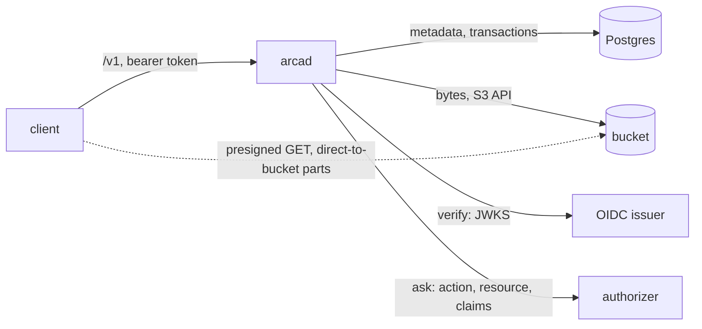

# Architecture

## Overview

Arca is durable storage as an infrastructure component. A platform that
runs people, agents, and sandboxes needs a place for what is neither a
commit nor a sandbox's local disk: the file a person uploads, the
artifact an agent produces, the working tree a sandbox needs back
tomorrow, the object an application serves. A git host holds commits and
a sandbox's volume dies with the sandbox. Arca is the third place, and
it is the only one of the three that knows who owns a byte, who may
read it, how much a space holds, and what happened to it last week.

Arca is one server, `arcad`, in front of two stores it does not own: an
S3 compatible bucket for bytes and a Postgres database for meaning. The
server is stateless. Any replica serves any request, and scaling is a
replica count. This spec fixes the shape every other spec assumes: the
two stores and the order writes reach them, the addressing of spaces and
planes, the packages and who imports them, the identity model, and the
invariants a later spec may not break.

Arca replaces a hosted service whose design, decisions, and code it
inherits ([[019-migration-from-drive]]). What this spec changes from
that design is one thing: the service decided access itself from the
claims of a token; Arca verifies and asks, the way the family's other
cores do, so one authorizer answers for all of them and a self-hoster
needs no fork.

## Design

### The two stores



The bucket holds bytes and the database holds meaning. The database is
the authority on whether an object exists; the bucket is the authority
on what it contains. Every operation reaches the two in one fixed
order, so a failure between them leaves one recoverable state and never
a visible lie:

| Operation | Order | A failure between the two leaves |
|---|---|---|
| put | bucket first, then database | an object in the bucket with no row: invisible, reaped by [[010-events-and-reaper]] |
| delete | database first, then bucket | a row gone with bytes still in the bucket: invisible, reaped |
| move | database only | nothing; the key does not change, the path does |
| restore from trash | database only | nothing |

Bytes stay off the hot path. A private download answers a redirect to a
short-lived presigned URL for one object, one method, one expiry. An
upload above the part size goes to the bucket in parts the client sends
directly against presigned part URLs; the server records the session
and completes the multipart. The server sees metadata, authorization,
checksums, and streams no larger than one part.

### Spaces and planes

Every object lives in exactly one space, and a space belongs to one
principal. The principal is the subject the token identifies, rendered
as `<issuer>|<sub>` ([[006-identity]]); an organization is a principal
whose subject the authorizer names. Arca holds no table of principals
beyond the ones that have touched it and no notion of membership; who
may act in whose space is the authorizer's answer.

Inside a space, two planes are two path prefixes with their own rules
and one storage model:

| Plane | Prefix | What it holds | Rules of its own |
|---|---|---|---|
| files | `files/` | objects a person, an application, or an agent stores | versions, trash, stars, conditional writes by ETag ([[005-files]]) |
| workspaces | `workspaces/<slug>/` | a durable subtree a sandbox attaches to | one writer lease, materialize, sync ([[009-workspaces]]) |

A repository's history lives on a git host, and a checked-out tree a
sandbox needs is a workspace or the sandbox's own disk, so there is no
plane for it.

A path is `<space>/<plane>/<rest>`, and the bucket key is derived from
the object's id and never from the path, so a move is a row update.
Every key the server writes carries one configured prefix, so several
installations, or several products of one company, share a bucket
without sharing a namespace.

### Packages

Three places, by who imports them.

```
object/                 the object model a platform imports: ids, paths, planes, the key derivation, integrity (003)
space/                  the space model: subjects, owners, usage as a value, the ladder of permissions (005, 008)
authorizer/             the action vocabulary and the resource shapes the authorizer question carries (006)

cmd/arcad/              main: subcommand dispatch, configuration, listeners, run group (002)
internal/config/        typed configuration from the environment; every problem in one message (002)
internal/version/       build identity set by -ldflags (002)
internal/blob/          the bucket client behind one interface: put, get, head, delete, presign, multipart (003)
internal/store/         the database: migrations, transactions, every table's queries (004)
internal/auth/          the verifier over the listed issuers, the authorizer client, the owner policy, the subject (006)
internal/api/           the /v1 handlers, the error table, the OpenAPI document (013)
internal/files/         put, get, list, move, delete; versions, trash, stars (005)
internal/uploads/       upload sessions and the multipart completion (007)
internal/shares/        grants, the permission ladder, public links, shared-with-me (008)
internal/workspaces/    attach, renew, release, materialize, sync (009)
internal/events/        the usage ledger, the event log, and its cursor (010)
internal/reaper/        the reconciliation of the two stores and the expiry of leases, sessions, and trash (010)
internal/admin/         the overview across spaces and the restore across them (012)
internal/check/         the check role of arcad (012)
internal/metrics/       the one registry and the table of 018
test/e2e/               arcad as a process against MinIO and Postgres (014)
test/conformance/       the contract as an importable test package (017)
test/stubs/             the stub issuer and authorizer, and the arca-stubs binary (014)
tools/                  generators and release scripts (013, 016)
deploy/                 kustomize base, examples, the operator's overlay (016)
docs/                   for people who run arcad or build against it
specs/                  this deck
```

The module root holds what a platform built on Arca imports. A change
there keeps existing call sites compiling or names the break in the
CHANGELOG. `internal/` holds what only `arcad` needs. A generic package
with a plausible second consumer outside Arca belongs in
`latere.ai/x/pkg`, the shared library Arca is built on.

### Roles of the binary

One binary, one image, one role per process. A Deployment selects the
role by its args ([[002-repository-scaffold]] owns the table).

| Role | Does |
|---|---|
| `serve` | the API, the stores, the probes; the default |
| `reap` | the reconciler of [[010-events-and-reaper]] as a process of its own, for an installation that wants it off the API replicas |
| `migrate` | applies the database migrations of [[004-metadata-store]] and exits |
| `check` | one line per requirement of the installation, exit 1 on any failure ([[012-administration]]) |

### Identity

Arca verifies and asks. The verifier is the family's,
`latere.ai/x/pkg/authkit/jwt`, over the issuers the operator lists;
Arca calls an issuer for its key set and for nothing else. The question
is the family's authorizer contract, `latere.ai/x/pkg/authz`: the
verified claims verbatim, the action from the vocabulary in
`authorizer/`, the resource with the fields [[006-identity]] names per
action. Without an authorizer configured, the owner policy applies: an
owner acts on its own space, an administrator on every space. A deny at
lookup is indistinguishable from a missing object. Arca reads no claim
for meaning: not `org_id`, not `roles`; the authorizer reads them.

A personal key narrowed by grants ([[006-identity]] names the
vocabulary the grants intersect with) reaches Arca the way any token
does; the intersection is the shared library's.

### Extension points

| Point | Who writes it | Contract |
|---|---|---|
| the authorizer | the operator | `POST` one question, `200` one answer ([[006-identity]]) |
| the event log | a consumer | tail by cursor ([[010-events-and-reaper]]) |
| the bucket | the operator | the S3 API, any implementation that honours `If-None-Match: *` on put |
| the database | the operator | Postgres 16 or newer |

### What Arca is not

Arca is not a git host: a repository's history lives on one, and Arca
holds at most a working tree of it. Arca is not a sandbox's volume: a
volume is where a sandbox's own disk lives, and a workspace is what a
sandbox mounts from Arca and syncs back. Arca is not an identity
provider and holds no session, no password, no membership.

## Invariants

Numbered so a later spec can cite the one it is bound by.

1. **Bucket first on write, database first on delete.** No operation
   reaches the two stores in another order, and no failure between them
   produces a row without bytes or a visible object without a row.
2. **The database decides existence, the bucket decides content.** A
   read that finds a row and no bytes is a server error and a reaper
   finding, never a `not_found`.
3. **Stateless replicas.** `arcad` keeps nothing on local disk between
   requests; any replica serves any request.
4. **Bytes off the hot path.** A download above the inline size is a
   redirect; an upload above the part size is direct to the bucket.
5. **Verify and ask.** Every `/v1` request carries a token from a
   listed issuer; the decision is the authorizer's or the owner
   policy's; Arca reads no claim for meaning.
6. **A refused object answers as a missing one.**
7. **One writer per workspace.** A workspace has at most one live
   lease, and a lease expires.
8. **The key is not the path.** A bucket key derives from the object id
   under the configured prefix; a move touches no bytes.
9. **No cloud SDK beyond the S3 API, no Kubernetes client.** The build
   list of `./cmd/arcad` is the standard library, `latere.ai/x/pkg`,
   the S3 client, the Postgres driver, and the OpenTelemetry SDK, and
   the gate holds it there.
10. **Nothing Latere is in the tree** outside `deploy/prod`, the
    operator's overlay [[016-release-and-installation]] declares.

## Acceptance criteria

| # | Criterion | Proved by |
|---|---|---|
| 1 | Every package in the layout exists, or the spec named beside it is not yet at `testing` | `tools/specindex` reads the layout block against the tree |
| 2 | The build list of `./cmd/arcad` holds no package outside invariant 9 | the `depcheck` gate, whose allow list names each row |
| 3 | No file outside `deploy/prod` and `specs/` names a Latere address | the `identity` gate's `no-latere-value` rule |
| 4 | Every `/v1` handler runs behind the verifier and asks before it acts | [[006-identity]]'s conformance rows, run by `test/conformance` |
| 5 | A put that fails after the bucket write leaves a reaper finding and no row | [[010-events-and-reaper]]'s fault test |
| 6 | A delete that fails after the row is gone leaves a reaper finding and no visible object | the same |
| 7 | A move touches no bucket key | [[005-files]]'s test against a counting bucket stub |
| 8 | Two attaches to one workspace yield one lease | [[009-workspaces]]'s test |

## Not in this spec

The wire shapes ([[013-api]]), the schema ([[004-metadata-store]]), the
vocabulary ([[006-identity]]), and the order the code arrives in
([[019-migration-from-drive]]).
