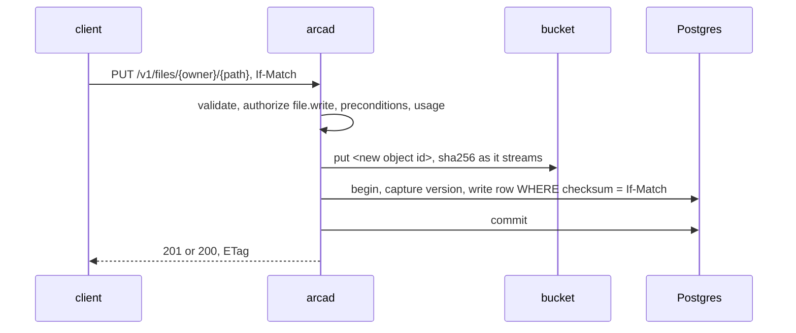

# Files

## Overview

The plane the other plane is built on. A file is a path in a space with
bytes behind it, and this spec is what happens to it: written, read,
listed, moved, deleted, versioned, trashed, restored, starred.

Two properties from [[001-architecture]] shape all of it. The bucket key
derives from an object id and never from the path (invariant 8), so a
move is one `UPDATE` and an overwrite leaves the previous bytes
addressable at their own key. Bytes stay off the hot path (invariant 4),
so a read of a large object is a redirect and a write of one is not this
spec's at all, it is [[007-uploads]]'s.

## Design

### The target: owner, plane, path

A request names a space and a path inside it. The owner is the subject
`<issuer>|<sub>` or the alias `me`, in the URL form
[[013-api]] fixes; the path is plane rooted and validated before
anything else runs:

- the first segment is a plane of [[001-architecture]]: `files` or
  `workspaces`;
- no empty segment, no `..`, no leading or trailing `/`;
- under `workspaces/` a path has at least three segments, because bytes
  live inside a workspace, not beside one.

A path that fails is `400`. A path under a workspace that does not exist
or is soft deleted is `404`, whoever asks ([[009-workspaces]]).

Every handler below authorizes per [[006-identity]] before it acts and
names the action it asks with. A refusal on a space the caller cannot
see is answered as a missing object (invariant 6).

### Put

`PUT` writes one object at a path, at or below `ARCA_INLINE_BYTES`.
Above that the server refuses with `413` and names the session API of
[[007-uploads]]: streaming a gigabyte through a replica is the thing
invariant 4 exists to prevent.



In order, and the order is the contract:

1. Load the current row, live or trashed. Its absence is not an error.
2. Authorize `file.write` on the target.
3. Preconditions, below.
4. `Content-Length` is required (`411` without it: the store needs the
   length up front and Arca buffers no body to find it). Over
   `ARCA_MAX_UPLOAD_BYTES` is `413`, over `ARCA_INLINE_BYTES` is `413`
   naming [[007-uploads]].
5. Usage admission against the declared length
   ([[010-events-and-reaper]]), which for an overwrite is the delta plus
   the version the overwrite will keep, compared against the limit the
   authorizer's answer carried if it carried one.
6. Mint an object id, stream the body to the bucket, and take the
   sha256 in the same pass ([[003-object-store]]).
7. One transaction: capture the previous row as a version, then apply
   the write with the precondition repeated in SQL, so two writers that
   both passed step 3 cannot both commit.
8. Commit, then emit the `put` event.

A failure between the bucket write and the commit leaves an object no
row points at, reaped by [[010-events-and-reaper]] and deletable
at once by the handler because the key is fresh and nothing else can
reference it. The predecessor had to reason about when deleting its own
upload would destroy the live file; keys derived from ids remove the
question.

The response carries the checksum as the `ETag` and, for a public
object, the URL a reader can use:

```json
{ "path": "files/notes/plan.md", "size": 20481,
  "checksum": "a3f1…", "checksum_kind": "sha256" }
```

### Conditional writes

| Header | Meaning | Failure |
|---|---|---|
| `If-Match: "<checksum>"` | write only while the stored checksum is this | `412` |
| `If-None-Match: *` | write only if no live row holds the path | `412` |
| neither | last writer wins | none |

Every object under `files/` takes these headers, and none requires them.
The caller that needs them most is the agent that reads a file, thinks,
and writes it back, whose lost update is silent and expensive; an agent
that keeps such state conventionally puts it under a `files/memory/`
prefix of its own choosing, which is a name and not a rule. The server
reads the prefix for nothing.

`If-None-Match: *` still revives a trashed path: the conflict arm is
scoped to rows with `deleted_at` set, so exactly one of two racing
creators commits and the other reads `412`.

### Get and head

`GET` authorizes `file.read`, then answers by size:

| Condition | Answer |
|---|---|
| `If-None-Match` matches the stored checksum | `304`, no body |
| the object is public | `302` to `ARCA_PUBLIC_CDN_URL` over the key, or to a presigned URL when that variable is unset |
| `size <= ARCA_INLINE_BYTES` | `200`, the body streamed from the bucket, with `ETag`, `Content-Type`, `Content-Length` |
| `size > ARCA_INLINE_BYTES` | `302` to a presigned URL, five minute expiry |

`?inline=1` asks for the bytes and is honoured only at or below the
inline size: above it the redirect stands, because invariant 4 is not a
default a caller may waive. `?inline=0` asks for the redirect at any
size, for a client that would rather not hold a connection open.
`?download=1` puts the file's last segment in the presigned URL's
content disposition, so a browser saves it under its own name instead of
the key. [[013-api]] owns the three parameters.

A row without bytes is `500` and a reaper finding, never `404`
(invariant 2).

`HEAD` runs the same gate and answers `Content-Type`,
`Content-Length`, `ETag`, and `Last-Modified` with no body, including
for a public object, where `GET` would redirect.

### List

`GET .../{prefix}?list=1&limit&cursor` asks `file.list` and returns the
live rows under the prefix, keyset paginated on `path`, plus the common
prefixes below it synthesised as directory entries so a browser can
render a tree Arca does not store.

```json
{ "entries": [ { "path": "files/notes/plan.md", "size": 20481,
                 "checksum": "a3f1…", "content_type": "text/markdown",
                 "is_public": false, "modified": "2026-09-18T09:12:44Z" } ],
  "prefixes": ["files/notes/archive/"],
  "next_cursor": "files/notes/plan.md" }
```

Trashed rows are absent. A cursor is a path, so a listing is stable
under concurrent inserts and a caller can resume it tomorrow.

### Move

`POST` with `{"move_to": "<path>"}` changes a path and touches no
bytes. It asks `file.write` once, with the destination as the resource's
`path` and the source as its `from` ([[006-identity]]), so the
authorizer sees both ends of the move in one question: a move out of a
subtree the caller may write into one it may not is a copy with extra
steps.

Constraints: the same space, the same plane, and a destination that no
live row holds (`409`). Version rows, stars, and a share whose prefix is
exactly this path follow the file in the same transaction; a share on a
parent prefix covers a subtree and stays where it is.

Moves are limited to `files/`. A path under `workspaces/` belongs to the
sync protocol of [[009-workspaces]], which would see a move as a delete
and a create.

A test asserts this operation makes zero calls against `blob.Counting`
([[003-object-store]]), which is criterion 7 of [[001-architecture]].

### Delete, trash, restore

`DELETE` asks `file.delete`. Under `files/` it is soft: it sets
`deleted_at`, the row leaves every listing, read, share, and link, and
the bytes stay. Under `workspaces/` it is hard, because sync owns those
trees and a soft row would reappear as a phantom file at the next
materialize. `?permanent=1` is hard anywhere.

A hard delete is row first and bytes second (invariant 1), taking the
path's version rows with it; the bytes of any version no longer
referenced go after the commit.

| Route | Does | Asks |
|---|---|---|
| `GET /v1/trash?owner=&limit&cursor` | the trashed paths of a space, newest first | `file.list` |
| `POST /v1/trash/restore` `{owner, path}` | clears `deleted_at`; `409` when a live row reoccupied the path | `file.restore` |
| `DELETE /v1/trash?owner=&path=` | purges one entry now | `file.delete` |
| `DELETE /v1/trash?owner=` | empties the space's trash | `file.delete` |

A trashed object is restorable for `ARCA_TRASH_RETENTION`, default 720
hours, after which [[010-events-and-reaper]] purges row and
bytes. Trashed bytes count towards the space's usage for the whole
window: a space that wants the bytes back empties its trash, and a
reader of the storage figure is not surprised later.

### Versions

An overwrite of a path under `files/` keeps what was there.
The previous row's metadata moves into `file_versions` inside the same
transaction as the write, and the bytes are not copied: the version row
keeps the object id the file had, and the new write is already at a new
id. Capture is `O(1)` whatever the file weighs.

| Route | Does |
|---|---|
| `GET .../{path}?versions=1` | the history, oldest first, keyset on `version_no` |
| `GET .../{path}?version=N` | one version, by the same size rule as a current read |
| `POST .../{path}` `{"restore_version": N}` | the current content becomes a new version and version `N` becomes current |
| `DELETE .../{path}?version=N` | prunes one version |

Versions ride the file routes because the path pattern swallows any
suffix a dedicated route would need, and a file legitimately named
`restore` must stay reachable.

Restore is itself non-destructive and swaps identities in one
transaction: the current row is captured, the restored version's
metadata becomes the row, and the restored version leaves the list,
because its object now backs the live file and a later retention pass
would otherwise delete bytes that are in use.

Retention is the newest 10 versions per path and nothing older than 30
days, whichever trims first, applied by
[[010-events-and-reaper]]. Both are constants, not configuration:
they bound a cost the operator did not ask for, and an installation that
wants a different bound is asking for a feature, not a variable.
Versions count towards the space's usage ([[010-events-and-reaper]]).
`workspaces/` keeps no versions, and a restore there is `400`.

### Stars

A star is a bookmark belonging to a subject, not a property of a file,
so it lives in its own table and never appears in another reader's view.
`PUT /v1/stars` and `DELETE /v1/stars` are idempotent and ask
`file.write` on the target, which is where [[006-identity]] puts
starring in the vocabulary. That is stricter than the predecessor, where
a reader could star a file shared with them, and it is a decision to
review rather than a detail. `GET /v1/stars` joins the caller's stars
with live rows and asks `file.list`, so a star whose target was deleted
or trashed drops out of the listing and is pruned later.

### Provenance zones do not arrive

The predecessor gated writes by the caller's `principal_type` claim:
humans wrote `files/`, machines wrote `agents/` and a memory namespace,
and an `agent_visibility` table curated what machines could read. It does
not come across, for two reasons that are both structural.

Arca reads no claim for meaning (invariant 5). A rule keyed on
`principal_type` is exactly a claim read for meaning, and building it in
would fork the family's identity model in the one repository that is
meant to prove it. And [[001-architecture]]'s planes are two: there is
no second namespace to be the machine half of the pair.

What replaces it is the authorizer. Arca hands it the subject, the
plane, and the path with every question ([[006-identity]]), so an
operator who wants no machine subject writing under `files/` writes that
rule once, in the place where every other access rule of the
installation lives, and it applies to reads and writes alike. Arca's
built-in owner policy has no zones, which is the honest default for a
core that decides nothing.

This is a decision worth a maintainer's eye: it removes a shipped,
founder-requested guarantee from the server and makes it the operator's
to restate.

### Events and usage

Every mutation emits one event after its commit: `put`, `delete`,
`move`, `restore`. Every mutation that moves bytes applies its delta to
the space's usage in its own transaction, and a write is refused when
the authorizer's answer carried a limit the charge would cross. Both
belong to [[010-events-and-reaper]]; this spec only names where they
hang.

### What arrives from Drive

From `internal/handler/files.go`, `versions.go`, `trash.go`, and the
archived specs `002-file-plane`, `013-trash-stars`,
`014-provenance-zones`, and `018-file-versions`.

| Arrives | Changes |
|---|---|
| put, get, head, list, move, delete, and their ordering | the owner is the subject `<issuer>\|<sub>`, not `(owner_type, owner_id)`, and `me` is the only alias. There is no `org` alias, because there is no org claim to resolve it from |
| the authorization calls in each handler | replaced by one question per handler, `authorized per [[006-identity]]`, with the action named. No handler reads `org_id`, `roles`, or `principal_type` |
| the CAS contract | unchanged as an option on every object; the mandatory precondition on a memory namespace goes with the namespace, so no handler inspects a plane to decide whether a write needs one |
| trash, restore, purge, stars | unchanged in shape; retention becomes `ARCA_TRASH_RETENTION` |
| versions, including the restore identity swap and the retention rule | unchanged; capture is simpler because every write already lands on a new id, so the `@<random>` key suffix disappears |
| presign by default, `?dl=direct` to stream | inverted: stream at or below `ARCA_INLINE_BYTES`, redirect above, with `?inline=` naming the two modes |
| the public carve-out paths `files/avatar` and `files/public/**` | gone. Publicity is a column set by [[008-shares-and-links]] |
| provenance zones and agent visibility | gone, with the reasoning above |
| the `agents/` namespace and the separate memory plane | gone; two planes, per [[001-architecture]]. Conditional writes are the feature that namespace existed for, and every object has them |
| `MAX_UPLOAD_SIZE`, the 2 MB avatar limit | `ARCA_MAX_UPLOAD_BYTES`, one limit for every path |

## Not in this spec

Writes above `ARCA_INLINE_BYTES` ([[007-uploads]]), who may act
([[006-identity]]), sharing and publicity
([[008-shares-and-links]]), workspace trees ([[009-workspaces]]), the
purge and retention passes ([[010-events-and-reaper]]), and the
wire details of every route here ([[013-api]]).

## Acceptance criteria

| # | Criterion | Proved by |
|---|---|---|
| 1 | A put round-trips: `PUT`, `GET`, `HEAD`, `DELETE`, with the checksum returned matching the bytes stored | the e2e tier against MinIO and Postgres |
| 2 | A put above `ARCA_INLINE_BYTES` is `413` and names the session API | `internal/files` handler test |
| 3 | A put without `Content-Length` is `411`, and one over `ARCA_MAX_UPLOAD_BYTES` is `413` | `internal/files` handler tests |
| 4 | Two concurrent `If-Match` writes of the same checksum leave one `200` and one `412`, and the bytes of the loser are gone | the store tier, two goroutines |
| 5 | A write with neither precondition succeeds on any path, and no handler branches on a prefix inside `files/` | `internal/files` handler test |
| 6 | `If-None-Match: *` revives a trashed path and conflicts with a live one | handler tests, both arms |
| 7 | A read at or below the inline size streams, one above it redirects, and `?inline=1` does not override the redirect | handler tests at both sides of the boundary |
| 8 | A move makes zero bucket calls and carries versions, stars, and an exact-path share with it | `blob.Counting` plus a store tier assertion on each table |
| 9 | A move onto an occupied path is `409` and changes nothing | handler test |
| 10 | A delete under `files/` is soft and the path vanishes from listing, read, and share; a delete under `workspaces/` is hard | handler tests over the two planes |
| 11 | Restore after a trash returns the bytes, and restore onto a reoccupied path is `409` | the e2e tier |
| 12 | Two overwrites leave two versions, a restore round-trips the bytes, and the restored version leaves the list | the e2e tier |
| 13 | A listing pages stably under concurrent inserts and synthesises directory prefixes | the store tier |
| 14 | A row whose bytes are missing answers `500`, not `404` | handler test with `blob.Memory` emptied behind the row |
| 15 | Every handler asks exactly one authorization question, with the action this spec names | the conformance rows of [[017-conformance-suite]] |
