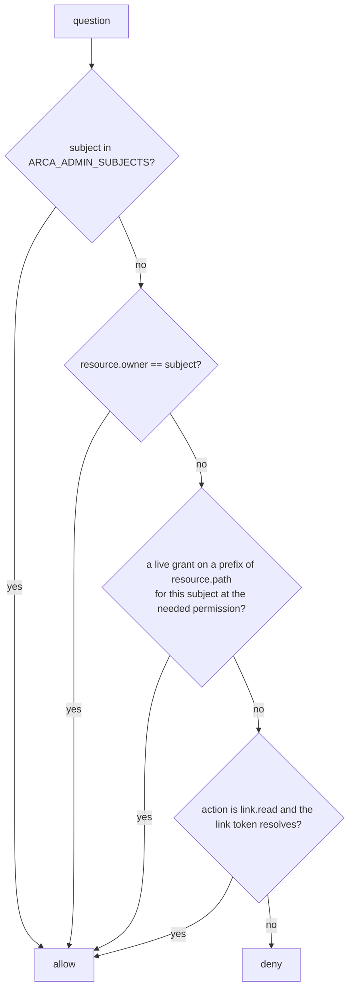

# Identity

## Overview

Arca verifies and asks. Every `/v1` request carries a bearer token from
an OIDC issuer the operator lists. Arca verifies the token against the
issuer's key set and calls the issuer for nothing else. Whether the
caller may perform the action on the resource is a question Arca sends
to an authorizer endpoint the operator writes, carrying the verified
claims verbatim, the action from a fixed vocabulary, and the resource.
Without an authorizer configured, a built-in owner policy answers: an
owner acts on its own space, a grantee acts within its grant, an
administrator acts on every space.

This is the one place Arca departs from the service it replaces. That
service decided access itself: it read `org_id` and `roles` from the
token, addressed spaces as `u-<id>` and `o-<id>`, and held the ladder in
its handlers. Arca reads no claim for meaning, addresses a space by the
subject the token identifies, and holds the ladder only in the owner
policy, so a platform with its own membership model answers the
question from its own tables and a self-hoster needs no fork.

The contract is the family's, shared with the other open cores: one
verifier package, one authorizer envelope, one conformance suite. An
authorizer written for one core answers for all of them.

## Current state

Built and in the tree on 2026-09-18, phase 2 of [[019-migration-from-drive]].
`authorizer/` publishes the vocabulary and the resource shapes,
`internal/auth` holds the verifier, the authorizer client, the owner
policy and the `Decide` seam, `cmd/arcad` builds both at start and mounts
the surface of [[013-api]] behind them, and the `verifier` and
`authorizer` waivers are gone from `.lateregate.yaml` so the real
identity rules run. The gate passes with all fifteen gates on.

Criteria 1, 2, 3, 6, 8, 11 and 12 have passing tests. Four are open and
belong to later phases: criterion 4 and criterion 9's second half wait
for `test/conformance` ([[017-conformance-suite]]), criterion 5's fault
modes for the stub tiers of [[014-test-stubs-and-tiers]], criterion 7
for the usage ledger of [[010-events-and-reaper]], and criterion 10 for
the `check` command of [[012-administration]]. The spec stays at
`testing` until they close.

What the implementation decided, where this spec was silent:

- The resource shapes are types of `authorizer/` rather than of
  `internal/auth`, because the table above names the fields per kind and
  an endpoint writer needs them as much as the server does. Cella keeps
  its shapes in the control plane and says why; Arca's are half of what
  an endpoint is written against, so they are published with the actions.
- A grant reaches none of eight actions, named above, and the prefix a
  grant on a workspace is read against is `workspaces/<slug>`.
- The grants table and the public link table are the `GrantLookup` and
  `LinkResolver` interfaces of `internal/auth`, which
  [[008-shares-and-links]] implements. Both nil is an installation that
  has issued neither, which is every installation until that spec lands.
- A table that cannot answer is no decision: a store failure in the
  grant step or the link step reaches the seam as
  `authorizer_unavailable` and never as a deny, the same rule as an
  endpoint that does not answer.
- `ARCA_OIDC_INSECURE_ISSUERS` is checked in `internal/auth`, not in the
  shared verifier, which has no such option: an issuer must be `https`,
  or `http` on loopback, and the variable admits `http` anywhere else.
- The tests use the family's own stubs, `latere.ai/x/pkg/authkit/issuertest`
  and `latere.ai/x/pkg/authz/stub`, so Arca stands up no issuer and no
  authorizer of its own. The stub issuer and stub authorizer of
  [[014-test-stubs-and-tiers]] are for the tiers that run arcad as a
  process.

## Design

### Verification

`latere.ai/x/pkg/authkit/jwt` verifies every token, configured from the
table of [[002-repository-scaffold]]:

| Rule | Value |
|---|---|
| issuers | `ARCA_OIDC_ISSUERS`, each with discovery and a JWKS cache that serves a stale set while a refresh fails |
| `iss` | in the list |
| `aud` | contains `ARCA_OIDC_AUDIENCE`, default `arca` |
| `exp`, `nbf` | enforced with the package's skew |
| `iat` | required, and no older than 24 hours, the family's one token-age rule |
| algorithms | RS256 and ES256 |
| size | the package's bound |
| grants | read: a token carrying `authorization_details` is narrowed by them, and a verifier that has not read the claim refuses the token (`grants_unread`) |
| warm-up | `Warm` at start against every issuer, so the first request does not pay for discovery |

A failure is a 401 with the package's reason table in the developer
detail and one fixed sentence in `message`. The verifier is one
middleware over `/v1`; the probes, `/`, `/openapi.json`, and the three
public link routes of [[008-shares-and-links]] are outside it, and
nothing else is.

Arca mints no tokens. A sandbox that attaches to a workspace presents a
token its own issuer minted for the audience `arca`; how that token
reaches the sandbox is the sandbox runtime's and the platform's, not
Arca's. This is rule R4 of the family: each core accepts its own
workload credentials back and no other core's.

### The subject

The subject of a token is `<iss>|<sub>`, rendered once by the shared
package and used everywhere a principal is named: the owner of a space,
the grantee of a share, the actor of an event, the holder of a lease,
the subject field of the authorizer request. Arca never stores or
compares a bare `sub`.

An organization is a principal too. Its subject is whatever the
authorizer names as the owner of an organization's space; Arca holds no
table of organizations, no membership, and no notion of an active
organization. A platform that gives each organization a space creates
it under the subject its identity provider assigns the organization,
and its authorizer answers for the people who may act in it.

### The action vocabulary

`authorizer/` exports the vocabulary as a `latere.ai/x/pkg/authz`
`Vocabulary` with labels, and a test holds the package's table equal
to this one. Twenty-three actions over seven kinds.

| Kind | Actions | Resource fields |
|---|---|---|
| `File` | `file.read`, `file.write`, `file.delete`, `file.list`, `file.restore` | `id` (absent on a write that creates), `owner`, `path`, `plane` (`files` or `workspaces`), `size`, `grant` (absent where the caller holds none) |
| `Upload` | `upload.write` | `owner`, `path`, `size` |
| `Share` | `share.create`, `share.read`, `share.list`, `share.revoke` | `id`, `owner`, `path`, `grantee`, `permission` |
| `Link` | `link.create`, `link.read`, `link.revoke` | `id`, `owner`, `path` |
| `Workspace` | `workspace.create`, `workspace.read`, `workspace.write`, `workspace.delete`, `workspace.list`, `workspace.attach`, `workspace.sync`, `workspace.restore` | `id`, `owner`, `slug`, `grant` (absent where the caller holds none) |
| `Event` | `event.read` | `owner` |
| `Space` | `space.admin` | `owner` (absent on the overview across spaces) |

Rules of the table:

- `file.write` covers put, move, star, and a conditional write; the
  resource's `path` is the target and, on a move, `from` carries the
  source. `plane` is `files` or `workspaces` and nothing else
  ([[001-architecture]]).
- `file.read` covers get, head, and a version's read; `file.list`
  covers a directory page, a version list, and the trash listing;
  `file.restore` is the one action that brings an object back from
  trash or a version forward.
- Starring is `file.write` on the caller's own space, because a star
  is a row the caller owns; the object starred may be one shared with
  them, and [[005-files]] records the tension with the service Arca
  replaces, which asked read access only.
- The three public link routes, `GET /v1/shares/links/{token}`, its
  `/meta` and its `/files/{path...}`, are the one exception to the
  verifier: they sit outside it, resolve the token first, and ask
  `link.read` with an anonymous subject and the link's owner as the
  resource owner, so an operator disables public reading by policy and
  a token that does not resolve is a `not_found` before any question.
- A `list` action carries the prefix listed as `path`, and the
  authorizer's `filter` narrows the page to the owners and labels it
  names.
- `space.admin` is the administrator's action, asked for every route
  under `/v1/admin`.
- A personal key's grants intersect with this vocabulary through
  `authz.Restrict`; an action the grants do not name is a deny with
  reason `grant`, indistinguishable on the wire from any other deny.

A `File` and a `Workspace` carry `grant`: the highest live grant the
caller holds on a prefix of the resource's path in the caller's favour,
`read`, `write` or `manage`, absent where they hold none. `internal/auth`
resolves it through the same `GrantLookup` seam the owner policy reads,
before the question goes out, in both modes. It is here because an
authorizer that is handed an owner, a path, a plane and a size cannot
tell a grantee from a stranger, so every read of a shared object is a
deny and the grants of [[008-shares-and-links]] reach nothing: `POST
/v1/shares` would write a row no decision consults. Arca reads no claim
for meaning to fill it; it reads its own table, which this spec already
allows for the owner policy, because a grant is a resource of the core
and not a claim about a person. What the rung admits stays the
authorizer's: an endpoint that admits the ladder's actions of the rung
answers as the owner policy does, and one with rules of its own may
admit less. A `Share`, a `Link`, an `Event` and a `Space` carry no
`grant`, because no grant reaches their actions.

Every label the console shows for these actions comes from the
vocabulary's `WithLabels`, so a platform's key picker reads the words
from the core and writes none of its own.

### The question

The request and the answer are `latere.ai/x/pkg/authz`'s envelope.

```json
POST {ARCA_AUTHORIZER_URL}
Authorization: Bearer {ARCA_AUTHORIZER_TOKEN}

{
  "subject":  "https://issuer.example|0f5c1d2e-...",
  "issuer":   "https://issuer.example",
  "sub":      "0f5c1d2e-...",
  "claims":   { "...": "every verified claim, verbatim" },
  "workload": null,
  "action":   "file.write",
  "resource": {"kind": "File", "owner": "https://issuer.example|4c1d7f90-...", "path": "files/reports/q3.pdf", "plane": "files", "size": 48213, "grant": "write"},
  "request":  {"id": "req_...", "ip": "203.0.113.4", "user_agent": "curl/8.7"}
}
```

The question above is a grantee's: the space is somebody else's and
`grant` is the rung Arca's table says this caller holds on a prefix of
that path. A caller writing in their own space asks the same question
with `owner` equal to `subject` and no `grant` at all, because ownership
is not a grant.

```json
200 {"allow": true, "ttl": 60, "limits": {"quota_bytes": 53687091200}}
200 {"allow": false, "reason": "the caller is not a member of the space's organization"}
```

| Rule | Value |
|---|---|
| cache | an allow for `ttl`, default 60 s, cap 600 s; a deny for 5 s; unavailability never; keyed by subject, action, resource id |
| retry | once, when the connection failed before a response line; never on a 5xx, a late timeout, a bad body |
| timeout | 5 s |
| unavailable | anything but a 200 with `allow`: 503 `authorizer_unavailable`, never an allow |
| deny | 403 `forbidden` with the reason in the developer detail; a deny at lookup is 404 `not_found`, indistinguishable from a missing object |
| `limits.quota_bytes` | the space's byte limit for the answer's `ttl`; without it a space has no limit, because Arca stores none ([[010-events-and-reaper]]) |
| `filter` | on a `list` action, the owners and labels the page is narrowed to |
| probe | the shared contract's reserved resource id, `authz.ProbeID`, of kind `Space`, which every authorizer denies for every subject; `arcad check` asks it and refuses an endpoint that allows. The id is the family's one value and not a word of Arca's own, so one check command reads one answer from every endpoint of the family; `authorizer.Probe` builds the resource |

The authorizer client is the shared one, so its transport carries the
request's trace and every call is a span.

### The owner policy

Selected when `ARCA_AUTHORIZER_URL` is unset. It is the frame
`latere.ai/x/pkg/authz` provides, with Arca's restrict step:



The ladder a grant is read against is [[008-shares-and-links]]'s:
`read` admits `file.read`, `file.list`, `workspace.read`,
`workspace.list`; `write` adds `file.write`, `file.delete`,
`file.restore`, `upload.write`, `workspace.write`, `workspace.attach`,
`workspace.sync`; `manage` adds `share.create`, `share.read`,
`share.list`, `share.revoke` on the granted subtree.

No grant reaches the remaining eight, which are the owner's or an
administrator's: `space.admin`, `workspace.create`, `workspace.delete`,
`workspace.restore`, `event.read`, `link.create`, `link.read`,
`link.revoke`. Making a workspace, removing one, undoing a delete,
reading a space's log, and minting or revoking a token anyone may read
with are powers over the space and not over a subtree of it, so a grant
on a subtree does not confer them. `link.read` sits on that list and is
still the one action an anonymous caller reaches, because the link step
of the flowchart answers it and no grant does.

`space.admin` is the administrator's alone, and is the one action of the
table the owner step does not reach either. Administration is a
capability and not ownership: a space's owner is not an administrator of
its own space, and the owner's own equivalents of what `/v1/admin` serves
ask the actions they always ask ([[012-administration]]). This policy
admits the action for a subject in `ARCA_ADMIN_SUBJECTS` and denies it to
everyone else, the space's own owner included, so the flowchart's first
step is the only one that answers it.

A grant names a path prefix, and a workspace names a slug rather than a
path, so the prefix a grant on a workspace is read against is
`workspaces/<slug>`, the subtree of the workspaces plane
([[001-architecture]]) that workspace owns.

The owner policy applies `authz.Restrict` last, so a narrowed personal
key is narrowed here too.

The owner policy answers from Arca's own grants table, which is the one
place this core reads its own state to decide. That is deliberate: a
grant is a resource of the core, not a claim about a person, and a
platform that wants grants decided elsewhere configures an authorizer
and the owner policy is not consulted.

### What arrives from Drive

| From | To | What changes |
|---|---|---|
| `drive/internal/handler/authz.go`, the `authorize` ladder | `internal/auth/policy.go`, the owner policy | the ladder stays; `isPlatformAdmin` becomes `ARCA_ADMIN_SUBJECTS` or the authorizer's answer; `roleIsOrgAdmin` is gone, an organization's administrators are the authorizer's |
| `drive/internal/handler/handler.go`, `NewVerifier` | `internal/auth/verifier.go` | the same package, with `ReadsGrants`, `RequireIssuedAt`, the 24 hour age, `Warm` |
| `drive/internal/handler/authz.go`, `parseOwner` with `u-` and `o-` | `space/` subjects | a space is addressed by subject; the two-letter prefixes go |
| `drive/internal/handler/authz.go`, `zoneWriteAllowed` by `PrincipalType` | nothing | a claim read for meaning; a platform that wants machine-only zones says so in its authorizer |
| `drive/internal/handler/visibility.go`, agent visibility | nothing | a hosted policy over the platform's principals; left behind, [[019-migration-from-drive]] |
| Drive's `platform_admin` role in the token | the authorizer's answer | Arca reads no role |

## Acceptance criteria

| # | Criterion | Proved by |
|---|---|---|
| 1 | A request without a token, with a token from an unlisted issuer, with the wrong audience, expired, without `iat`, or older than 24 hours is a 401 with the package's reason | `internal/auth` table test over the reason table |
| 2 | No handler under `/v1` other than the three public link routes runs before the verifier, and no request path calls the issuer for anything but the key set | `latere.ai/x/pkg/authkit/conformance.Run` in `internal/auth`, the family audience suite, and a route-table test that names the three exceptions and no more |
| 3 | Every handler asks exactly one action from the table before it acts, and the table equals `authorizer/`'s | a test that walks the route table of [[013-api]] against the vocabulary; `TestVocabularyMatchesSpec006` reads this file |
| 4 | A deny at lookup is a 404 identical in body and headers to a missing object | `test/conformance` case |
| 5 | An authorizer that answers anything but a 200 with `allow` yields a 503 and never an allow | the stub authorizer's fault modes in [[014-test-stubs-and-tiers]] |
| 6 | An allow is cached for `ttl` and a deny for 5 seconds, keyed by subject, action, and resource id | `internal/auth` cache test with a counting stub |
| 7 | A write past an answer's `limits.quota_bytes` is refused for that answer's `ttl` and admitted once the answer expires or stops carrying the field, and no store holds a limit | [[010-events-and-reaper]]'s test |
| 8 | The owner policy admits the owner, an administrator, a grantee within the ladder, and a resolving link, and denies everything else | `internal/auth` policy table test |
| 9 | A personal key narrowed to `file.read` on one path reads it and is refused every other action with reason `grant`, under both the authorizer and the owner policy | `test/conformance` case A13 of the family suite plus Arca's own |
| 10 | `arcad check` refuses an authorizer that allows the probe resource | `internal/check` test against the stub |
| 11 | `pkg/authz/conformance` passes against the owner policy | `internal/auth` test |
| 12 | No Go file outside `internal/auth` names `org_id`, `roles`, or `principal_type` | the `identity` gate's `claims` rule |
| 13 | Every question about a file or a workspace that names a path carries the caller's rung as `grant`, absent where they hold none, in both modes, and a grants table that cannot answer is `authorizer_unavailable` | `internal/auth` grant test |
| 14 | Under an external authorizer that admits the ladder's actions of `resource.grant`, a grantee reads a shared object and a caller with no grant on it reads a missing one | `test/conformance` `case006Grantee` |

## Not in this spec

The wire shapes of the handlers ([[013-api]]), the grants table
([[008-shares-and-links]]), the stubs ([[014-test-stubs-and-tiers]]),
and the platform's authorizer, which lives with the platform.
