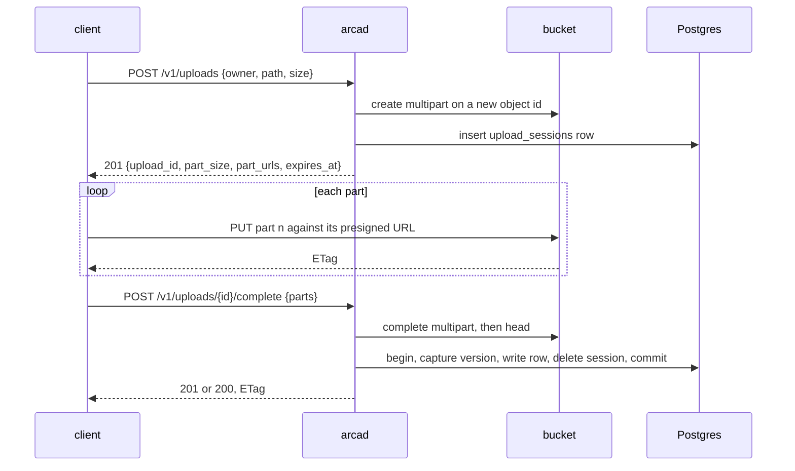

# Uploads

## Overview

How bytes arrive when there are too many of them to stream through a
replica. Invariant 4 of [[001-architecture]] says an upload above the
part size goes direct to the bucket; this spec is that path: a session
row, a set of presigned part URLs the client uploads against, and a
completion that assembles the parts and writes the row.

The shape follows from what the two stores are. The server must decide
the write, account for it, and record it, and none of that requires the
bytes to pass through the server. So they do not, and what the server
keeps is the one thing the bucket cannot give back: a durable pointer to
an upload in flight.

## Design

### Two size classes, one boundary

`ARCA_INLINE_BYTES`, default 16 MiB, is the boundary, and it is the
same number on both sides of the transfer, so a caller has one rule to
remember.

| Class | Route | Bytes go | Server sees | Enforced |
|---|---|---|---|---|
| at or below `ARCA_INLINE_BYTES` | `PUT` of [[005-files]] | through the server | every byte | quota before the write, sha256 over the stream, `Content-Length` required |
| above it, up to `ARCA_MAX_UPLOAD_BYTES` | the session below | client to bucket | no byte | quota at create and again at completion, the store's checksums, the assembled size |

A `PUT` above the boundary is `413` naming this API, and a session for a
declared size at or below it is accepted, because a client that already
knows it wants resumable parts should not be argued with.

The part size is 16 MiB and the part cap is 1000, both constants. That
ceiling, 16 GiB, is above `ARCA_MAX_UPLOAD_BYTES`'s default of 5 GiB, so
the real limit is the configured one and the cap is only a guard against
a client asking for a million URLs.

### The session



**Create.** `POST /v1/uploads` with `{owner, path, size, content_type}`
asks `upload.write` on the target path and runs the same gate as a
`PUT`: the path is validated, the workspace must be live
([[009-workspaces]]), and quota admission runs against the declared
size. Then it mints an object id, opens a multipart upload on its key,
writes the session row, and presigns one URL per part.

```json
{ "upload_id": "0192f0c3-…", "owner": "me",
  "path": "files/video/keynote.mp4",
  "part_size": 16777216, "part_count": 42,
  "part_urls": ["https://…", "…"],
  "expires_at": "2026-09-19T09:12:44Z" }
```

A session's key is its own object id, never the key of the object it
will replace. Nothing a session does, and nothing an abandoned session
leaves behind, can touch bytes a live row points at. That property is
free here, where every write has its own id, and it was a hand-built
convention in the predecessor.

Part URLs are valid 24 hours, the same as the session. The bucket needs
a CORS rule for the operator's console origin before a browser can use
them ([[003-object-store]]).

**Complete.** `POST /v1/uploads/{id}/complete` with the part numbers and
the ETags the bucket returned. It asks `upload.write` again rather than
`file.write`: the session was authorized against the path at create, and
one action over the whole flow keeps a client from passing a gate at
create that it would fail at completion. The same conditional-write
contract as `PUT` applies, carried by the same headers and checked
before assembly so a doomed completion costs nothing: a write under
`memory/` still requires `If-Match` or `If-None-Match: *`
([[005-files]]).

Then, in order: assemble the parts, head the assembled object for its
true size and ETag, re-check quota against that size rather than the
declared one, and write the row in one transaction that also captures
the version and deletes the session. The response mirrors `PUT`, `201`
for a create and `200` for an overwrite, with the checksum as the
`ETag`.

Completion is resumable. A retry whose upload id the bucket no longer
knows may be a second attempt after the first assembled the object and
then failed at the database; the handler heads the key, and if the
object is there it proceeds from the row write instead of failing. A
completion that finds neither upload nor object is `400`, and the parts
really were wrong.

**Abort.** `DELETE /v1/uploads/{id}` asks `upload.write`, aborts the
multipart, and deletes the row, in that order. If the abort fails the
row stays, deliberately: an incomplete multipart's parts are invisible
to object listing, so the row is the only durable pointer to them, and
deleting it strands the parts for the life of the bucket, billed and
unreachable. A retained row costs the reaper one retry. The caller is
told the truth, `502`, not a false success.

A session is visible only to the subject that created it, and to an
administrator. Anyone else gets `404` ([[006-identity]]).

### Integrity without seeing the bytes

The server cannot hash what it never reads, so integrity is delegated
and verified at three points.

1. **Per part, by the store.** A client that sends a part's base64
   sha256 as `x-amz-checksum-sha256` has it verified on receipt, and
   Arca passes the per part digests to the completion so the store
   recomputes the composite over them. Sessions created with
   `"checksum": "sha256"` open the multipart with that algorithm
   ([[003-object-store]]).
2. **Per part, by the ETag.** Every completion must echo each part's
   ETag. A wrong or missing one fails the assembly at the store, not at
   Arca, and answers `400`.
3. **Whole object, by the head.** The assembled size is read back and
   is what the row records and what the quota charges. The declared size
   was a promise; the head is the fact. A completed object over the
   space's limit is deleted and answers `413` rather than being kept and
   billed.

The checksum of a multipart object is the store's composite ETag, so its
row carries `checksum_kind = 'etag'` ([[004-metadata-store]]). It is not
a sha256 of the content and a client must not treat it as one; it is
still a conditional-write token, which is what `If-Match` needs it to
be. A client that wants a content digest it can verify sends one per
part and keeps its own.

### Expiry and the abandoned session

A session expires 24 hours after it is created, recorded in
`expires_at`. The reaper of [[010-quotas-events-and-reaper]] aborts
every expired session's multipart and deletes its row, holding the row
whenever the abort fails, for the reason above. It is the same pass that
collects an object assembled by a completion that never committed.

Twenty-four hours is a constant and joins no configuration table. It is
long enough for a slow client with pauses and short enough that
abandoned parts are a rounding error on a storage bill, and an operator
who needs another number is describing a different product.

### Package and interface

`internal/uploads` holds the three handlers and nothing else: the parts
of this flow that touch the bucket are [[003-object-store]]'s, the row
work is [[004-metadata-store]]'s `Sessions`, and the row-write at
completion is the same code path [[005-files]] uses for a `PUT`, taken
by both so the two writes cannot drift apart in their CAS behaviour,
version capture, or event.

### What arrives from Drive

From `internal/handler/uploads.go` and the archived spec
`015-multipart-uploads`.

| Arrives | Changes |
|---|---|
| the three routes, the fixed part size, the 1000 part cap, the presigned part URLs | unchanged |
| quota at create against the declared size, again at completion against the assembled size | unchanged |
| the CAS contract shared with `PUT`, including the `memory/` requirement | unchanged |
| the resumable completion, and the abort that keeps its row when the store's abort fails | unchanged, and the reasoning is written into this spec so the next reader does not undo it |
| the session key `{key}@{rand}`, chosen so a session cannot clobber the live object | gone as a device: the key is the session's own object id, and the property holds by construction |
| the owner of a session | the subject `<issuer>` and `<sub>`, and visibility is a question for [[006-identity]] rather than a comparison against `claims.Sub` in the handler |
| the refusal of a session on the public carve-out paths | gone with the carve-out itself; publicity is a column ([[008-shares-and-links]]) and any path may be uploaded in parts |
| the threshold, hard coded at 16 MiB in server and client | `ARCA_INLINE_BYTES`, one number, served to clients by [[013-api]] so a client never hard codes it again |
| the 24 hour sweep implied by the reconciler | `expires_at` on the row, so the deadline is data and a test can move it |
| the bucket CORS requirement, written against one product's console | the operator's console origin, an installation step in [[016-release-and-installation]] |

## Not in this spec

Writes at or below the boundary ([[005-files]]), the bucket calls
themselves ([[003-object-store]]), the reaper's schedule
([[010-quotas-events-and-reaper]]), who may write
([[006-identity]]), and the wire details ([[013-api]]).

## Acceptance criteria

| # | Criterion | Proved by |
|---|---|---|
| 1 | A session created, uploaded part by part, and completed lands the object with the right size, checksum, event, and quota charge | the e2e tier against MinIO and Postgres |
| 2 | A `PUT` above `ARCA_INLINE_BYTES` is `413` and names this API | `internal/files` handler test |
| 3 | A declared size over `ARCA_MAX_UPLOAD_BYTES`, or over the part cap, is refused at create and opens no multipart | `internal/uploads` tests with `blob.Counting` |
| 4 | A session whose declared size fits but whose assembled size exceeds the quota is refused at completion, and the assembled object is deleted | the store tier |
| 5 | Completion with a wrong part ETag is `400` and leaves no row | the store tier against MinIO |
| 6 | A completion retried after a database failure succeeds without re-uploading a part | the store tier, with the row write failed once |
| 7 | `If-Match` and `If-None-Match: *` behave at completion exactly as at `PUT`, and `memory/` without either is `428` | one table run against both handlers |
| 8 | An abort removes the multipart and the row, and an abort whose store call fails keeps the row and answers `502` | `internal/uploads` tests with a failing stub |
| 9 | An expired session is aborted and removed by the reaper, and its parts are gone from the store | the e2e tier with the clock moved |
| 10 | A session is invisible to every subject but its creator and an administrator | the conformance rows of [[017-conformance-suite]] |
| 11 | An overwrite through a session captures a version, and the previous object's bytes survive | the e2e tier |
| 12 | A part uploaded with a wrong sha256 is rejected by a store that verifies checksums | the store tier against MinIO |
