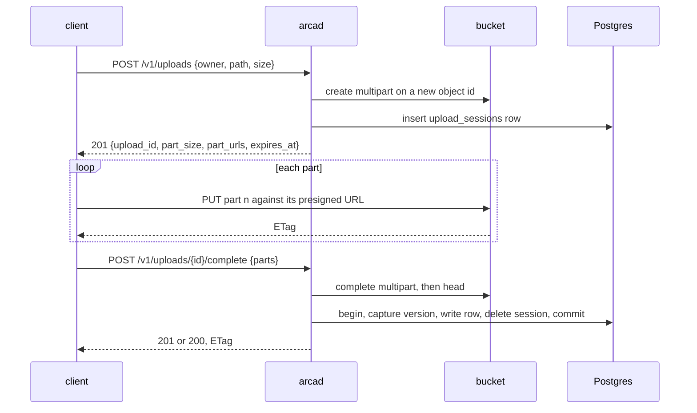

# Uploads

## Overview

How bytes arrive when there are too many of them to stream through a
replica. Invariant 4 of [[001-architecture]] says an upload above the
part size goes direct to the bucket; this spec is that path: a session
row, a set of presigned part URLs the client uploads against, and a
completion that assembles the parts and writes the row.

The shape follows from what the two stores are. The server must decide
the write, account for it, and record it, and none of that requires the
bytes to pass through the server. So they do not, and what the server
keeps is the one thing the bucket cannot give back: a durable pointer to
an upload in flight.

## Current state

Built and in the tree on 2026-09-18, phase 3 of [[019-migration-from-drive]].
`internal/uploads` holds the three handlers, `internal/store` holds the
session query set and `0002_uploads.up.sql` creates `upload_sessions`, which
is the migration [[004-metadata-store]]'s ownership table assigns this spec.
The commits are `9bbf965` (the table, the queries and the reference check),
`3ba4536` (the two sizes), `7204bd4` (the handlers), `0cb8d7e` (the wiring
and the document), `2742b24` (the store and e2e tiers) and `eee80ec` (the
detail a refusal carries). The gate passes at each of them, with
`internal/uploads` at 92%.

The row write at completion is [[005-files]]'s `Commit`, taken by both, so a
put and a completed session cannot drift apart in their conditional
behaviour, their version capture, their charge or their event. Two fields
were added to that write for this spec: what the space has already paid, so
a session that opened and completed is charged once, and a hook that runs in
the same transaction, so the session row leaves in the commit the object
arrives in.

The merge to `main` bound the expiry sweep. `Service.Sweep` is pass 4 of
[[010-events-and-reaper]]'s table over the query criterion 9 exposes: an
expired session's parts are aborted, its row leaves in the transaction that
gives its declared bytes back, and a store that will not discard keeps the
row for the next run, because the row is the only durable pointer to parts
object listing cannot see. A dry run counts and changes nothing, which this
pass can say honestly: what it would change is a query and not a write. It
runs on every replica with `ARCA_REAP_INTERVAL` set and in `arcad reap` as a
process of its own, which can carry it where pass 3 cannot: the sweep puts
no question, so it needs no authorizer.

One bug of the service Arca replaces is fixed here rather than carried.
`StorageKeyReferenced` in `drive/internal/store/refs.go` line 19 reads
`files` and `file_versions` while calling itself "the single invariant
deciding whether a blob may be deleted", and the migration creating its
`upload_sessions` table calls that row the only durable pointer to an
upload's parts. Arca's `store.ObjectReferenced` names all three, and
`TestObjectReferencedNamesEveryTableThatHoldsAnObjectID` reads every table of
the embedded schema that carries an `object_id` and holds the statement to
that list, so a fourth table added with the column cannot be left out
quietly. `TestTheGuardFindsThePredecessorsGap` uses the predecessor's own
statement as its fixture.

Criteria 1, 2, 3, 5, 7, 8 and 11 have passing tests. Criterion 4's refusal
and its deletion are proved at the unit tier against the answer's limit, and
the reaper's half of it is [[010-events-and-reaper]]'s. Criterion 6 is
proved at the unit tier with the row write failed once, and the retry
resumes from the row write. Criterion 9 is closed: the expiry query is proved
against Postgres and the sweep that runs it is bound as pass 4 above. The uploads group of
[[017-conformance-suite]] runs green against this build on 2026-09-19, four
cases over the three routes. Criterion 10 is closed at the unit tier and not
in that group: the stack the suite runs on answers every subject every
action, so the question cannot be asked there, and what this core owes the
criterion is one question asked and one answer given, which
`TestASessionIsInvisibleToEverySubjectTheAuthorizerRefuses` and
`TestASessionAnotherSubjectHoldsIsASessionThatIsNotThere` hold. The creator
half of it is the authorizer's by the divergence below. Criterion 12 is
[[020-per-part-checksums]], split out on 2026-09-19.

What the implementation decided, where this spec was silent or where the
tree made another reading better:

- An abort the store refuses answers `503` `storage_unavailable` and not the
  `502` this spec names. The error table of [[013-api]] has no row at 502,
  and `storage_unavailable` is the row for a store that could not do what
  was asked. The row stays either way, which is the property the paragraph
  is about, and the reaper retries.
- A session carries no `checksum` field, and criterion 12 is
  [[020-per-part-checksums]]. Opening a multipart with a checksum algorithm
  is `blob.PutOptions`'s to offer and it carries a content type alone
  ([[003-object-store]]). The two mechanisms that hold today are the part
  labels the store verifies when it assembles, and the head that reads the
  assembled size back. What was written here as one field turned out to be
  four: a presigned `UploadPart` URL carries only a header its signature
  covers, so the digest is known when the URL is minted, which puts one
  digest per part in the create body ([[013-api]]), the algorithm and the
  digests in `blob.PutOptions`, `PresignPart` and `blob.Part`
  ([[003-object-store]]), and the digests on the `upload_sessions` row,
  because a session resumed inside its twenty-four hours mints the URLs it
  minted before. Three specs and a migration is not one field.
- Visibility is the authorizer's answer alone. This spec names the creator
  and an administrator; Arca holds no notion of an administrator, and
  comparing a session's creator against the caller inside the handler is a
  policy this core does not decide and a claim read for meaning if it were
  read from the token. One question is asked, and a session nobody may act
  on is a session that is not there.
- What is kept and what is dropped when a completion fails follows from who
  will come back. A completion the caller's own request refused will not, so
  the assembled object goes and the session with it; a completion a store
  refused will, so both stay and the retry resumes from the row write rather
  than from a part. The predecessor kept the object in one of those two
  cases and not in the other for the same reason, without writing the reason
  down.
- A declared size of zero or less is `invalid_field`, and one over the part
  cap is `too_many_parts`, both read before anything opens, so a refused
  session opens no multipart.
- A session id that is not an identifier at all reads as a session that does
  not exist, so a client sending a word learns what a client sending
  somebody else's session learns. Until `eee80ec` the two answers differed
  in the one field a caller can still read: a deny at lookup carried the
  authorizer's reason and an unknown id carried its own sentence. An id is a
  guessable string, so that difference was an oracle; both now carry the
  sentence an unknown id carries.

## Design

### Two size classes, one boundary

`ARCA_INLINE_BYTES`, default 16 MiB, is the boundary, and it is the
same number on both sides of the transfer, so a caller has one rule to
remember.

| Class | Route | Bytes go | Server sees | Enforced |
|---|---|---|---|---|
| at or below `ARCA_INLINE_BYTES` | `PUT` of [[005-files]] | through the server | every byte | the usage charge before the write, sha256 over the stream, `Content-Length` required |
| above it, up to `ARCA_MAX_UPLOAD_BYTES` | the session below | client to bucket | no byte | the usage charge at create and again at completion, the store's checksums, the assembled size |

A `PUT` above the boundary is `413` naming this API, and a session for a
declared size at or below it is accepted, because a client that already
knows it wants resumable parts should not be argued with.

The part size is 16 MiB and the part cap is 1000, both constants. That
ceiling, 16 GiB, is above `ARCA_MAX_UPLOAD_BYTES`'s default of 5 GiB, so
the real limit is the configured one and the cap is only a guard against
a client asking for a million URLs.

### The session



**Create.** `POST /v1/uploads` with `{owner, path, size, content_type}`
asks `upload.write` on the target path and runs the same gate as a
`PUT`: the path is validated, the workspace must be live
([[009-workspaces]]), and usage admission runs against the declared
size. Then it mints an object id, opens a multipart upload on its key,
writes the session row, and presigns one URL per part.

```json
{ "upload_id": "0192f0c3-…", "owner": "me",
  "path": "files/video/keynote.mp4",
  "part_size": 16777216, "part_count": 42,
  "part_urls": ["https://…", "…"],
  "expires_at": "2026-09-19T09:12:44Z" }
```

A session's key is its own object id, never the key of the object it
will replace. Nothing a session does, and nothing an abandoned session
leaves behind, can touch bytes a live row points at. That property is
free here, where every write has its own id, and it was a hand-built
convention in the predecessor.

Part URLs are valid 24 hours, the same as the session. The bucket needs
a CORS rule for the operator's console origin before a browser can use
them ([[003-object-store]]).

**Complete.** `POST /v1/uploads/{id}/complete` with the part numbers and
the ETags the bucket returned. It asks `upload.write` again rather than
`file.write`: the session was authorized against the path at create, and
one action over the whole flow keeps a client from passing a gate at
create that it would fail at completion. The same conditional-write
contract as `PUT` applies, carried by the same headers and checked
before assembly so a doomed completion costs nothing ([[005-files]]).

Then, in order: assemble the parts, head the assembled object for its
true size and ETag, charge the difference between that size and the
declared one, and write the row in one transaction that also captures
the version and deletes the session. The response mirrors `PUT`, `201`
for a create and `200` for an overwrite, with the checksum as the
`ETag`.

Completion is resumable. A retry whose upload id the bucket no longer
knows may be a second attempt after the first assembled the object and
then failed at the database; the handler heads the key, and if the
object is there it proceeds from the row write instead of failing. A
completion that finds neither upload nor object is `400`, and the parts
really were wrong.

**Abort.** `DELETE /v1/uploads/{id}` asks `upload.write`, aborts the
multipart, and deletes the row, in that order. If the abort fails the
row stays, deliberately: an incomplete multipart's parts are invisible
to object listing, so the row is the only durable pointer to them, and
deleting it strands the parts for the life of the bucket, billed and
unreachable. A retained row costs the reaper one retry. The caller is
told the truth, `502`, not a false success.

A session is visible only to the subject that created it, and to an
administrator. Anyone else gets `404` ([[006-identity]]).

### Integrity without seeing the bytes

The server cannot hash what it never reads, so integrity is delegated
and verified at three points.

1. **Per part, by the store.** A part's base64 sha256, sent as
   `x-amz-checksum-sha256` and verified by the store on receipt, with the
   digests carried to the completion so the store recomputes the
   composite over them. That is [[020-per-part-checksums]] and not this
   spec: the header has to be signed into the presigned URL, so the
   digests are known at create and kept on the row, which is a change to
   [[003-object-store]]'s options, this spec's create body and
   [[013-api]]'s wire. What holds here is points 2 and 3.
2. **Per part, by the ETag.** Every completion must echo each part's
   ETag. A wrong or missing one fails the assembly at the store, not at
   Arca, and answers `400`.
3. **Whole object, by the head.** The assembled size is read back and
   is what the row records and what the space is charged. The declared
   size was a promise; the head is the fact. A completed object past a
   limit the authorizer's answer carried is deleted and answers `413`
   rather than being kept and billed.

The checksum of a multipart object is the store's composite ETag, so its
row carries `checksum_kind = 'etag'` ([[004-metadata-store]]). It is not
a sha256 of the content and a client must not treat it as one; it is
still a conditional-write token, which is what `If-Match` needs it to
be. A client that wants a content digest it can verify sends one per
part and keeps its own.

### Expiry and the abandoned session

A session expires 24 hours after it is created, recorded in
`expires_at`. The reaper of [[010-events-and-reaper]] aborts
every expired session's multipart and deletes its row, holding the row
whenever the abort fails, for the reason above. It is the same pass that
collects an object assembled by a completion that never committed.

Twenty-four hours is a constant and joins no configuration table. It is
long enough for a slow client with pauses and short enough that
abandoned parts are a rounding error on a storage bill, and an operator
who needs another number is describing a different product.

### Package and interface

`internal/uploads` holds the three handlers and nothing else: the parts
of this flow that touch the bucket are [[003-object-store]]'s, the row
work is [[004-metadata-store]]'s `Sessions`, and the row-write at
completion is the same code path [[005-files]] uses for a `PUT`, taken
by both so the two writes cannot drift apart in their CAS behaviour,
version capture, or event.

### What arrives from Drive

From `internal/handler/uploads.go` and the archived spec
`015-multipart-uploads`.

| Arrives | Changes |
|---|---|
| the three routes, the fixed part size, the 1000 part cap, the presigned part URLs | unchanged |
| the charge at create against the declared size, again at completion against the assembled size | unchanged, with the charge applied to the ledger of [[010-events-and-reaper]] rather than recomputed |
| the CAS contract shared with `PUT` | unchanged as an option; no path requires a precondition ([[005-files]]) |
| the resumable completion, and the abort that keeps its row when the store's abort fails | unchanged, and the reasoning is written into this spec so the next reader does not undo it |
| the session key `{key}@{rand}`, chosen so a session cannot clobber the live object | gone as a device: the key is the session's own object id, and the property holds by construction |
| the owner of a session | the subject `<issuer>` and `<sub>`, and visibility is a question for [[006-identity]] rather than a comparison against `claims.Sub` in the handler |
| the refusal of a session on the public carve-out paths | gone with the carve-out itself; publicity is a column ([[008-shares-and-links]]) and any path may be uploaded in parts |
| the threshold, hard coded at 16 MiB in server and client | `ARCA_INLINE_BYTES`, one number, served to clients by [[013-api]] so a client never hard codes it again |
| the 24 hour sweep implied by the reconciler | `expires_at` on the row, so the deadline is data and a test can move it |
| the bucket CORS requirement, written against one product's console | the operator's console origin, an installation step in [[016-release-and-installation]] |

## Not in this spec

Writes at or below the boundary ([[005-files]]), the bucket calls
themselves ([[003-object-store]]), the reaper's schedule
([[010-events-and-reaper]]), who may write
([[006-identity]]), and the wire details ([[013-api]]).

## Acceptance criteria

| # | Criterion | Proved by |
|---|---|---|
| 1 | A session created, uploaded part by part, and completed lands the object with the right size, checksum, event, and usage charge | the e2e tier against MinIO and Postgres |
| 2 | A `PUT` above `ARCA_INLINE_BYTES` is `413` and names this API | `internal/files` handler test |
| 3 | A declared size over `ARCA_MAX_UPLOAD_BYTES`, or over the part cap, is refused at create and opens no multipart | `internal/uploads` tests with `blob.Counting` |
| 4 | A session whose declared size fits but whose assembled size crosses the answer's limit is refused at completion, and the assembled object is deleted | `TestUsageOnComplete` and `TestMultipartOverrunIsReaped`, on the store tier |
| 5 | Completion with a wrong part ETag is `400` and leaves no row | the store tier against MinIO |
| 6 | A completion retried after a database failure succeeds without re-uploading a part | the store tier, with the row write failed once |
| 7 | `If-Match` and `If-None-Match: *` behave at completion exactly as at `PUT`, and a completion with neither succeeds | one table run against both handlers |
| 8 | An abort removes the multipart and the row, and an abort whose store call fails keeps the row and answers `502` | `internal/uploads` tests with a failing stub |
| 9 | An expired session is aborted and removed by the reaper, and its parts are gone from the store | the e2e tier with the clock moved |
| 10 | A session is visible only to a subject the authorizer admits, and a session another subject holds answers byte for byte what a session that is not there answers. Which subjects are admitted, the creator included, is the authorizer's answer and not this core's; the divergence above records why | `TestASessionIsInvisibleToEverySubjectTheAuthorizerRefuses` and `TestASessionAnotherSubjectHoldsIsASessionThatIsNotThere` |
| 11 | An overwrite through a session captures a version, and the previous object's bytes survive | the e2e tier |
| 12 | A part's integrity is held by the two mechanisms a server that never reads the bytes has: the part labels the store verifies when it assembles, and the head that reads the assembled size back. A digest the store verifies per part is [[020-per-part-checksums]] | criterion 5 for the labels, criterion 4 for the head |

## Outcome

Complete on 2026-09-19. The three routes, the session row, the two size
classes, the resumable completion, the abort that keeps its row, and the
expiry sweep are in the tree and serving: `v0.1.7` runs them in production
at the origin, and phase 3 of [[019-migration-from-drive]] put them there.
`internal/uploads` is at 92% and the gate is green at every commit.

Eleven of the twelve criteria are met by tests that run. Criterion 12 is
[[020-per-part-checksums]].

### What shipped against what was written

| Criterion | Outcome |
|---|---|
| 1, 4, 5, 6, 9, 11 | met against MinIO and Postgres at the store and e2e tiers |
| 2, 3, 7, 8 | met at the unit tier, the refusals proved with `blob.Counting` so a refused session opens no multipart |
| 10 | met, narrowed. This core asks one question and renders a deny at lookup byte for byte as an unknown id; which subjects the answer admits is the authorizer's, so the creator comparison the criterion named is not made here |
| 12 | split to [[020-per-part-checksums]] |

### Why criterion 12 was split

It reads as one field on a session and one option on a put, and it is
neither. A presigned `UploadPart` URL carries only the headers its
signature covers, so `x-amz-checksum-sha256` has to be signed in when the
URL is minted, and a digest signed at mint is a digest the client declared
at create. That pushes one digest per part into the create body
([[013-api]]), the algorithm and the digests into `blob.PutOptions`,
`PresignPart` and `blob.Part` ([[003-object-store]]), and the digests onto
the `upload_sessions` row, because a session is resumable for
twenty-four hours and a resume mints the URLs it minted before. Three
specs, a migration and a store-tier fixture against MinIO is not an hour,
and half of it belongs to [[003-object-store]] rather than here: the
whole-object path already carries a trailing sha256 over TLS, and what is
missing is the multipart side of a contract the single put keeps.

What holds in the meantime is written down rather than implied. A part
with a wrong label fails the assembly at the store and answers `400`, and
the head after assembly is the fact the row records and the space is
charged for, against a declared size that was only a promise. Neither
catches a part whose bytes are not the bytes the client meant to send, and
the spec now says so where it used to say the opposite.

### The divergence worth keeping

Visibility. The criterion named the creator and an administrator, and this
core knows neither. Comparing a session's creator against the caller inside
the handler is a policy decision, and reading it off a token is a claim read
for meaning, which invariant 5 of [[001-architecture]] forbids. So one
question is asked, and a session nobody may act on is a session that is not
there, developer detail included: until `eee80ec` a deny at lookup carried
the authorizer's reason and an unknown id carried its own sentence, and a
session id is a guessable string, so that difference was an oracle.
