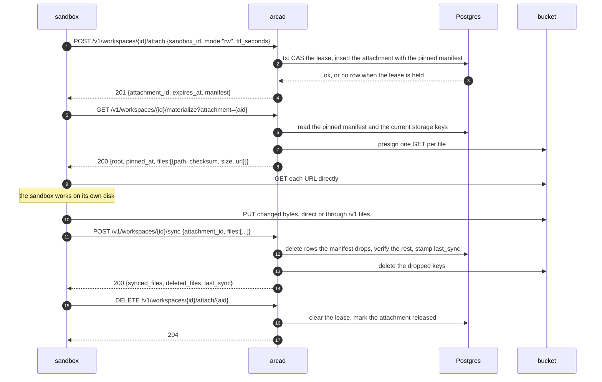

# Workspaces

## Overview

A sandbox is a machine that appears, does work, and goes away. Its disk
goes away with it. A workspace is the part that does not: a named,
durable subtree of a space that a sandbox mounts at the start of a run
and writes back at the end, so tomorrow's sandbox starts where
yesterday's stopped.

The storage model is copy in, sync back, with snapshot reads. A sandbox
attaches, takes a manifest and the bytes it names, works against its own
local disk at local-disk speed, declares the result, and releases. Arca
never mounts anything and never sees a file system; it hands out a
manifest with presigned URLs and accepts a manifest back. That is what
makes a workspace work for a runtime it does not control, and Cella, the
open sandbox runtime, is the runtime these routes are shaped for.

One property makes the model safe to build on: at most one writer at a
time. Invariant 7 of [[001-architecture]] states it, and this spec is
where it is enforced, through a lease that a writer holds, renews, and
loses by crashing.

A checked-out repository is a workspace like any other. Its history
lives on a git host and never in Arca; what Arca holds is a working
tree, including the `.git` directory if the sandbox syncs one back.
There is no second kind of workspace and no column that would name one.

## Design

### The record

| Field | Meaning |
|---|---|
| `id` | the workspace's identity, the handle every route names |
| `owner` | the space, the subject `<issuer>\|<sub>` |
| `slug` | the name inside the space, matching `^[a-z0-9][a-z0-9-]{0,63}$` |
| `writer_sandbox_id` | the holder of the lease, null when free |
| `writer_expires_at` | when the lease lapses |
| `last_sync` | the boundary the newest snapshot was taken at |
| `created_by` | the subject that created it |
| `deleted_at` | when it was soft deleted, null while live |

`(owner, slug)` is unique and the uniqueness is not conditional on
`deleted_at`, which is what makes restore simple; see below.
[[004-metadata-store]] owns the table.

The root prefix is `workspaces/<slug>/`, derived from the slug and never
stored.

Files under the root are ordinary objects of [[005-files]]. They are
listed, trashed, charged to the space's usage, and shared by exactly
the code paths that serve every other object. A grant on the root prefix
is a share of the workspace ([[008-shares-and-links]]), so nothing here
holds a second permission model.

### Routes

| Method | Path | Action | Does |
|---|---|---|---|
| POST | `/v1/workspaces` | `workspace.create` | creates, 409 on a taken slug |
| GET | `/v1/workspaces` | `workspace.list` | lists a space |
| GET | `/v1/workspaces/deleted` | `workspace.list` | lists the soft deleted ones |
| GET | `/v1/workspaces/{id}` | `workspace.read` | the record, plus file and byte counts and the lease state |
| PATCH | `/v1/workspaces/{id}` | `workspace.write` | renames the slug |
| DELETE | `/v1/workspaces/{id}` | `workspace.delete` | soft deletes |
| POST | `/v1/workspaces/{id}/restore` | `workspace.restore` | un-deletes |
| POST | `/v1/workspaces/{id}/attach` | `workspace.read` for `ro`, `workspace.attach` for `rw` | opens an attachment |
| POST | `/v1/workspaces/{id}/attach/{aid}/renew` | the action the attach asked | extends the lease |
| DELETE | `/v1/workspaces/{id}/attach/{aid}` | the action the attach asked | releases |
| GET | `/v1/workspaces/{id}/materialize` | `workspace.read` | the manifest and the URLs |
| POST | `/v1/workspaces/{id}/sync` | `workspace.sync` | writes the result back |

Every route is authorized per [[006-identity]] with the action named, and
the resource carries `id`, `owner`, and `slug`. The mode of an
attach picks the action so the ladder of [[008-shares-and-links]] falls
out without a second rule: a `read` grantee mounts read-only, and only a
`write` grantee can take the lease. A deny at lookup answers not-found,
per invariant 6 of [[001-architecture]]. [[013-api]] owns the status
codes and the pagination.

`/v1/workspaces/deleted` is a literal path and `/v1/workspaces/{id}` a
wildcard, and the literal wins in Go's `ServeMux`, so the two coexist
with no ordering rule to remember.

A rename moves rows and touches no bucket key, by invariant 8 of
[[001-architecture]]. A rename or a delete while the lease is held is a
conflict: the writer's view of its own paths would change underneath it.

### The writer lease

An attachment is one sandbox's session against one workspace.

| Field | Meaning |
|---|---|
| `id` | the attachment's identity |
| `workspace_id` | which workspace |
| `sandbox_id` | the sandbox that attached, opaque to Arca |
| `subject` | the subject authorized at attach |
| `mode` | `ro` or `rw` |
| `status` | `active`, `released`, or `reaped` |
| `manifest` | the snapshot pinned at attach |
| `expires_at` | when the attachment lapses |

**The invariant.** A workspace has at most one live lease. A `rw` attach
is a conditional update on the workspace row,
`SET writer_sandbox_id = $1 WHERE id = $2 AND writer_sandbox_id IS NULL`,
in the same transaction as the attachment insert. A second `rw` attach
matches no row and is a conflict. A `ro` attach never touches the lease
and there is no limit on how many exist at once.

The lease is time bounded, because a sandbox that crashes cannot release.
Default one hour, ceiling twenty-four hours, both constants in
`internal/workspaces` and not configuration; the client asks for a TTL in
seconds and gets the smaller of its ask and the ceiling. A renew stamps a
new `expires_at` and nothing else. A release clears
`writer_sandbox_id` and marks the attachment `released`. The reaper of
[[010-events-and-reaper]] marks an expired active attachment
`reaped` and clears the lease it held.

A reaped writer's unsynced work is lost, by design. Arca holds no copy of
what a sandbox has not sent it, so the only alternative to losing it is
holding a lease forever. A runtime bounds the loss by syncing
periodically; the `reap` event makes the loss visible rather than silent.

A renew or a sync against an attachment that is no longer `active` is
gone, not forbidden. The sandbox must re-attach and re-materialize
rather than continue against a snapshot it no longer holds a claim to.

### Attach, materialize, sync, release



### Materialize

Materialize answers the manifest pinned at attach, plus one presigned GET
per file. Bytes never pass through `arcad`, which is invariant 4 of
[[001-architecture]]:

```json
GET /v1/workspaces/2b7e.../materialize?attachment=9c1f...

200
{
  "root": "workspaces/build/",
  "pinned_at": "2026-09-18T10:00:00Z",
  "files": [
    {"path": "src/main.go", "checksum": "sha256:4f9a...", "size": 2814,
     "url": "https://bucket.example/...&X-Amz-Expires=300"}
  ]
}
```

Two properties matter and both come from pinning to the attachment's
manifest. A reader never sees a torn mix of one writer's half-finished
sync, because the manifest was taken at attach and a sync rewrites it
only once it has completed. And the URL is presigned against the object's
current storage key read from the row, not against a key recomputed from
the path, because a multipart upload ([[007-uploads]]) writes a key the
path does not predict.

A path that was in the snapshot and has since lost its row is omitted
rather than served as a broken URL. `checksum` lets the sandbox skip a
file it already holds from a previous run.

### Sync

Sync is the write-back boundary. The writer declares the full post-state
of the subtree; the changed bytes have already arrived through the
ordinary write path of [[005-files]] or [[007-uploads]] before the call.

```json
POST /v1/workspaces/2b7e.../sync
{
  "attachment_id": "9c1f...",
  "files": [
    {"path": "src/main.go", "checksum": "sha256:4f9a...", "size": 2814},
    {"path": "bin/app",     "checksum": "sha256:11c0...", "size": 5120000}
  ]
}
```

The handler refuses a sync that is not the writer's: the attachment must
be `active`, its mode `rw`, and the workspace's `writer_sandbox_id` must
still be that attachment's sandbox. Then it reconciles:

| Case | Result |
|---|---|
| a row under the root that the manifest does not name | deleted, rows first and keys after, which is invariant 1 of [[001-architecture]] |
| a path the manifest names that has a row | kept |
| a path the manifest names that has no row | the whole sync is a conflict, `manifest_incomplete`, with the missing paths listed |

The last row is the reason sync declares rather than diffs. A client that
announced a file it never uploaded gets told so, and Arca never records a
boundary that lies about what it holds. Deletions are batched, one
statement for the rows and one call per thousand keys, so dropping a
large tree costs a constant number of round trips and not one per file.

A completed sync stamps `last_sync`, rewrites the attachment's manifest
to the post-sync state so the same attachment can materialize again, and
appends a `sync` event. Sync is idempotent: replaying the same manifest
deletes nothing and changes nothing but the timestamp.

### Delete and restore

A delete stamps `deleted_at` and is refused while the lease is held. The
subtree stays readable to nobody and restorable by the owner for
`ARCA_TRASH_RETENTION`, the same window a trashed object of
[[005-files]] gets; there is no second retention setting. After it, the
reaper of [[010-events-and-reaper]] purges the rows and the bytes
and the row itself.

`GET /v1/workspaces/deleted` lists what is inside the window and
`POST /v1/workspaces/{id}/restore` clears `deleted_at`. Restore needs no
collision guard, and the reason is the uniqueness constraint: because
`(owner, slug)` is unique regardless of `deleted_at`, a tombstone
keeps its slug reserved until purge, so no live workspace can have taken
the name in the meantime. Restoring something that is not deleted is a
conflict; restoring something already purged is not-found.

### Events

Appended to the log of [[010-events-and-reaper]]:

| Mutation | Action | Detail |
|---|---|---|
| a `ro` or `rw` attach | `attach` | `mode`, `sandbox_id`, `attachment_id` |
| a release | `release` | `attachment_id` |
| a sync | `sync` | `attachment_id`, `files`, `deleted` |
| a lease or attachment reaped | `reap` | `attachment_id` |
| a workspace purged | `purge` | `slug` |
| a workspace restored | `restore` | `slug` |

Create, rename, and delete of the record itself are not separate actions.
The enum is closed ([[010-events-and-reaper]]), and a consumer
that wants workspace lifecycle reads the `put` and `delete` events on the
root prefix.

### What arrives from Drive

| From | What changes |
|---|---|
| `.archive/005-workspaces.md`, `drive/internal/handler/workspaces.go` | the record, the derived root prefix, CRUD, the lock-guarded rename and delete |
| `.archive/006-attach-sync.md`, `drive/internal/handler/attach.go` | attach, renew, release, the CAS lease, the TTL |
| `drive/internal/handler/sync.go` | materialize and sync, unchanged in shape including `manifest_incomplete` |
| `.archive/020-deleted-workspaces.md` | the deleted listing and self-restore, and the slug-slot analysis that makes restore guard-free |
| migrations `000003_workspaces`, `000004_attachments` | folded into the initial schema of [[004-metadata-store]] |

Owner addressing changes from `(owner_type, owner_id)` to the subject
`<issuer>|<sub>`, and `principal_id` on an attachment becomes that
subject. The listing's `scope=all` parameter goes: a shared workspace
reaches a caller through the grant, and the narrowing of a list is the
authorizer's `filter` ([[006-identity]]), not a query parameter.

Removed with the org claim: the create rule that read org membership, the
deleted-listing scoping that showed an org member only its own creations
and an org admin everything, and the provenance zone check that decided
writability from the token's principal type. All three are now one
authorizer question. The workspace purge window stops being a constant
and becomes `ARCA_TRASH_RETENTION`, which [[002-repository-scaffold]]
already carries.

Left behind for [[019-migration-from-drive]]: `GET /v1/userspace/materialize`,
which snapshotted a whole `files/` plane into a sandbox. It is a
convenience over listing and presigning, it is not a workspace, and a
client that wants it builds it from [[005-files]].

## Not in this spec

The object schema and the migrations ([[004-metadata-store]]). What a put
under a workspace root does ([[005-files]], [[007-uploads]]). The reaper
loop that expires leases and purges tombstones
([[010-events-and-reaper]]). The grant that shares a workspace
([[008-shares-and-links]]). Git protocol of any kind: a repository's
history lives on a git host, and [[001-architecture]] says Arca is not
one.

## Acceptance criteria

| # | Criterion | Proved by |
|---|---|---|
| 1 | Two concurrent `rw` attaches leave exactly one lease, and the loser is a conflict | a real-database race test in `internal/workspaces`, not a mock |
| 2 | Many concurrent `ro` attaches all succeed and none touches the lease | the same test's read-only arm |
| 3 | A renew extends `expires_at` and a release clears the lease and marks the attachment released | `internal/workspaces` test |
| 4 | An expired lease is cleared by the reaper, and the zombie writer's next sync or renew is gone | [[010-events-and-reaper]]'s expiry test, asserted from this side |
| 5 | The root prefix is derived from the slug, and `(owner, slug)` collides across live and deleted rows alike | `internal/workspaces` test |
| 6 | A rename moves rows and issues no bucket call | a counting bucket stub, the test invariant 8 of [[001-architecture]] names |
| 7 | A rename or a delete while the lease is held is refused | `internal/workspaces` test |
| 8 | Materialize pins to the attachment manifest, presigns the row's current storage key, and omits a path whose row is gone | store-tier test against MinIO with a multipart-written object |
| 9 | Materialize taken during a writer's sync is internally consistent and never a torn mix | e2e with a sync in flight |
| 10 | A sync deletes exactly the rows the manifest drops, keeps the rest, and stamps `last_sync` | e2e against Postgres and MinIO |
| 11 | A sync naming a path that was never uploaded is refused with the missing paths listed, and writes nothing | e2e |
| 12 | Replaying a sync changes nothing | e2e |
| 13 | A sync from a non-writer attachment, or from a released one, is refused | e2e |
| 14 | `ro` attach asks `workspace.read` and `rw` attach asks `workspace.attach`, so a `read` grantee mounts read-only and cannot take the lease | [[017-conformance-suite]]'s rows, with a recording authorizer |
| 15 | A delete lists in `/v1/workspaces/deleted`, restores within `ARCA_TRASH_RETENTION`, and is purged after it | e2e plus [[010-events-and-reaper]]'s purge test |
| 16 | Restore of a live workspace is a conflict and restore of a purged id is not-found | e2e |
| 17 | No handler in `internal/workspaces` reads `org_id`, `roles`, or the principal type | the `identity` gate's rule, plus a grep test |
