# Webhooks

## Overview

The event log of [[010-quotas-events-and-reaper]] can be tailed, and
tailing means polling. A webhook is the other direction: a subscriber
registers a URL once and Arca posts to it when something happens in the
space, so a consumer reacts in a second instead of on the next poll.

A subscription belongs to one space and filters the space's log by path
prefix and action. Delivery is at least once. Every delivery is signed,
so a subscriber can prove the body came from the installation it
registered with, and carries a delivery id that is stable across
retries, so a subscriber can drop what it has already handled.

An endpoint that keeps failing is retired rather than retried forever.
Retirement is terminal: the subscription stops delivering and stays in
the database as the record of what happened, and coming back means
registering again. That is deliberate. Twenty consecutive failures is an
endpoint that is gone, and re-registering is how its owner proves it is
not.

## Design

### The subscription

| Field | Meaning |
|---|---|
| `id` | the subscription's identity |
| `owner` | the space it subscribes to, the subject `<issuer>\|<sub>` |
| `url` | where deliveries go; `https` only |
| `secret` | the key a subscriber verifies with, shown once at create |
| `path_prefix` | the subtree to deliver for; empty is the whole space |
| `actions` | the actions to deliver; empty is all of them |
| `active` | false once retired |
| `failure_count` | consecutive failures across events |
| `attempts` | retries spent on the event at the cursor |
| `next_attempt_at` | the backoff gate; null is due now |
| `cursor_event_id` | the last event id dealt with |
| `locked_until` | the delivery lease; null or past is free |

[[004-metadata-store]] owns the table. `actions` is validated at create
against the closed vocabulary of [[010-quotas-events-and-reaper]], read
from the same table in `internal/events` that the emitters read, so a
filter can never name an action that will never be emitted.

Twenty subscriptions per space. It is a constant in `internal/webhook`
and not configuration, because an installation that needs a different
number has an authorizer: the answer's `limits.webhooks` raises the cap
for one space for that answer's `ttl`, decoded exactly the way
[[006-identity]] decodes `limits.quota_bytes`.

### Routes

| Method | Path | Action | Does |
|---|---|---|---|
| POST | `/v1/webhooks` | `webhook.create` | registers; answers the secret once |
| GET | `/v1/webhooks` | `webhook.list` | lists a space's subscriptions, never a secret |
| GET | `/v1/webhooks/{id}` | `webhook.read` | one subscription and its delivery state |
| DELETE | `/v1/webhooks/{id}` | `webhook.delete` | removes it |
| POST | `/v1/webhooks/{id}/test` | `webhook.read` | fires one synthetic delivery, synchronously |

Every route is authorized per [[006-identity]] with the action named, and
the resource carries `id`, `owner`, and `url`. The `url` is in the
question on purpose: an operator's policy may refuse a destination
without Arca holding an allow list of its own.

There is no update route, and the vocabulary has no `webhook.write`
action to give one. Everything an update would change, the filter, the
starting cursor, a retired subscription's health, is expressed by
deleting and registering again. The cost is that the id and the secret
change; the benefit is that the four actions above are the whole surface
and that a retired endpoint cannot be waved back to life by a flag.

```json
POST /v1/webhooks
{
  "owner": "me",
  "url": "https://receiver.example/arca",
  "path_prefix": "files/reports",
  "actions": ["put", "delete"],
  "from_event": 41822
}
```

```json
201
{
  "id": "7d21...",
  "owner": "https://issuer.example|0f5c...",
  "url": "https://receiver.example/arca",
  "path_prefix": "files/reports",
  "actions": ["put", "delete"],
  "active": true,
  "secret": "shown once, never again",
  "created_at": "2026-09-18T10:02:11Z"
}
```

`from_event` is optional and defaults to the log's current head, so a new
subscription delivers what happens next and not the space's history.
Setting it to an older id replays from there, which is how a consumer
that lost its state catches up.

### The secret and the signature

`ARCA_WEBHOOK_SIGNING_KEY` is the installation's key and is required
before any webhook route serves. A subscription's secret is derived from
it:

```
secret = base64url(HMAC-SHA256(ARCA_WEBHOOK_SIGNING_KEY, subscription_id))
```

Deriving rather than generating means every subscriber holds a different
secret, so one subscriber cannot forge a delivery to another, and the
installation holds one key rather than a store of unrelated ones. The
derived value is written to the subscription's `secret` column and read
from there on the delivery path, so rotating the installation key leaves
live subscriptions working and changes only what a subscription
registered after the rotation gets. It is returned exactly once, in the
`201`, and no route answers it again.

Each delivery carries two headers:

| Header | Value |
|---|---|
| `X-Arca-Signature` | `sha256=` and the hex HMAC-SHA256 of the exact request body under the subscription's secret |
| `X-Arca-Delivery` | `<subscription id>-<event id>`, stable across every retry of that event |

A subscriber verifies by recomputing the HMAC over the bytes it received,
before parsing them. [[013-api]] records both headers in the document it
serves.

```json
POST https://receiver.example/arca
Content-Type: application/json
X-Arca-Signature: sha256=9f2c...
X-Arca-Delivery: 7d21...-41823

{
  "id": 41823,
  "action": "put",
  "owner": "https://issuer.example|0f5c...",
  "path": "files/reports/q3.pdf",
  "actor": "https://issuer.example|0f5c...",
  "occurred_at": "2026-09-18T10:02:11Z"
}
```

The test route posts the same shape with `"action": "test"` and `"id": 0`
through the same signing and the same guard, and answers the subscriber's
status code to the caller. It moves no cursor and counts no failure.

### Delivery

The worker runs inside `serve` on every replica, every fifteen seconds,
and one pass drains every subscription that is `active` and past its
`next_attempt_at`. It runs there and nowhere else: delivery is part of
serving, so `arcad reap` does not deliver, and an installation that moves
reaping off the API replicas still delivers from them.

**The lease.** The worker runs everywhere, so without a claim two
replicas tail one subscription, deliver the same event twice, and walk
the cursor backwards. A replica claims a subscription by setting
`locked_until` into the future in a conditional update, and a replica
that matches no row skips that subscription this pass. The lease is ten
minutes, which is longer than the worst case drain, fifty deliveries at
five seconds each, so a healthy pass never loses its claim in the middle
of one; a replica that dies holding a claim blocks its subscription for
at most that long. The reaper of [[010-quotas-events-and-reaper]] needs
no such lease because a duplicate delete is nothing and a duplicate
delivery is a wrong fact sent to a stranger.

A drain reads the next event after the cursor, applies the filter, and
either delivers it or advances past it. An event the filter excludes
advances the cursor without a delivery, so a narrow filter over a busy
space does not fall behind. A pass delivers at most fifty events per
subscription, so one chatty space cannot starve the others.

| Constant | Value | Why |
|---|---|---|
| pass interval | 15 s | the delay a subscriber sees on an idle space |
| attempt timeout | 5 s | a slow subscriber must not hold the pass |
| retries per event | 1 min, 5 min, 30 min | three attempts over about half an hour |
| events per pass | 50 | fairness across subscriptions |
| lease | 10 min | longer than the worst case drain |
| retirement | 20 consecutive failures | an endpoint that is gone |

All six are constants in `internal/webhook`. None is configuration, and
none belongs in the table of [[002-repository-scaffold]].

Redirects are not followed: a subscriber registered a URL, and a redirect
is a different one. A response outside `2xx` is a failure.

**Failure.** A failed attempt schedules the next from the backoff table
and increments `attempts` and `failure_count`. When the backoff table is
exhausted the event is skipped, the cursor advances past it, and
`attempts` resets. Delivery is therefore at least once and at most three
attempts per event, and a subscriber that is down for an hour loses
events rather than blocking the queue behind them. A subscriber that
needs them back registers again with `from_event`.

**Retirement.** Twenty consecutive failures, counted across events and
not within one, clears `active` and appends a `webhook_disabled` event to
the space's log. The subscription stops being read by any pass. It is the
one action in [[010-quotas-events-and-reaper]]'s vocabulary that this
spec emits, and it exists so the retirement is visible to whatever is
watching the space, including another webhook.

```mermaid
stateDiagram-v2
  [*] --> active: POST /v1/webhooks
  active --> active: delivered, cursor advances, failure_count resets
  active --> backoff: attempt failed, next_attempt_at set
  backoff --> active: a later attempt succeeds
  backoff --> backoff: retry 1 min, 5 min, 30 min
  backoff --> skipped: retries exhausted
  skipped --> active: cursor advances past the event
  backoff --> retired: 20 consecutive failures
  active --> retired: 20 consecutive failures
  retired --> [*]: webhook_disabled appended; register again for a new subscription
  active --> [*]: DELETE /v1/webhooks/{id}
```



### The destination guard

Every connection attempt is checked at dial time, on the address the name
actually resolved to, not on the URL at registration. Loopback, the
private ranges, link local including the cloud metadata address, unique
local addresses, multicast, and the unspecified address are all refused.
Checking the resolved address is what makes a name that resolves to a
private address after registration harmless, which registration-time
validation alone cannot do. The test route runs the same guard.

A refused destination is a delivery failure like any other and counts
toward retirement. [[015-security-and-threat-model]] owns the analysis;
this spec owns the rule.

### What arrives from Drive

| From | What changes |
|---|---|
| `.archive/019-webhooks.md` | the whole design: subscriptions, the signed payload, backoff, auto-disable, the destination guard |
| `drive/internal/handler/webhooks.go` | create, list, read, delete, test |
| `drive/internal/webhook` | the worker, the claim, the drain, the backoff, the signature |
| migrations `000015_webhooks`, `000016_webhook_lease` | folded into `0006_webhooks.up.sql` of [[004-metadata-store]], the lease column included from the start |

Owner addressing changes from `(owner_type, owner_id)` to the subject
`<issuer>|<sub>`, and the two caps, five for a person and twenty for an
organization, become one cap of twenty, because an organization is a
subject like any other.

The headers are renamed. `X-Latere-Signature` and `X-Latere-Delivery`
become `X-Arca-Signature` and `X-Arca-Delivery`: Arca is an open core and
its wire protocol carries its own name, not the name of one company that
runs it. [[019-migration-from-drive]] carries the consequence, which is
that every existing subscriber reads the new header names.

The secret stops being a value the caller may supply and a random value
the server generates, and becomes a value derived from
`ARCA_WEBHOOK_SIGNING_KEY`. A caller-supplied secret was a way for a
caller to choose a weak one.

Removed with the org claim: the rule that only a human could manage
webhooks, which read the token's principal type, and the rule that only a
space owner or an organization's administrator could, which read
`org_id` and `roles`. Both are now one authorizer question per route. An
installation that wants machines kept out of webhook management denies
`webhook.create` for a service subject, which is a policy and reads like
one.

Left behind for [[019-migration-from-drive]]: `PATCH /v1/webhooks/{id}`,
whose three uses are covered by registering again, and the console's
webhook settings pane, which belongs to the hosted platform that builds
on Arca.

## Not in this spec

The table ([[004-metadata-store]]). The events and their vocabulary
([[010-quotas-events-and-reaper]]). The status codes and the served
document ([[013-api]]). Fan-out to a queue, per-object subscriptions, and
a replay user interface: a cursor at create is enough, and a consumer
that wants a queue puts one behind its own URL.

## Acceptance criteria

| # | Criterion | Proved by |
|---|---|---|
| 1 | A create answers the secret once and no later route answers it | `internal/webhook` test plus an e2e read and list |
| 2 | Two subscriptions in one installation have different secrets, and each secret is reproducible from `ARCA_WEBHOOK_SIGNING_KEY` and the id | `internal/webhook` test |
| 3 | A `http` URL, an unknown action, and a twenty-first subscription in one space are each refused | `internal/webhook` test |
| 4 | An authorizer answering `limits.webhooks` raises the cap for that space and no other | `internal/webhook` test with a stub authorizer |
| 5 | A write in the space delivers a signed body a receiver verifies with the secret it was given | e2e against an in-test receiver |
| 6 | The filter is respected, and an excluded event advances the cursor with no delivery | e2e |
| 7 | The delivery id is the same across every retry of one event and different across events | e2e with a receiver that fails once |
| 8 | A `500` then a `200` delivers once at the backoff, and the cursor advances once | e2e with a fake clock |
| 9 | Retries exhausted skips the event and advances the cursor | `internal/webhook` test |
| 10 | Twenty consecutive failures clears `active` and appends `webhook_disabled`, and no later pass reads the subscription | e2e, asserting the event through the tail of [[010-quotas-events-and-reaper]] |
| 11 | Two workers over one subscription deliver each event once and never move the cursor backwards | a real-database concurrency test, not a mock |
| 12 | A replica that dies holding a lease releases it within ten minutes | `internal/webhook` test with a fake clock |
| 13 | A delivery to a name resolving to loopback, an RFC 1918 address, or the metadata address is refused at dial time, and registration-time validation is not what refuses it | `internal/webhook` test with a resolver that answers a private address |
| 14 | The test route signs and guards the same way, answers the receiver's status, and moves no cursor | e2e |
| 15 | A redirect is not followed | `internal/webhook` test |
| 16 | `from_event` replays from the id given, and its absence starts at the head | e2e |
| 17 | No handler in `internal/webhook` reads `org_id`, `roles`, or the principal type | the `identity` gate's rule, plus a grep test |
