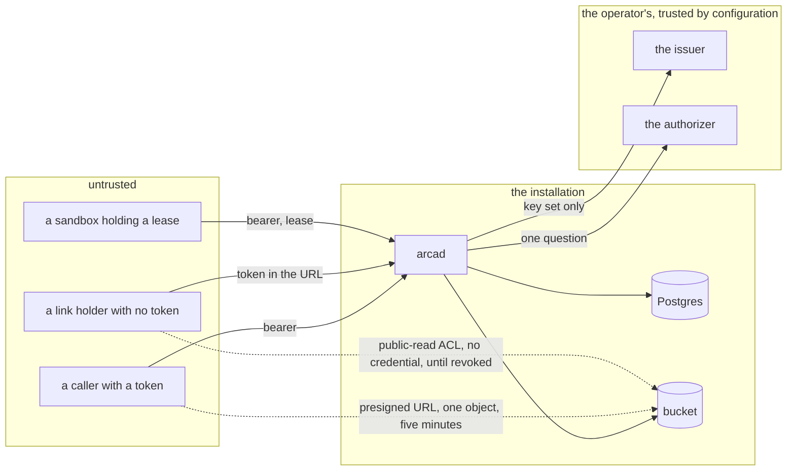
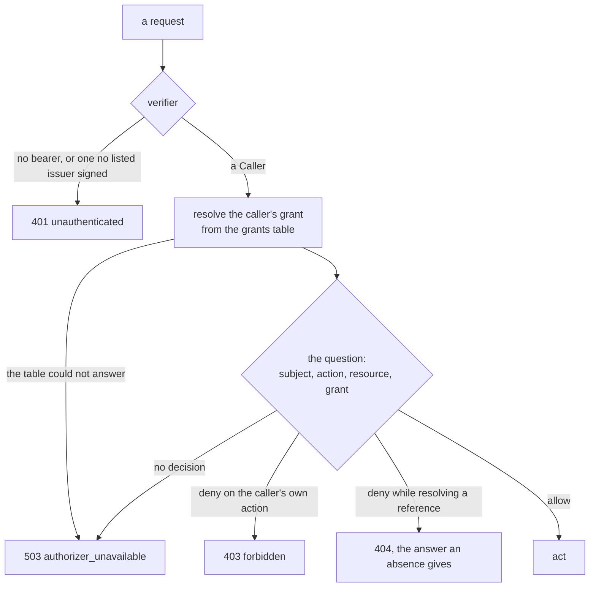

# Security and threat model

## Overview

Arca holds other people's bytes, hands out URLs that need no token, and
lets an unattended sandbox write into a space a person owns. This spec
names what is worth taking, who would take it, where the boundaries
between them are, and, for every threat, the control that stops it and
the test that proves the control is there.

It is written against the code as built, not against the code as
planned. Every `Test` cell below names a function that exists in this
tree. The unit tier is green over them; the cells that name a store,
e2e or conformance test run under their own stack and are green there,
not in a bare `go test ./...`. That is a deliberate correction: the
first draft of
this file named thirty-eight test functions, of which three existed.
The controls were real and tested throughout; the names in the table
were invented at drafting time and never reconciled with the tree. A
threat model whose proofs cannot be looked up is a claim, so the
reconciliation is mechanical rather than manual: `test/threatmodel`
reads this file and holds every `Test` cell to what the toolchain lists
and every commitment of `SECURITY.md` to a row of the controls table.

It is also the source of `SECURITY.md`, so a reviewer who arrives at the
repository reads a handful of commitments and one document rather than
the whole spec deck.

## Design

### Assets

| Asset | Where it lives | What holding it is worth |
|---|---|---|
| object bytes | the operator's bucket, under `ARCA_BUCKET_PREFIX` | everything a space holds |
| paths, owners, checksums, grants, leases, the ledger, the event log | the operator's Postgres | the shape of every space, and the authority to change it |
| link and public grant tokens | the `shares` table, and every URL a holder has ever pasted | read of one subtree, with no token of the holder's own |
| presigned URLs | in flight, in a `302`, in a materialize manifest, in a browser's history | read of one object for five minutes |
| the public-read ACL a public grant stamps on an object | the bucket, and the CDN in front of it | read of one object by anyone, without reaching `arcad` at all |
| `ARCA_BUCKET_SECRET_KEY`, `ARCA_DATABASE_URL`, `ARCA_AUTHORIZER_TOKEN` | the server's configuration, mounted from a Secret | the installation |
| the record of who did what: the event log ([[012-administration]]) | Postgres | the only account of an administrator's actions |
| the installation's availability | `arcad`, and the two stores behind it | every space at once, for as long as it is down |

The public-read ACL is the asset with the longest reach. A public grant
whose prefix names one object marks that object's row and stamps the
ACL on its key (`internal/shares/links.go`, `mint` and `stamp`), and
`ARCA_PUBLIC_CDN_URL` makes an ordinary read redirect to the CDN rather
than to a presigned URL. Those bytes are then readable with no token
and without touching this server, so the revoke path is the control
that matters: `withdraw` clears the ACL before it revokes the row, so a
bucket that will not answer leaves the grant standing and the caller
retrying, which grants no more than before. Revoking first and failing
to clear would leave an object readable that no grant covers.

### Trust boundaries

Four boundaries. Between a caller and `arcad` the control is the
verifier and the authorizer. Between `arcad` and the two stores the
control is the operator's network and credentials, and a compromise
there is out of scope below. Between `arcad` and the issuer and the
authorizer the control is configuration: `arcad` trusts them because the
operator named them, and calls the issuer for a key set and nothing
else. The fourth is the dotted pair, where bytes leave the bucket
without passing through this server at all: a presigned URL, bounded by
`blob.PresignTTL`, and a public object's ACL, bounded only by the
revoke.

Nothing in the core dials an address a consumer chose. Arca makes
outbound calls to the bucket, the database, the issuer, and the
authorizer, every one of them named by the operator, and a consumer that
wants to know what happened tails the event log rather than being
called back ([[010-events-and-reaper]]). That removes a whole boundary
and the request-forgery surface behind it.

### Adversaries

| Adversary | Holds | Wants |
|---|---|---|
| an authenticated caller | a valid bearer from a listed issuer | another subject's space, more room than its platform allows it, an administrator's surface, a grant it was not given |
| a link holder | one token | the rest of the space, a write, another space's link |
| an anonymous prober | the network | a token by guessing, an object by path, the shape of what exists |
| a sandbox holding a lease | a token for the audience `arca`, one lease | another workspace, a lease it should have lost, bytes outside its subtree |
| a revoked collaborator | an id it was shown before the revoke | to learn whether what it once saw is still there |
| a network position | the wire | a bearer, a link token, a presigned URL |
| a compromised authorizer | the decision | to allow every action for every subject, including actions it does not recognise |
| a compromised replica | the pod | the rest of the cluster |
| a consumer of the module | an import of `object/`, `authorizer/` | to derive a key for an object it does not own |

### The order every handler works in

The whole of the access control is three steps in one order, and the
order is what makes a refusal say nothing.

Three properties hold that shape up, and each is a row of the controls
table. Nothing acts before a decision. No failure anywhere in the chain
becomes an allow: neither the grants table, nor the endpoint, nor the
ledger. And a deny at lookup is answered as an absence, so a request
cannot be written to enumerate what somebody else owns.

### The surfaces

**`internal/auth`.** A bearer is verified through
`latere.ai/x/pkg/authkit/jwt` against the issuers `ARCA_OIDC_ISSUERS`
lists. The token's own `iss` selects the key set it is checked against,
so a token from an unlisted issuer is refused before a signature is
tried. `aud` must contain `ARCA_OIDC_AUDIENCE`, `iat` is required and
bounds the token's age at a day, and an `http://` issuer off loopback is
a start-up failure unless `ARCA_OIDC_INSECURE_ISSUERS` admits it. The
verifier reads no claim for meaning; the claims go to the authorizer
verbatim.

Who decides is one seam, `Authorizer.Decide` and `Authorizer.Lookup`,
behind which sits either the operator's endpoint or the `OwnerPolicy` of
this package. The policy is the shared frame of `latere.ai/x/pkg/authz`
with Arca's rows in front of it: the probe first and denied for
everyone, then the administrator, the owner, the grantee within the
ladder, the link that resolves, and then a deny. `space.admin` is handed
no object, so the owner rung never reaches it and the administrator list
decides it alone: a space's owner is not an administrator of its own
space.

Two refusals are the load-bearing ones. The grant the caller holds on
the resource is resolved from Arca's own grants table before the
question goes out, in both modes, and a table that cannot answer
produces `authorizer_unavailable` and never a deny: a question sent
without a grant the caller holds is a question the endpoint answers
wrong, and a wrong answer is worse than none. And `OwnerPolicy.restrict`
intersects its own allow with the grants the token carries through
`authz.Restrict`, so a personal key narrowed by RFC 9396
`authorization_details` reaches only what its grants name. The
conjunction turns an allow into a deny and never a deny into an allow.

**`internal/shares`, the three public link routes.** These carry no
caller. They are the whole of the exception to invariant 5 of
[[001-architecture]], and `redeem` fixes their order: resolve the token
first, refuse a path the prefix does not cover, and only then ask
`link.read` with the resolved grant's id, its owner, the path, and an
empty subject. Every refusal on those routes is one sentence,
`notFound()`, which names neither the token nor the path: an unknown
token, a revoked one, an expired one, a path outside the grant, and a
denied `link.read` are one answer, so a caller learns nothing by asking.
A deny is collapsed into that sentence explicitly rather than rendered
through `api.FromAuth`, because the endpoint's reason would say that the
token resolved, which is the one fact these routes withhold. The token
is 256 bits from `crypto/rand` rendered base64url, it is answered once
at creation and dropped by every listing, and the response carries
`Referrer-Policy: no-referrer` because the token is a path segment.

**`internal/admin`.** Two routes: an overview across spaces and a
restore across owners. Both ask `space.admin` before they act and
before any lookup. There is no administrative copy of a listing and no
moderation route, because a second surface answering the same questions
from a second set of handlers would double every filter rule and every
pagination bug: reading someone else's objects is the ordinary file
route, answered on a space the caller does not own. A deny is 403 and
not the 404 the service Arca replaces used to hide the surface, because
the route names are in `/openapi.json` anyway and existence hiding
protects objects rather than route names. An installation with neither
an authorizer nor `ARCA_ADMIN_SUBJECTS` has no administrator and both
routes refuse everyone, which is the correct default for a self-hosted
installation that needs none.

**`internal/blob` and the bucket prefix.** Keys are opaque to this
package. `object.ID.Key` derives a key from the object id and the
prefix and from nothing else, so a path that slipped every check
addresses nothing, and a move is one `UPDATE` that touches no key. Every
key carries `ARCA_BUCKET_PREFIX`, normalised at start-up, which is what
separates two installations sharing one bucket. Every put carries
`If-None-Match: *`; a store that answers `NotImplemented` degrades once,
says so, and fails `arcad check`. A presigned read is one key, one
method, and `PresignTTL`, five minutes, chosen against the download it
must survive rather than against convenience. Nothing recalls a signed
URL, so the exposure after a revoke is exactly that window.

**`internal/reaper` and the delete ordering.** The passes exist because
the two stores fail independently, and the ordering is what decides what
a crash leaves behind. A put writes the bucket first, so a crash leaves
bytes nothing points at, which pass 1 sweeps after a grace window. A
delete writes the database first, so a crash leaves bytes whose row is
already gone, which is the same orphan. `purgeTrash` holds that order
explicitly: the rows and the ledger delta go in one transaction, and
only then are the keys deleted, and a bucket that refuses leaves an
orphan for pass 1 rather than a row whose object is gone. That is the
safe direction. The reverse would leave a visible row with no bytes,
which is a lie to every caller, and invariant 2 forbids it. Every
destructive statement is conditional on the state it read, so two
replicas reaping at once give one deletion and one no-op.

**`deploy/base` and `deploy/prod`, the confinement.** The pod runs as a
non-root user with a read-only root filesystem, no capabilities,
`seccompProfile: RuntimeDefault`, `allowPrivilegeEscalation: false`, and
`automountServiceAccountToken: false`, because `arcad` speaks to no API
server. `arcad-ingress` admits the two listeners; the internal listener
is protected by nothing routing to it rather than by a token.
`arcad-egress` is a port list and not a destination allowlist, and it
says so: a bucket endpoint and an issuer are public names whose
addresses change, so a policy by CIDR would be wrong on most
installations and would fail closed with no message a reader could act
on. What it buys is that a compromised replica cannot reach the rest of
the cluster on any other port. The ports are 53, 80, 443, 5432, 4317 and
4318.

`deploy/prod/networkpolicy-database.yaml` widens that for this
installation alone, and it is the one manifest where the confinement is
loosened rather than tightened. It admits 25060 and 25061, the managed
database and its connection pool, and 40318, the telemetry collector the
namespace injects. Two things follow that a contributor should be able
to defend. A port no policy names is a connection dropped rather than
refused, so the failure mode is a timeout and not an error, which is why
the database port is a release-blocking omission and the collector port
is a silent one: telemetry is not readiness, so a dropped export fails
nothing and says nothing. And 25061 is admitted before anything dials
it, deliberately, so the later pooling change is a Deployment change and
not a Deployment change plus a policy nobody remembered. Policies are
additive, so this widens egress for the two workloads carrying the label
and leaves every other installation's confinement exactly as the base
writes it.

### What was found and fixed

Five leaks were found and fixed while this service was built. They are
history rather than open work, and each is stated against the code that
stands now. A threat model that does not carry them loses the reason
several of the controls above are shaped the way they are.

| The leak | What the code does now | Where |
|---|---|---|
| a share listing answered every link token to any caller who could list; the predecessor stripped the token only from the grantee's own listing | `view` renders a grant without its token, and `Grant.Token` is set in exactly one place, the answer to a create. There is no route that reads a token back out of the database | `internal/shares/grants.go`, `links.go` |
| a public grant admitted any authenticated caller, because the grant step read a token grant as if it were a subject grant | `grants.Permission` matches `held.GranteeKind == store.GranteeSubject` and nothing else. A token grant is the link step, one branch further down, and it is reached only by `link.read` | `internal/shares/policy.go` |
| eight lookup refusals carried the authorizer's reason where an absence gives a fixed sentence, which is an existence oracle on a caller-chosen path | `Service.Refused` collapses a `not_found` from a deny into the same sentence the handler writes for an absence, and the eight call sites all route through it | `internal/files/files.go` and its seven callers, plus `internal/uploads/session.go` |
| a usage check failed open: the predecessor recomputed usage outside the write and admitted the write when the query failed, so enforcement stopped exactly when the database was under pressure | the charge and the check are one statement inside the write's own transaction. A failure refuses the write and records no charge | `internal/events/usage.go`, `internal/files/write.go` |
| `If-None-Match` admitted a matching write | every put and every copy destination carries `If-None-Match: *`, and a store that refuses the condition degrades loudly and fails `arcad check` rather than silently writing unconditionally | `internal/blob/s3.go`, `memory.go` |

### What the collapse covers, and where it lives

The eight sites of the row above are the paths a caller names. Four more
lookup sites rendered the authorizer's reason into `details.detail`
where an absence rendered the handler's own sentence: `share.read` and
`share.revoke` (`internal/shares/grants.go`), `link.revoke`
(`internal/shares/links.go`), and every workspace route that reads a row
before it asks (`internal/workspaces/lifecycle.go`, `ask`). They now
answer through the collapse too.

Nothing about the exposure forced it. The status line, the error code
and the user sentence were identical in all four cases, which is what
[[017-conformance-suite]] compares and what a caller reads; only the
developer detail differed. The discriminator is the identifier: those
four are addressed by a `gen_random_uuid()` primary key, so there is
nothing to enumerate over, and to use the oracle at all a caller must
already hold an id that was disclosed to it. The eight that were fixed first are
addressed by a path the caller chooses, where enumeration is the whole
attack.

What forced it is that [[013-api]] says a 404 from a deny is byte for
byte a 404 from an absence, with no route excepted. A sentence with four
exceptions is a sentence a reader has to check route by route, and the
next route somebody adds is the one where the identifier is
caller-chosen. So the sentence stands as written and the code was made
to match it, rather than the sentence being narrowed to the routes where
enumeration is the attack.

The collapse itself is `api.Refused`, one function: it answers a deny
whose code is `not_found` with the refusal the handler writes for an
absence, and keeps the authorizer's reason on every other deny.
`files.Service.Refused` is that function with the object's sentence
formatted for it, `shares` passes `noGrant` and `noLink`, and
`workspaces` passes its own `notFound`. One implementation per package
is how four routes were left out of the rule to begin with.

### Controls

Every row names the spec that owns the control and the tests that prove
it. Names are as they appear in the tree.

| Threat | Control | Spec | Test |
|---|---|---|---|
| a caller reaching another subject's space | every handler reads, asks, then acts; a deny on the caller's own action is 403, a deny while resolving a reference is the answer an absence gives, on every route that reads a row before it asks | 006, 013 | `TestEveryHandlerAsksExactlyOneActionBeforeItActs`, `TestEveryLookupDenyIsTheAnswerAnAbsenceGives`, `TestEveryShareLookupDenyIsTheAnswerAnAbsenceGives`, `TestEveryWorkspaceLookupDenyIsTheAnswerAnAbsenceGives`, `TestADenyOnAnotherSpaceIsAMissingObject` |
| a route that acts before it asks, or asks twice | every registered route declares one action and is held to it | 013 | `TestEveryRouteAsksExactlyOneAction`, `TestARouteThatIsDeniedDoesNotAct` |
| a revoked permission still honoured | an allow is cached per replica for the answer's `ttl`, a deny briefly, unavailability never; the key is subject, action and resource id. The window is the accepted staleness and the authorizer sets it per answer | 006 | `TestAnAllowIsCachedPerSubjectActionAndResource`, `TestAnExpiredAnswerIsAskedAgain` |
| an allow that was never decided | the client fails closed on anything but a 200 carrying `allow` | 006 | `TestUnavailableIsNeverAnAllow`, `TestAnAuthorizerThatAnswersNothingIsNeverAnAllow` |
| an authorizer that allows everything, including actions it does not know | the probe resource, the reserved id every authorizer must deny, is asked by `arcad check` and by readiness, and an allow fails the installation | 012, 006 | `TestTheProbeIsDeniedAndAnEndpointThatAllowsItIsReported`, `TestAnUnavailableEndpointFailsTheCheck` |
| a token minted for another service replayed at Arca | `aud` must contain `ARCA_OIDC_AUDIENCE`, `iss` must be listed, `iat` is required and bounds the age at a day, `exp` and `nbf` are enforced | 006 | `TestServiceConformance`, the family's audience suite in process; `TestATokenWithNoSubjectIsRefused`, `TestTheAudienceDefaults` |
| a key set fetched over a channel that can be rewritten | an `http://` issuer off loopback is refused at start-up unless the variable admits it | 006 | `TestAnHTTPIssuerOffLoopbackNeedsTheVariable`, `TestTheVerifierRefusesToStartOnABadDeployment` |
| a narrowed personal key used past its grants | `authz.Restrict` intersects the policy's allow with the token's grants; a claim that does not read as grants is a deny and not an error | 006 | `TestOwnerPolicyNarrowsByTheGrants` |
| a grants table that cannot answer admitting a stranger | a failure to resolve the grant is `authorizer_unavailable` and never a deny and never an allow | 006, 008 | `TestAGrantsTableThatCannotAnswerIsNoDecision`, `TestAGrantsTableThatCannotAnswerStopsTheQuestion`, `TestATableThatCannotAnswerIsNoDecision` |
| a grantee indistinguishable from a stranger to an operator's endpoint | every question about a file, an upload or a workspace carries `grant`, the highest live rung the caller holds on a prefix of the path, resolved in both modes. A question about the caller's own space carries none, because ownership is not a grant | 006, 008 | `TestBothModesResolveTheGrant`, `TestTheQuestionCarriesTheCallersGrant`, `TestTheGrantsModeAdmitsTheLaddersActionsOfTheRung` |
| a token grant read as a subject grant | the grant step matches subject grants only; a token grant is reached by `link.read` alone | 008, 006 | `TestTheLinkStepAnswersLinkReadAndNothingElse`, `TestWhatTheGrantStepDoesNotAdmit` |
| a claim read for meaning, so an issuer's membership claim becomes authority | nothing but issuer, subject, audience and validity changes what Arca does; claims travel to the authorizer verbatim | 006, 001 | `TestNoHandlerReadsAClaimForMeaning`, `TestAdminReadsNoClaims`, `TestAnAnonymousQuestionCarriesEmptyClaims` |
| a presigned URL leaking from a redirect, a log, or a history | one object, one method, one expiry of `blob.PresignTTL`; no log attribute carries a signed URL, a credential, or the path | 003, 018 | `TestStoreAPresignedReadIsOneKeyAndOneMethod`, `TestTheRequestLineCarriesTheIdsAndNothingSecret` |
| path traversal into another object | a path holding an empty or relative segment, a leading or trailing slash, a control character, or an unknown plane is refused before anything else on every route that takes one | 005, 013 | `TestAPathIsTheShapeSpec005Names`, `TestAPathThatIsNotOneIsRefusedBeforeTheBucketIsReached` |
| key confusion: a path that reaches another object's bytes | the bucket key derives from the object id, never from the path or the owner, so a path that slipped every check addresses nothing. A move touches no key | 003, 001, 005 | `TestKeyPutsTheShardFromTheTailUnderThePrefix`, `TestParseKeyReadsBackTheIDAndRefusesTheRest`, `TestAMoveTouchesNoBucketKey`, `TestStoreAMoveMakesNoBucketCallAndCarriesWhatKeysOnThePath` |
| one installation reading another's objects in a shared bucket | every key carries `ARCA_BUCKET_PREFIX`, normalised at start-up, and a leading slash in it is a configuration error | 003, 002 | `TestThePrefixGainsItsSlashAndRefusesAnythingElse`, `TestKeyPutsTheShardFromTheTailUnderThePrefix` |
| public link enumeration | 256 bits from `crypto/rand` under a unique index, and a token bucket per client address in front of the routes that take no bearer | 008, 013 | `TestTheTokenCarriesTheEntropySpec015Requires`, `TestTheAddressRateLimitBoundsWhatHasNoSubject` |
| a link refusal that says which refusal it was | an unknown, revoked, or expired token, a path outside the prefix, and a denied `link.read` are one sentence naming neither token nor path | 008 | `TestARefusedRedemptionNamesNoToken`, `TestATokenThatResolvesToNothingIsNotFoundBeforeAnyQuestion`, `TestAnAuthorizerThatDeniesLinkReadStopsEveryLink` |
| a link token in an access log or a referrer | a link response sets `Referrer-Policy: no-referrer`, and the access log names the mux pattern rather than the path, so a token in a path segment reaches no line. The cited tests prove the header and that no bearer reaches a line; that the pattern is logged for a link route in particular is structural and is one of the gaps criterion 23 would surface | 008, 018 | `TestTheThreeRoutesRedeemATokenWithNoBearer`, `TestE2EAPublicLinkIsReadWithNoBearer`, `TestTheRequestLineCarriesTheIdsAndNothingSecret` |
| a link token in a listing | the token is answered once at creation and is absent from every other shape | 008 | `TestMintingALinkAnswersTheTokenOnce` |
| a link that grants more than reading | a token grant carries `read`; a create asking for more is `link_read_only` | 008 | `TestALinkThatWouldGrantMoreThanReadingIsRefused`, `TestE2EALinkThatWouldWriteIsRefused` |
| a link read outside the subtree it names | the prefix is matched by segment, so `files/reports` covers `files/reports/q3.pdf` and not `files/reports-archive` | 008 | `TestALinkServesNothingOutsideItsPrefix` |
| a public object readable after its grant is gone | the ACL is cleared before the row is revoked, and a bucket that will not answer leaves the grant standing rather than the object readable. A prefix naming a subtree marks no object at all | 008, 003 | `TestAPublicGrantMarksTheObjectItNames`, `TestAPublicGrantOverASubtreeMarksNoObject`, `TestABucketThatWillNotStampIsAnUnavailableStore`, `TestStoreACopyOfAPublicObjectIsStampedAndNotCarried` |
| usage accounting bypass through multipart | the session is charged its declared size, and the completion charges the difference against the assembled size read back from the store | 007, 010 | `TestACompletionPastTheAnswersLimitIsRefusedAndTheObjectGoes`, `TestTheCompletionReadsTheAssembledSizeBack` |
| usage accounting bypass by holding many open sessions | an open session's declared bytes are charged from the moment it opens until it completes or is reaped | 007, 010 | `TestASessionThatCouldNotBeOpenedLeavesNoMultipartAndNoCharge`, `TestAnExpiredSessionIsSweptWithItsPartsAndItsCharge` |
| a usage charge that fails open | the charge and the check are one statement inside the write's own transaction, so a failure refuses the write and records no charge | 010 | `TestUsageFailsClosed`, `TestStoreUsageFailsClosed`, `TestALedgerThatCannotBeWrittenTakesTheWriteDownWithIt`, `TestAWriteRefusedByTheLedgerLeavesNoRowAndNoBytes` |
| a ledger that silently stops counting | the reaper recomputes every space from the rows that hold the bytes and reports each correction; a correction racing a live charge loses | 010, 018 | `TestLedgerReconciles`, `TestStoreLedgerReconciles`, `TestLedgerCorrectionLosesToALiveCharge` |
| a workspace lease held by a sandbox that died | a lease expires, one hour by default and twenty-four at most, both constants of `internal/workspaces` that no configuration raises, and the reaper releases every lease past its expiry | 009, 010 | `TestTheLeaseIsBoundedByTheCeilingAndDefaultsToAnHour`, `TestTheReaperPassEndsWhatOutlivedItsDeadline`, `TestTheReaperPassFreesALeaseNoAttachmentHolds` |
| two writers in one workspace | the lease is taken by one conditional `UPDATE` whose predicate is that no writer holds it, so a race yields one winner | 009, 001 | `TestTwoWritersOnOneWorkspaceLeaveOneLease`, `TestAHolderThatCannotBeReadStillRefusesTheSecondWriter` |
| a released or reaped attachment still writing | a sync checks that the attachment is active and that the workspace's lease is that attachment's | 009, 013 | `TestASyncThatIsNotTheWritersIsRefused`, `TestAZombieWriterWhoseLeaseMovedOnRenewsNothing`, `TestARenewAgainstAnAttachmentThatEndedIsGone` |
| a sandbox reaching outside its workspace | a manifest carries only the pinned paths under the workspace root, a path that leaves it is refused, and an attachment of another workspace is not found | 009 | `TestAManifestPathThatLeavesTheWorkspaceIsRefused`, `TestMaterializePinsToTheAttachmentAndSignsTheKeyTheRowNames`, `TestAnAttachmentOfAnotherWorkspaceIsNotFound` |
| a bucket that ignores `If-None-Match: *` | every put and copy carries it; a store that refuses degrades once, is logged and named by readiness, and fails `arcad check`. The API's compare and swap is in SQL and does not depend on the bucket | 003, 012, 018 | `TestAStoreWithoutConditionalCreateRunsDegradedAndSaysSoOnce`, `TestStoreAConditionalCreateHoldsUnderARaceOfWriters`, `TestIfMatchIsACompareAndSwapAndIfNoneMatchIsCreateOnly`, `TestStoreTwoConditionalWritersOfOnePathLeaveOneWinner` |
| an event log read by the wrong caller | the tail asks `event.read` like any other action, applies the answer's `filter` to its own query, and fails closed | 010, 006 | `TestTheTailAsksEventReadAboutTheSpaceTheCallerNamed`, `TestTheTailRefusesADeny`, `TestEventFilter`, `TestTheTailFailsClosedOnAnAuthorizerThatAnswersNothing` |
| a flood, and the guessing that hides in one | a token bucket per subject after authentication and one per client address before it; the second bounds both a flood of bad tokens and a search for a link token | 013, this spec | `TestTheSubjectRateLimitIsPerSubject`, `TestTheAddressRateLimitBoundsWhatHasNoSubject`, `TestARefusedBearerIsStillCounted`, `TestARateOfZeroLimitsNothing` |
| a client request id used to inject into a log | `X-Request-Id` is kept only when it is at most 128 printable ASCII characters, and is replaced otherwise | 013 | `TestEveryRequestCarriesAnId`, `TestTheQuestionCarriesTheRequestId` |
| a body that exhausts memory | JSON bodies are capped and decoded with unknown fields refused; an object body needs a `Content-Length` and is capped at `ARCA_MAX_UPLOAD_BYTES`; above `ARCA_INLINE_BYTES` the bytes do not pass through the server | 013, 007 | `TestABodyPastTheBoundIsRefusedRatherThanRead`, `TestAPutIsRefusedWithoutALengthAndAboveTheTwoSizes`, `TestASizeNoRouteServesIsRefusedAndOpensNoMultipart` |
| an administrator nobody appointed | `space.admin` is handed no object, so no owner rung reaches it; an installation with neither an endpoint nor `ARCA_ADMIN_SUBJECTS` refuses everyone | 012, 006 | `TestAnInstallationWithNoAdministratorRefusesEveryone`, `TestAListedSubjectIsTheAdministratorOfAnInstallationWithNoEndpoint`, `TestADeniedCallerIsForbiddenAndNotHidden` |
| an administrative surface wider than the two routes | the package declares two rows, both asking `space.admin`, and the document is generated from the same declaration | 012, 013 | `TestAdminRouteActions`, `TestEveryAdministrativeRowOfSpec013IsRegistered`, `TestTheRowsAndTheHandlersAreOneDeclarationReadTwice` |
| a secret in a log, a manifest, or a response | every key and bearer is read once at start-up and never logged; the manifests mount every credential from a Secret | 002, 016, 018 | `TestTheRequestLineCarriesTheIdsAndNothingSecret`, `TestTheBaseKeepsCredentialsInSecrets`, `TestProdKeepsCredentialsInSecrets` |
| a visible row whose bytes are gone | a delete writes the database first and the bucket second, so a crash leaves an orphan the reaper sweeps and never a row that lies. A put writes the bucket first for the same reason | 010, 001 | `TestStoreADeleteThatFailedAfterTheRowIsReaped`, `TestStoreAPutThatFailedAfterTheBucketWriteIsReapedAfterTheWindow`, `TestPassFiveTakesTheRowsTheKeysAndTheBytesOfTheLedger`, `TestPassFiveLeavesTheBytesToPassOneWhenTheBucketRefuses` |
| a compromised replica moving laterally in the cluster | a non-root read-only pod with no capabilities and no service account token, and an egress port list that is the confinement | 016, this spec | `TestBaseIsConfined`, `TestEveryOverlayAdmitsTheEgressItsEndpointsNeed`, `TestProdAdmitsTheDatabasePortsThisInstallationUses` |
| a consumer of the module deriving another's key | `object.ID.Key` takes a prefix and an id and derives nothing from a path or an owner, and an id that is not one has no key at all | 003 | `TestAnIDThatIsNoIDHasNoShardAndNoKey`, `TestParseIDRefusesEverySpellingButTheCanonicalOne` |
| a dependency with a known vulnerability | the `vuln` gate on every push, and a dependency list held to invariant 9 of [[001-architecture]] | 002 | the gate |
| an image that is not what was released | keyless cosign signatures, an SBOM attestation, and a build provenance attestation on both images, verified from a clean runner before the release exists | 016 | `TestTheReleaseImageCopiesWhatThePipelineBuilt`, `TestReleasePublishesUnderTheOwnersNamespace`, and the `release-verify` job |
| this table drifting from the tree, so a control's proof cannot be looked up | every `Test` cell is held to what `go test -list` finds across the repository, every commitment of `SECURITY.md` to a row of this table, and every spec a row cites to this spec's `depends_on` | this spec | `TestEveryControlNamesATestTheTreeHas`, `TestEveryCommitmentOfTheRootFileIsAControl`, `TestEverySpecAControlNamesIsADependency` |

### Configuration this spec needs

Two variables, both of which are in the table of
[[002-repository-scaffold]] and both implemented in `internal/config`.
Every other control here is a constant or reads a variable that table
already holds.

| Variable | Default | Meaning |
|---|---|---|
| `ARCA_REQUESTS_PER_MINUTE` | `600` | the token bucket per subject after authentication; `0` disables it |
| `ARCA_UNAUTHENTICATED_REQUESTS_PER_MINUTE` | `60` | the token bucket per client address before authentication, which bounds bad tokens and link token guessing |

The authorizer's `limits.requests_per_minute` overrides the first for
the subject it names, for the answer's `ttl` ([[006-identity]]).

### What is out of scope

- A compromised `arcad` host. It holds the bucket credential, the
  database URL, and the authorizer bearer, and therefore everything. An
  operator protects it as the root of the installation.
- A compromised bucket or database. They are the installation, not a
  boundary inside it.
- Encryption at rest and in transit between `arcad` and its two stores.
  Both are the operator's: a bucket's server-side encryption and a
  Postgres connection's TLS are configured where they live, and
  `ARCA_DATABASE_URL` carries the mode.
- The security of the issuer and of the authorizer. Arca trusts what the
  operator configured, and the blast radius of a compromised authorizer
  is every space, which is why `arcad check` tests it and why an
  unavailable answer is a refusal rather than a fallback.
- A link holder who gives the link away. The token is the capability;
  that is what a link is, and the control is that it grants reading one
  subtree and is revoked by one row.
- The hosted platform's own policy: who may share with whom, which
  principals may see which paths, and whether an approval queue stands
  between a request and a grant. Arca left all three behind
  ([[008-shares-and-links]], [[013-api]]) and they are answered in an
  authorizer.
- Denial of service beyond the two rate limits, and the cost a large but
  authorized upload imposes on a shared bucket.
- Side channels between installations sharing one bucket, beyond the key
  prefix.
- A CDN's own access control. `ARCA_PUBLIC_CDN_URL` names an origin the
  operator runs, and what it caches and for how long is configured
  there; a public object's bytes may outlive the revoke in a cache.

### The root file

`SECURITY.md` carries the reporting address, the response times, and the
commitments. It is prose, because the reader is somebody who arrived at
the repository and wants five sentences rather than a table, and each of
its commitments is a row of the controls table above. This is the
mapping, one row per commitment and per control that answers it, and the
commitment cell is the clause `SECURITY.md` writes, word for word.
`TestEveryCommitmentOfTheRootFileIsAControl` holds the three sides
together: a commitment the root file adds and this table does not answer
fails, and so does a row naming a control the table above does not have.

| Commitment, as `SECURITY.md` words it | The control that answers it |
|---|---|
| every `/v1` request carries a token from an issuer the operator listed, and nothing reads or writes an object before the authorizer has decided, with a refused object answering exactly as a missing one | a token minted for another service replayed at Arca |
| every `/v1` request carries a token from an issuer the operator listed, and nothing reads or writes an object before the authorizer has decided, with a refused object answering exactly as a missing one | a route that acts before it asks, or asks twice |
| every `/v1` request carries a token from an issuer the operator listed, and nothing reads or writes an object before the authorizer has decided, with a refused object answering exactly as a missing one | a caller reaching another subject's space |
| a decision the authorizer cannot give is a refusal, never an allow | an allow that was never decided |
| a decision the authorizer cannot give is a refusal, never an allow | a grants table that cannot answer admitting a stranger |
| a presigned URL names one object, one method, and one expiry, and is never logged | a presigned URL leaking from a redirect, a log, or a history |
| a public link resolves to the object its token names and to nothing beside it | a link read outside the subtree it names |
| a workspace has one writer at a time and a lease that expires | two writers in one workspace |
| a workspace has one writer at a time and a lease that expires | a workspace lease held by a sandbox that died |

Two commitments the first draft of this section carried are not in the
root file and are not in this table: that Arca reads no claim for
meaning, and the list of the three ways a byte leaves. Both are true and
both are rows of the controls table; neither is a sentence `SECURITY.md`
makes, and this section said it was from the day it was drafted. That is
the drift the harness ends: the section and the file it describes are
now read by a test rather than by whoever last edited one of them.

### What arrives from Drive

There is no threat model to inherit. The service Arca replaces has no
`SECURITY.md` and no archived security spec; its archive's spec 016 is
about clone tuning. What arrives is code, and this spec is the first
time the reasoning behind it is written down.

| From | What arrives | What changes |
|---|---|---|
| `drive/internal/storage/s3.go` | the five minute `PresignTTL`, the 24 hour part TTL, and the discipline that no signed URL is logged | unchanged, and now stated as a control with a test |
| `drive/internal/handler/handler.go`'s `validatePath` | the path rule | unchanged in substance; the plane list is [[001-architecture]]'s two rather than five |
| `drive/internal/handler/shares.go`'s `newToken` | 256 bits from `crypto/rand` | rendered base64url rather than hex, so the URL is shorter at the same entropy. The listing that answered the token does not arrive |
| `drive/internal/webhook/worker.go`'s `GuardedClient`, `PublicIP`, and its signing | nothing | webhooks were retired on 2026-09-18 before drafting closed. The destination rule, the dialer control hook, the delivery signature, and the whole request-forgery surface they defended go with them; a consumer tails the event log ([[010-events-and-reaper]]) |
| `drive/internal/handler/quota.go` | the charge and the check after assembly | the stored limit does not arrive; the accounting moves inside the write's own transaction, so the fail-open on a usage query becomes a refusal |
| `drive/internal/handler/attach.go` | the conditional lease acquisition, the one hour default and twenty-four hour ceiling, and the reaper that frees an orphan lease | unchanged, and now stated as a control with a test |
| `drive/internal/handler/admin.go`'s `admin_audit` writes | the transactional record rule, applied to the event log | the separate table does not arrive; the mark moves to where the decision is made ([[012-administration]]). The 404 the predecessor answered an administrative deny with does not arrive either |
| nothing | the rate limits, `Referrer-Policy` on link responses, the conditional-create requirement, the probe question, the pod confinement and the egress policy, and `SECURITY.md` | new. The service Arca replaces had no rate limit of any kind, on any route, including the unauthenticated link routes |

## Not in this spec

Each control's own design, which its spec owns. The deploy manifests'
structure ([[016-release-and-installation]]). The redaction rules and
the access log's fields ([[018-observability]]). The suite an
installation must pass ([[017-conformance-suite]]).

## Acceptance criteria

Every criterion is met by tests in the tree. The unit tier is green over
them; the cells naming a store, e2e or conformance test are green in
their own tier.

| # | Criterion | Proved by |
|---|---|---|
| 1 | Every handler asks exactly one action of the vocabulary before it acts, and a denied route acts on nothing | `TestEveryHandlerAsksExactlyOneActionBeforeItActs`, `TestEveryRouteAsksExactlyOneAction`, `TestARouteThatIsDeniedDoesNotAct` |
| 2 | A deny at lookup is the answer an absence gives, status, code, sentence and developer detail alike, on every route that reads a row before it asks, whether the caller chose the identifier or this service minted it | `TestEveryLookupDenyIsTheAnswerAnAbsenceGives`, `TestEveryShareLookupDenyIsTheAnswerAnAbsenceGives`, `TestEveryWorkspaceLookupDenyIsTheAnswerAnAbsenceGives`, `TestADenyOnAnotherSpaceIsAMissingObject` |
| 3 | An authorizer that answers nothing, answers malformed, or answers without `allow` refuses every request and never allows one; so does a grants table that cannot answer | `TestUnavailableIsNeverAnAllow`, `TestAnAuthorizerThatAnswersNothingIsNeverAnAllow`, `TestAGrantsTableThatCannotAnswerIsNoDecision`, `TestAGrantsTableThatCannotAnswerStopsTheQuestion` |
| 4 | An authorizer that allows the probe resource is reported and fails the check, and one that cannot be reached fails it too | `TestTheProbeIsDeniedAndAnEndpointThatAllowsItIsReported`, `TestAnUnavailableEndpointFailsTheCheck` |
| 5 | A token for another audience, from an unlisted issuer, past its age bound, or with no subject is refused, and an `http://` issuer off loopback fails start-up | `TestServiceConformance`, `TestATokenWithNoSubjectIsRefused`, `TestTheAudienceDefaults`, `TestAnHTTPIssuerOffLoopbackNeedsTheVariable` |
| 6 | A personal key narrowed by grants reaches only what its grants name, and the intersection never turns a deny into an allow | `TestOwnerPolicyNarrowsByTheGrants` |
| 7 | Every question about a file, an upload or a workspace carries the caller's rung in both modes, and a question about the caller's own space carries none | `TestBothModesResolveTheGrant`, `TestTheQuestionCarriesTheCallersGrant`, `TestTheGrantsModeAdmitsTheLaddersActionsOfTheRung` |
| 8 | A token grant admits no authenticated caller through the grant step; only `link.read` reaches one | `TestTheLinkStepAnswersLinkReadAndNothingElse`, `TestWhatTheGrantStepDoesNotAdmit` |
| 9 | No handler reads a claim for meaning, and an anonymous question carries empty claims | `TestNoHandlerReadsAClaimForMeaning`, `TestAdminReadsNoClaims`, `TestAnAnonymousQuestionCarriesEmptyClaims` |
| 10 | A presigned read names one key and one method, and no log line carries a bearer, a signed URL, or a path | `TestStoreAPresignedReadIsOneKeyAndOneMethod`, `TestTheRequestLineCarriesTheIdsAndNothingSecret` |
| 11 | A path holding a relative or empty segment, a leading or trailing slash, a control character, or an unknown plane is refused before the bucket is reached, and no bucket key is derived from a path | `TestAPathIsTheShapeSpec005Names`, `TestAPathThatIsNotOneIsRefusedBeforeTheBucketIsReached`, `TestKeyPutsTheShardFromTheTailUnderThePrefix`, `TestAMoveTouchesNoBucketKey` |
| 12 | A link token carries 256 bits, is answered once, is absent from every listing, never grants a write, serves nothing outside its prefix, and every refusal of a link route is one sentence naming neither token nor path | `TestTheTokenCarriesTheEntropySpec015Requires`, `TestMintingALinkAnswersTheTokenOnce`, `TestALinkThatWouldGrantMoreThanReadingIsRefused`, `TestALinkServesNothingOutsideItsPrefix`, `TestARefusedRedemptionNamesNoToken`, `TestATokenThatResolvesToNothingIsNotFoundBeforeAnyQuestion` |
| 13 | A link response carries `Referrer-Policy: no-referrer` on all three routes | `TestTheThreeRoutesRedeemATokenWithNoBearer`, `TestE2EAPublicLinkIsReadWithNoBearer`, `TestE2EAPublicLinkServesTheObjectsBytes` |
| 14 | A public grant marks only the object its prefix names, a bucket that will not stamp is an unavailable store rather than a silent partial grant, and publicity does not travel with copied bytes | `TestAPublicGrantMarksTheObjectItNames`, `TestAPublicGrantOverASubtreeMarksNoObject`, `TestABucketThatWillNotStampIsAnUnavailableStore`, `TestStoreACopyOfAPublicObjectIsStampedAndNotCarried` |
| 15 | A completion past the answer's limit is refused and the object goes, and the charge is read against the assembled size the store reports | `TestACompletionPastTheAnswersLimitIsRefusedAndTheObjectGoes`, `TestTheCompletionReadsTheAssembledSizeBack` |
| 16 | A ledger read or write that fails refuses the write rather than admitting it, and a ledger altered behind the server's back is corrected and reported, with a correction losing to a live charge | `TestUsageFailsClosed`, `TestStoreUsageFailsClosed`, `TestAWriteRefusedByTheLedgerLeavesNoRowAndNoBytes`, `TestLedgerReconciles`, `TestLedgerCorrectionLosesToALiveCharge` |
| 17 | A workspace whose writer stops calling is writable again after the lease expires and one reaper pass, two writers leave one lease, and a sync that is not the writer's is refused | `TestTheLeaseIsBoundedByTheCeilingAndDefaultsToAnHour`, `TestTheReaperPassFreesALeaseNoAttachmentHolds`, `TestTwoWritersOnOneWorkspaceLeaveOneLease`, `TestASyncThatIsNotTheWritersIsRefused` |
| 18 | A manifest path that leaves the workspace is refused, and an attachment of another workspace is not found | `TestAManifestPathThatLeavesTheWorkspaceIsRefused`, `TestAnAttachmentOfAnotherWorkspaceIsNotFound` |
| 19 | A store that refuses a conditional create runs degraded, says so once, and is named by the check; two conditional writers of one path leave one winner | `TestAStoreWithoutConditionalCreateRunsDegradedAndSaysSoOnce`, `TestStoreAConditionalCreateHoldsUnderARaceOfWriters`, `TestStoreTwoConditionalWritersOfOnePathLeaveOneWinner` |
| 20 | An `event.read` answer carrying a `filter` narrows the tail, a deny refuses it, and an authorizer that answers nothing never opens it | `TestEventFilter`, `TestTheTailRefusesADeny`, `TestTheTailFailsClosedOnAnAuthorizerThatAnswersNothing` |
| 21 | The subject bucket limits per subject and the address bucket limits what has no subject, a refused bearer is still charged, and a rate of zero limits nothing | `TestTheSubjectRateLimitIsPerSubject`, `TestTheAddressRateLimitBoundsWhatHasNoSubject`, `TestARefusedBearerIsStillCounted`, `TestARateOfZeroLimitsNothing` |
| 22 | The pod is non-root, read-only, capability-free and holds no service account token; every overlay admits the egress its own endpoints need and no more; every credential is mounted from a Secret | `TestBaseIsConfined`, `TestEveryOverlayAdmitsTheEgressItsEndpointsNeed`, `TestProdAdmitsTheDatabasePortsThisInstallationUses`, `TestTheBaseKeepsCredentialsInSecrets`, `TestProdKeepsCredentialsInSecrets` |
| 23 | Every `Test` cell in the controls table names a function `go test -tags=tiers -list ./...` finds, and every row names something that proves it | `TestEveryControlNamesATestTheTreeHas` in `test/threatmodel`, which reads this file and runs that listing |
| 24 | Every commitment in `SECURITY.md` is a row of this spec's commitment mapping and every row of that mapping is a control of the table, and every spec a control cites is in this file's `depends_on` | `TestEveryCommitmentOfTheRootFileIsAControl`, `TestEverySpecAControlNamesIsADependency` |
| 25 | The four lookup sites addressed by a server-minted id answer a deny exactly as an absence, developer detail included, so [[013-api]]'s sentence holds with no route excepted | `TestEveryShareLookupDenyIsTheAnswerAnAbsenceGives`, `TestEveryWorkspaceLookupDenyIsTheAnswerAnAbsenceGives` |

## Outcome

Complete on 2026-09-19. Criteria 1 to 22 were already proved by tests in
the tree when this spec reached `testing`; the three that held it there
are built, and none of them was split into a follow-up.

**Criterion 23 is `test/threatmodel`**, a test-only package beside
`test/deploy`. `TestEveryControlNamesATestTheTreeHas` parses the
controls table out of this file through `runtime.Caller`, runs `go test
-tags=tiers -list '.*' ./...` from the repository root, and holds every
`Test` cell to that listing. All 118 names in the cells resolve today,
114 of them distinct. The listing
carries the tiers tag because eleven of the cells name a store, e2e or
conformance test, which a bare listing does not see; a tagged listing is
a superset of the untagged one, so one run answers for both. That has a
consequence a reader should find written down: the unit run now compiles
the tier files too, so a tier that stops compiling reds `go test ./...`
rather than waiting for the next `make test-e2e`. It costs the suite
about twenty seconds per invocation.

**Criterion 24 is the commitment mapping** under "The root file" and
`TestEveryCommitmentOfTheRootFileIsAControl`. The test reads the
commitments out of `SECURITY.md` as clauses of the paragraph that file
writes them in, reads the mapping table here, and holds the two equal in
both directions, then holds every control the mapping names to the
controls table. It found the drift it was written for on its first run:
`SECURITY.md` makes five commitments and this section listed four, of
which one, that Arca reads no claim for meaning, is not in that file at
all. The section is now the mapping and says what is not in the root
file. `TestEverySpecAControlNamesIsADependency` is the criterion's
second half, every spec number a control cites against this file's
`depends_on`; it passed on arrival and never failed, so it is a guard
rather than a repair.

**Criterion 25 routed the four sites through the collapse** rather than
narrowing [[013-api]]'s sentence. The earlier verifier's argument holds
on the exposure: `share.read`, `share.revoke`, `link.revoke` and the
workspace routes are addressed by a `gen_random_uuid()` primary key, so
the oracle was never walkable and no space's contents were reachable
through it. It does not hold on the rule. A sentence in the API contract
with four exceptions is one a reader has to check route by route, so the
code was made to match the sentence: `api.Refused` is the collapse as
one function, `files.Service.Refused` now delegates to it, and the four
sites answer a `not_found` deny with the refusal their own absence
writes. `TestEveryShareLookupDenyIsTheAnswerAnAbsenceGives` and
`TestEveryWorkspaceLookupDenyIsTheAnswerAnAbsenceGives` drive seven
routes twice each, once denied at lookup and once against a service
holding nothing, and compare the envelopes byte for byte with the
request id removed. Both failed on the authorizer's reason before the
change and pass after it.

Seven routes and not nine. The workspace renew, release, sync and
materialize reach the same `ask` through `attachment` rather than
through `lookup`, so the change covers them and a test cannot drive them
the same way: opening the attachment they need asks the very action the
attachment's mode names and is allowed, and [[006-identity]] caches an
allow per subject, action and resource, so a deny set afterwards is not
the answer the route reads. A case for them would measure the cache
rather than the collapse, and the test says so where a reader looks.

What the four sites answer differs only in `details.detail`, so no
status, code or user sentence moved and [[017-conformance-suite]]'s
comparisons are unchanged. The two new tests and the three of
`test/threatmodel` are named in the controls table, which its own
harness then checks.
