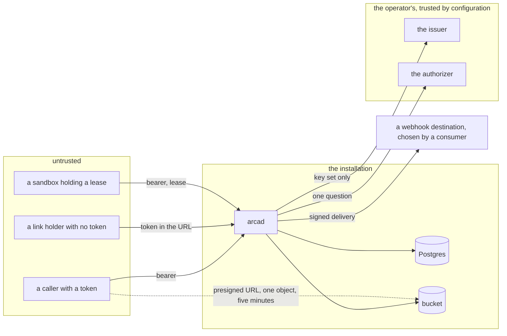

# Security and threat model

## Overview

Arca holds other people's bytes, hands out URLs that need no token, and
lets an unattended sandbox write into a space a person owns. This spec
names what is worth taking, who would take it, where the boundaries
between them are, and, for every threat, the one control that stops it
and the one test that proves the control is there. A control without a
test is a claim, and a test reads this file and fails when a row loses
its proof.

It is also the source of `SECURITY.md`, so a reviewer who arrives at the
repository reads four commitments and one document rather than seven
specs.

## Design

### Assets

| Asset | Where it lives |
|---|---|
| object bytes | the operator's bucket, under `ARCA_BUCKET_PREFIX` |
| paths, owners, checksums, grants, leases, the ledger, the audit log | the operator's Postgres |
| link and public grant tokens | the grants table, and every URL a holder has ever pasted |
| presigned URLs | in flight, in a `302`, in a materialize manifest, in a browser's history |
| webhook signing keys | the subscriptions table, and the receiver the consumer runs |
| `ARCA_BUCKET_SECRET_KEY`, `ARCA_DATABASE_URL`, `ARCA_AUTHORIZER_TOKEN`, `ARCA_WEBHOOK_SIGNING_KEY` | the server's configuration, mounted from a Secret |
| the record of who did what: the event log and the audit log | Postgres |
| the installation's availability | `arcad`, and the two stores behind it |

### Trust boundaries

Four boundaries. Between a caller and `arcad` the control is the
verifier and the authorizer. Between `arcad` and the two stores the
control is the operator's network and credentials, and a compromise
there is out of scope below. Between `arcad` and the issuer and
authorizer the control is configuration: `arcad` trusts them because the
operator named them, and calls the issuer for a key set and nothing
else. Between `arcad` and a webhook destination the control is the
destination rule, because the destination is chosen by a consumer and is
therefore not trusted at all.

### Adversaries

| Adversary | Holds | Wants |
|---|---|---|
| an authenticated caller | a valid bearer from a listed issuer | another subject's space, more room than its quota, an administrator's surface, a grant it was not given |
| a link holder | one token | the rest of the space, a write, another space's link |
| an anonymous prober | the network | a token by guessing, an object by path, the shape of what exists |
| a sandbox holding a lease | a token for the audience `arca`, one lease | another workspace, a lease it should have lost, bytes outside its subtree |
| a network position | the wire | a bearer, a link token, a presigned URL, a forged delivery |
| a webhook destination a consumer chose | a delivery | to be believed; to make `arcad` dial inside the operator's network |
| a compromised authorizer | the decision | to allow every action for every subject, including actions it does not recognise |
| a consumer of the module | an import of `object/`, `space/`, `authorizer/` | to derive a key for an object it does not own |

### Controls

Every row names the spec that owns the control and the test that proves
it. `Test` cells name test functions; criterion 1 holds them to that.

| Threat | Control | Spec | Test |
|---|---|---|---|
| a caller reaching another subject's space | every handler reads, asks the authorizer, then acts; a deny on the caller's own action is 403, a deny while resolving a reference is a 404 byte for byte identical to an absence | 006, 013 | `TestRouteTableActions`, `TestReadAskAct` |
| a revoked permission still honoured | an allow is cached per replica for the answer's `ttl`, 60 s by default and capped at 600 s; a deny for 5 s; unavailability never; the key is subject, action, and resource id. The cache window is the accepted staleness and the authorizer sets it per answer | 006 | `TestDecisionCache` |
| an allow that was never decided | the client fails closed on anything but a 200 carrying `allow`; one retry only when the connection failed before a response line; an `http://` endpoint off loopback is refused at start-up | 006 | `TestAuthorizerFailsClosed` |
| an authorizer that allows everything, including actions it does not know | `arcad check` asks the probe resource, the id `probe` of kind `Space`, which every authorizer must deny, and fails the installation when it is allowed | 012, 006 | `TestCheckRefusesAPermissiveAuthorizer` |
| a token minted for another service replayed at Arca | `aud` must contain `ARCA_OIDC_AUDIENCE`, `iss` must be listed, `iat` is required and no older than 24 hours, `exp` and `nbf` are enforced, and only RS256 and ES256 are accepted | 006 | `TestVerifierRefusals`, the family's audience conformance suite |
| a narrowed personal key used past its grants | `authz.Restrict` intersects the grants with the vocabulary before the question is asked; an action outside them is a deny with reason `grant`, indistinguishable on the wire | 006 | `TestRestrictedKey` |
| a presigned URL leaking from a redirect, a log, or a history | one object, one method, one expiry of five minutes, `blob.PresignTTL`; a signed URL is written to no log, no event, no audit detail, and no response body except a manifest the caller asked for | 003, 013, 018 | `TestPresignIsScoped`, `TestNoPresignedURLIsLogged` |
| a presigned URL outliving a revoke | nothing recalls a signed URL, so the exposure is exactly `PresignTTL`. Five minutes is that number, chosen against the download it must survive rather than against convenience | 003, 008 | `TestPresignTTL` |
| path traversal into another object | a path is refused when it holds `..` or `//`, starts or ends with `/`, or names a plane the server does not serve; the check runs before anything else on every route that takes a path | 005, 013 | `TestPathRule`, table-driven over the refusal cases |
| key confusion: a path that reaches another object's bytes | the bucket key derives from the object id and never from the path, so a path that slipped every check still addresses nothing. A move is one `UPDATE` and touches no key | 003, 001, 005 | `TestKeyIsTheId`, and 001's criterion 7 against a counting bucket |
| one installation reading another's objects in a shared bucket | every key carries `ARCA_BUCKET_PREFIX`, normalised at start-up, and a leading `/` in it is a configuration error | 003 | `TestKeyPrefix` |
| public link enumeration | 256 bits from `crypto/rand`, rendered base64url, under a unique index; an unknown, revoked, or expired token is the same `not_found`; the three link routes are rate limited per client address, which is what makes guessing cost more than it can pay | 008, this spec | `TestTokenEntropy`, `TestLinkRateLimit` |
| a link token in an access log or a referrer | the token is a path segment, so the access log records the grant id in place of the path for the three link routes, and a link response sets `Referrer-Policy: no-referrer` | 008, 018 | `TestLinkPathsAreNotLogged` |
| a link that grants more than reading | a token grant carries `read`; a create asking `write` or `manage` is `link_read_only` | 008 | 008's criterion 4 |
| quota bypass through multipart | the session is admitted against the declared size, and the completion is admitted again against the assembled size read from the store, which is the admission that counts. Bytes that landed before a refusal are aborted and reaped | 007, 010 | `TestQuotaOnComplete`, `TestMultipartOverrunIsReaped` |
| quota bypass by holding many open sessions | an open session's declared bytes count against the space until it completes or is reaped, so a thousand sessions do not fit under one quota | 007, 010 | `TestOpenSessionsCount` |
| a quota check that fails open | a usage query that fails is `storage_unavailable` and refuses the write. The service Arca replaces admitted it, so quota enforcement stopped exactly when the database was under pressure | 010 | `TestQuotaFailsClosed` |
| a workspace lease held by a sandbox that died | a lease carries an expiry, one hour by default and twenty-four hours at most, both constants of `internal/workspaces` that no configuration raises, and the reaper releases every lease past its expiry each `ARCA_REAP_INTERVAL`, so a workspace cannot wedge. A reaped writer's unsynced work is lost, which is the stated trade | 009, 010 | `TestLeaseExpires`, `TestReaperFreesAnOrphanLease` |
| two writers in one workspace | the lease is taken by one conditional `UPDATE` whose predicate is that no writer holds it, so a race yields one winner, never two | 009, 001 | 001's criterion 8 |
| a released or reaped attachment still writing | a sync checks that the attachment is active and that the workspace's lease is that attachment's; otherwise `attachment_gone` or `lease_not_held` | 009, 013 | `TestSyncRequiresTheLease` |
| a sandbox reaching outside its workspace | a lease authorizes one workspace subtree; a materialize manifest carries only the pinned paths, and a sync reconciles only under the workspace root | 009 | `TestLeaseIsConfinedToItsSubtree` |
| a bucket that ignores `If-None-Match: *` | every put carries it. A store that answers `NotImplemented` fails `arcad check`, is named by readiness, and the run is recorded as unconditional, logged once per process. The API's compare and swap is in SQL and does not depend on the bucket, so the loss is a collision guard, not the contract | 003, 012, 018 | `TestConditionalCreateRequired`, the store tier against MinIO and against a stub that refuses |
| a webhook aimed inside the operator's network | a destination must be `https`, and every resolved address of every connection attempt is checked in the dialer's control hook, which is what defeats a rebind that a registration-time check does not; loopback, private, link-local including the cloud metadata address, carrier-grade NAT, multicast, and unspecified addresses are refused; redirects are not followed | 011 | `TestDestinationRules`, table-driven over the address classes |
| a forged or replayed delivery | HMAC-SHA256 over the attempt timestamp and the body, recomputed per attempt, with both in the headers; a receiver refuses a timestamp older than five minutes, which is the receiver's half of the contract and the stub sink's behaviour | 011, 014 | `TestSignature`, `TestSinkVerifiesSignature` |
| a delivery carrying content | a delivery carries ids, paths, actions, and sizes, and no byte of an object, no token, no presigned URL, and no signing key | 011 | `TestDeliveriesCarryNoSecrets` |
| a webhook used as an amplifier | five second timeout, three bounded retries, and retirement of the subscription after twenty consecutive failures, with an event recording the retirement | 011 | `TestRetirement` |
| a flood, and the guessing that hides in one | a token bucket per subject after authentication, and one per client address before it; the second bounds both a flood of bad tokens and a search for a link token | this spec, 013 | `TestRateLimits` |
| a client request id used to inject into a log | `X-Request-Id` is kept only when it is at most 128 printable ASCII characters, and is replaced otherwise | 013 | `TestRequestId` |
| a body that exhausts memory | JSON bodies are capped and decoded with unknown fields refused; an object body needs a `Content-Length` and is capped at `ARCA_MAX_UPLOAD_BYTES`; above `ARCA_INLINE_BYTES` the bytes do not pass through the server at all | 013, 007 | `TestBodiesAndTypes` |
| an administrator acting unseen | every allow of `space.admin` writes an audit row, in the mutation's own transaction for a write and best effort for a read, and no route deletes from the table | 012 | 012's criteria 8, 9, and 10 |
| a secret in a log or a response | every key and bearer is read once at start-up and never logged; a webhook signing key and a link token are returned once at creation and are absent from every listing; the deploy manifests mount secrets from a Secret | 002, 011, 016, 018 | `TestLogsRedact`, `TestSecretsAreReturnedOnce` |
| a consumer of the module deriving another's key | `object.ID.Key` takes the prefix and an id and derives nothing from a path or an owner, so holding the package grants no ability the API does not | 003 | `TestKeyDerivationIsTotal` |
| a dependency with a known vulnerability | the `vuln` gate on every push, and a dependency list held to invariant 9 of [[001-architecture]] by `depcheck` | 002 | the gate |
| an image that is not what was released | keyless cosign signatures, an SBOM attestation, and a build provenance attestation on both images, verified from a clean runner before the release exists | 016 | the `release-verify` job |
| a test that touches a developer's real state | every tier binds `:0`, keeps files under `t.TempDir()`, uses a schema and a bucket prefix of its own, and removes both | 014 | `TestTiersAreIsolated` |

### Configuration this spec needs

Two variables, each of which joins the table of
[[002-repository-scaffold]]. Every other control here is a constant or
reads a variable that table already holds.

| Variable | Default | Meaning |
|---|---|---|
| `ARCA_REQUESTS_PER_MINUTE` | `600` | the token bucket per subject after authentication; `0` disables it |
| `ARCA_UNAUTHENTICATED_REQUESTS_PER_MINUTE` | `60` | the token bucket per client address before authentication, which bounds bad tokens and link token guessing |

The authorizer's `limits.requests_per_minute` overrides the first for
the subject it names, for the answer's `ttl` ([[006-identity]]). Every
response carries `RateLimit-Limit`, `RateLimit-Remaining`, and
`RateLimit-Reset`, and a 429 adds `Retry-After`.

### What is out of scope

- A compromised `arcad` host. It holds the bucket credential, the
  database URL, the authorizer bearer, and the webhook signing key, and
  therefore everything. An operator protects it as the root of the
  installation.
- A compromised bucket or database. They are the installation, not a
  boundary inside it.
- Encryption at rest and in transit between `arcad` and its two stores.
  Both are the operator's: a bucket's server-side encryption and a
  Postgres connection's TLS are configured where they live, and
  `ARCA_DATABASE_URL` carries the mode.
- The security of the issuer and of the authorizer. Arca trusts what the
  operator configured, and the blast radius of a compromised authorizer
  is every space, which is why `arcad check` tests it and why an
  unavailable answer is a refusal rather than a fallback.
- A link holder who gives the link away. The token is the capability;
  that is what a link is, and the control is that it grants reading one
  subtree and is revoked by one row.
- The hosted platform's own policy: who may share with whom, which
  principals may see which paths, and whether an approval queue stands
  between a request and a grant. Arca left all three behind
  ([[008-shares-and-links]], [[013-api]]) and they are answered in an
  authorizer.
- Denial of service beyond the two rate limits, and the cost a large but
  authorized upload imposes on a shared bucket.
- Side channels between installations sharing one bucket, beyond the key
  prefix.

### The root file

`SECURITY.md` carries the reporting address, the response times, and
four commitments, each a row above:

1. Every `/v1` request carries a token from an issuer the operator
   listed, and nothing acts before a decision. An unavailable decision
   is a refusal, and a refusal is indistinguishable from a missing
   object.
2. A byte leaves Arca through an authorized read or a presigned URL that
   names one object, one method, and five minutes, and through nothing
   else.
3. A public link is a 256 bit capability that grants reading one
   subtree, is revoked by one row with no grace window, and can never
   grant a write.
4. Arca reads no claim for meaning. Nothing about a token but its
   issuer, subject, audience, and validity changes what Arca does, so an
   installation's access policy lives in its authorizer and nowhere in
   this code.

A test reads `SECURITY.md` and this file and holds each commitment to a
row of the controls table.

### What arrives from Drive

There is no threat model to inherit. The service Arca replaces has no
`SECURITY.md` and no archived security spec; its archive's spec 016 is
about clone tuning. What arrives is code, and this spec is the first
time the reasoning behind it is written down.

| From | What arrives | What changes |
|---|---|---|
| `drive/internal/storage/s3.go` | the five minute `PresignTTL`, the 24 hour part TTL, and the discipline that no signed URL is logged | unchanged, and now stated as a control with a test |
| `drive/internal/handler/handler.go`'s `validatePath` | the path rule | unchanged in substance; the plane list is [[001-architecture]]'s four rather than five |
| `drive/internal/handler/shares.go`'s `newToken` | 256 bits from `crypto/rand` | rendered base64url rather than hex, so the URL is shorter at the same entropy |
| `drive/internal/webhook/worker.go`'s `GuardedClient` and `PublicIP` | the destination rule and the dialer control hook | carrier-grade NAT, `100.64.0.0/10`, joins the refused classes; `net.IP.IsPrivate` does not cover it and the service Arca replaces admitted it |
| the same file's signing | HMAC-SHA256 per delivery | the timestamp joins the signed input and the headers; the service Arca replaces signed the body alone, so a delivery could be replayed forever and a receiver had no window to enforce |
| `drive/internal/handler/quota.go` | the admission chokepoint and the second admission after assembly | the fail-open on a usage query becomes a refusal |
| `drive/internal/handler/attach.go` | the conditional lease acquisition, the one hour default and twenty-four hour ceiling, and the reaper that frees an orphan lease | unchanged, and now stated as a control with a test |
| `drive/internal/handler/admin.go`'s `admin_audit` writes | the transactional audit rule | it moves to where the decision is made, so every `space.admin` allow is recorded, not only the ones on admin routes ([[012-administration]]) |
| nothing | the rate limits, `Referrer-Policy` on link responses, the conditional-create requirement, the probe question, and `SECURITY.md` | new. The service Arca replaces had no rate limit of any kind, on any route, including the unauthenticated link routes |

## Not in this spec

Each control's own design, which its spec owns. The deploy manifests
that mount the secrets ([[016-release-and-installation]]). The redaction
rules and the access log's fields ([[018-observability]]). The suite an
installation must pass, which includes the refusal cases
([[017-conformance-suite]]).

## Acceptance criteria

| # | Criterion | Proved by |
|---|---|---|
| 1 | Every `Test` cell in the controls table names a function `go test -list ./...` finds, and every test named appears in the acceptance criteria of the spec its `Spec` cell names | `TestThreatModelControlsHaveTests`, reading this file and the spec deck |
| 2 | Every commitment in `SECURITY.md` maps to a row of the controls table, and every row's spec is in this file's `depends_on` | `TestSecurityPolicyMatchesTheModel`, reading both files |
| 3 | A canary object's bytes, a canary link token, and a canary webhook signing key appear in no log line, no event, no audit detail, no webhook delivery, and no list response across the whole e2e tier | `TestNoSecretsLeak`, grepping the tier's captured output |
| 4 | No signed URL appears in any log line, and the three link routes log a grant id rather than a path | `TestNoPresignedURLIsLogged`, `TestLinkPathsAreNotLogged` |
| 5 | A path holding `..`, `//`, a leading or trailing `/`, or an unknown plane is refused on every route that takes a path, and no bucket key is ever derived from a path | `TestPathRule`, `TestKeyIsTheId` |
| 6 | A caller that completes a multipart larger than it declared is refused, the bytes are aborted, and the space's usage is unchanged | `TestMultipartOverrunIsReaped` |
| 7 | A usage query failure refuses the write rather than admitting it | `TestQuotaFailsClosed` |
| 8 | A workspace whose writer stops calling is writable again after the lease expires and one reaper pass, with no operator action | `TestReaperFreesAnOrphanLease` |
| 9 | A bucket that answers `NotImplemented` to a conditional create fails `arcad check` and is named by readiness, and the server still serves with the condition recorded as unavailable | `TestConditionalCreateRequired` against a refusing stub |
| 10 | A webhook destination that resolves to a loopback, private, link-local, carrier-grade NAT, multicast, or unspecified address is refused, on the first attempt and on a rebind between attempts | `TestDestinationRules` |
| 11 | A delivery replayed outside the five minute window is refused by the sink, and a delivery whose body was altered fails the signature | `TestSinkVerifiesSignature` |
| 12 | The 601st authenticated request in a minute is 429 with the four headers, and the 61st unauthenticated request from one address is 429, link routes included | `TestRateLimits` |
| 13 | An authorizer that allows the probe resource fails `arcad check`, and one that never answers yields 503 and never an allow | `TestCheckRefusesAPermissiveAuthorizer`, `TestAuthorizerFailsClosed` |
| 14 | Every allow of `space.admin` leaves an audit row, and a failed mutation leaves none | 012's criteria 8 and 9 |
| 15 | `cosign verify` and `gh attestation verify` accept both released images from a clean runner | the `release-verify` job of [[016-release-and-installation]] |
