# Release and installation

## Overview

A self-hoster installs Arca from a release, not from a checkout, and
upgrades on a schedule of their own. A `v*` tag is a release: two
multi-arch images, binary archives for four platforms with checksums,
cosign signatures, a bill of materials and a provenance attestation per
image, a deploy archive, and a GitHub release whose body is the
CHANGELOG section for that version. This spec says what the tag
produces, what the deploy tree contains, what an operator does from an
empty cluster to a serving installation, and what the version number
promises across an upgrade.

The pipeline is this repository's own, in
`.github/workflows/release.yml`, and calls no shared workflow. The
shared `service-release.yml` builds one architecture and runs its
deploy and its smoke as one job it does not expose as a callable step;
a core that an operator installs needs archives, signatures, a bill of
materials, and a deploy archive that workflow does not produce, and
needs a tag on a fork to publish every artifact under the fork's own
namespace with no cluster anywhere near it.

## Current state

Not built. `verify.yml` runs the gate ([[002-repository-scaffold]]),
there is no `release.yml`, no `deploy/`, no `tools/`, and no install
document. The CHANGELOG rule is already in force: the pre-push hook
refuses a `v*` tag with no section.

## Design

### Artifacts per release

| Artifact | Where | Built from |
|---|---|---|
| `ghcr.io/latere-ai/arcad:<tag>` | GHCR, `linux/amd64` and `linux/arm64` as one multi-arch image | `Dockerfile.ci`, which copies the binary the pipeline built onto the runtime stage of [[002-repository-scaffold]]'s `Dockerfile`; the two stages are byte for byte the same between their markers |
| `ghcr.io/latere-ai/arca-stubs:<tag>` | the same | `Dockerfile.stubs`: the stub issuer and the stub authorizer of [[014-test-stubs-and-tiers]] in one image, so an operator's first installation and the `kind` example run a released, signed stub and not a checkout |
| `arcad_<tag>_<os>_<arch>.tar.gz` | the GitHub release | `go build` for `linux` and `darwin` on `amd64` and `arm64`, with the `-ldflags` of [[002-repository-scaffold]] setting `internal/version`, so a binary from the pipeline and one from `make build` report their identity the same way |
| `checksums.txt` | the GitHub release | SHA-256 over every archive, signed with `cosign sign-blob` keyless |
| `deploy-<tag>.tar.gz` | the GitHub release | `deploy/base` and `deploy/examples` with both image references rewritten to the tag; `deploy/prod` is not in it |
| `sbom-arcad.spdx.json`, `sbom-arca-stubs.spdx.json`, `sbom-module.spdx.json` | the GitHub release | SPDX from each image and from the module graph |
| release notes | the GitHub release | the `CHANGELOG.md` section for the version, the candidate smoke evidence, the conformance report of [[017-conformance-suite]], and the image digests |

Every image is signed keyless with the workflow's OIDC identity, which
is what an operator verifies without holding a key. Each image also
carries an SBOM attestation and a build provenance attestation through
`actions/attest-sbom` and `actions/attest-build-provenance`, so
`gh attestation verify oci://<image> --repo <owner>/<repo>` answers for
an image before it runs.

The two image names in the table are what a tag on this repository
publishes. The workflow writes neither namespace down: it derives the
namespace from the repository owner running it, overridable by the
build-time variable `ARCA_RELEASE_IMAGE_NAMESPACE`. Every value the
pipeline reads carries the `ARCA_` prefix, the same one the server
reads, so an operator forking the repository greps for one string; none
of them is a runtime setting and none is in
[[002-repository-scaffold]]'s table, which is the server's
configuration and not the pipeline's. A test refuses a namespace literal
in the workflow's build, push, and sign steps and in the deploy
archive, so a fork's tag publishes to the fork's packages and pins the
fork's images in its manifests.

`GET /version` on a released node serves the tag as `version`. That is
the deploy confirmation the smoke reads: a rollout that returned while
old pods still serve reports the old tag and fails the release.

### The pipeline

```mermaid
flowchart LR
  build[build: archives, images, signatures, attestations, deploy archive]
  candidate[candidate: the published image against MinIO and Postgres]
  conformance[conformance: the kind stack from the published images runs 017]
  deploy[deploy: the operator's overlay, gated on a repository variable]
  publish[publish: the GitHub release]
  install[install-release: docs/install.md against a bare kind cluster]
  verify[release-verify: a clean runner checks sums, signatures, attestations]
  build --> candidate --> conformance --> deploy --> publish --> install --> verify
```



| Job | Proves | Stops the release when |
|---|---|---|
| `build` | the tag's tree builds into both images for both architectures and into the four archives; every artifact is signed | the tag carries SemVer build metadata, which an image tag cannot hold; a build, a push, or a signature fails |
| `candidate` | the pushed bytes start beside a fresh Postgres and a fresh MinIO, `arcad migrate` applies every migration, `arcad check` passes, the probes answer, and `/version` equals the tag | any of those does not happen inside the wait |
| `conformance` | the kind stack of [[014-test-stubs-and-tiers]], brought up from the published images, is green under [[017-conformance-suite]] | any case fails, or a case skips that the release run's skip list does not name |
| `deploy` | the operator's overlay applies, the Deployment rolls to the new image, and the live installation reports the tag | the rollout does not complete inside ten minutes, or the live smoke fails |
| `publish` | the release exists with the CHANGELOG section as its body, the smoke and conformance evidence appended, every asset attached | there is no CHANGELOG section for the tag |
| `install-release` | `docs/install.md` walks green against a bare kind cluster from the published artifacts alone, with no checkout on the path of any command, and ends with the conformance suite | a step of the document does not work as written |
| `release-verify` | from a clean runner: `cosign verify` accepts both images, `cosign verify-blob` accepts `checksums.txt`, `sha256sum -c` passes over the downloaded archives, `gh attestation verify` accepts both images, and the release body equals the changelog section | any check fails |

`deploy` runs only when the repository variable `ARCA_RELEASE_DEPLOY`
is set, with the kubeconfig held in the repository secret
`ARCA_KUBECONFIG`. Both are CI values under the rule above, so neither
is in [[002-repository-scaffold]]'s table. The operator
who runs the hosted platform that builds on Arca sets them on their own
repository; a fork sets neither, so a tag on a fork publishes every
artifact and the job is skipped. The job applies `deploy/prod`, sets
the image on the Deployment to the tag, waits for the rollout, and then
runs `tools/smoke/release.sh` against the installation's own origin,
whose markdown output is the evidence in the release body.

The every-push install walk is a separate `install` job in
`verify.yml`, not in `release.yml`: no tag exists at push time, so it
renders `deploy/examples/kind` with the image references overridden to
the development image built earlier in the same run. On a tag,
`install-release` supersedes it against the published artifacts.

### Cutting a tag

`go tool lateregate release <version>` is the only way a tag is made.
It refuses while CI is red on the commit being tagged, moves the notes
under `## Unreleased` in `CHANGELOG.md` into a section for the version,
commits, tags, and pushes. A tag pushed by hand with no section is
refused by the pre-push hook and again by the `publish` job, so a
release without notes does not reach GHCR or the releases page.

### The deploy tree

```
deploy/base/            kustomize, no namespace: an overlay sets it
  deployment.yaml       arcad serve, the two listeners, the probes, the security context
  service.yaml          the public port; the internal port is scraped, not routed
  hpa.yaml              replicas by CPU; arcad is stateless (invariant 3)
  poddisruptionbudget.yaml
  networkpolicy.yaml    egress to the bucket, the database, the issuers, the authorizer; ingress from the ingress controller and the scraper
  serviceaccount.yaml   no Role and no RoleBinding: arcad speaks to no API server (invariant 9)
  prometheusrule.yaml   the alerts of [[018-observability]]; beside the kustomization, not in it
  kustomization.yaml
deploy/bootstrap/       applied by hand once, before the overlay
  namespace.yaml
  secrets.example.yaml  the shape of the Secret the base mounts, with no value
  README.md
deploy/examples/kind/   MinIO, Postgres, the stubs image, node ports, up.sh and down.sh
deploy/examples/aws/    ingress, public URL, replicas, an S3 bucket and RDS
deploy/examples/digitalocean/  the same against Spaces and a managed Postgres
deploy/prod/            the operator's overlay
```

The Deployment runs `arcad serve` with `ARCA_PUBLIC_ADDR` and
`ARCA_INTERNAL_ADDR` at their defaults, `terminationGracePeriodSeconds`
90 to cover the drain of [[002-repository-scaffold]], `runAsNonRoot`,
every capability dropped, `seccomp: RuntimeDefault`, no privilege
escalation, and a read-only root filesystem with no writable volume,
because `arcad` keeps nothing on local disk. A second Deployment, off
by default in the base and enabled by a patch, runs `arcad reap` for an
installation that wants the reconciler of
[[010-quotas-events-and-reaper]] off the API replicas. `arcad migrate`
is a Job the operator runs before each upgrade, never an init container,
so two replicas rolling at once do not migrate twice.

`prometheusrule.yaml` sits in `deploy/base` and is not a resource of
its kustomization. A `PrometheusRule` needs the Prometheus operator's
CustomResourceDefinition, which Arca does not require and the kind
example does not install, so a base that named it would fail to apply
on every installation without that operator. An installation that runs
the operator applies the file beside the base.
[[018-observability]] owns what is in it.

`deploy/prod` is the operator's overlay and the one directory in the
tree that may name the installation it serves: it is declared in
`.lateregate.yaml` under both `identity.skip` and `identity.overlays`,
so the gate's `no-latere-value` rule reads the addresses it sets rather
than refusing them. Everything else in the tree names a host only as an
example under `example.com`. It is not in the deploy archive, because
it is one operator's configuration and not a starting point.

The base's container environment declares `ARCA_OIDC_AUDIENCE: arca`,
which is the first deployment manifest in the tree. The gate's
`audience` and `bearers` identity rules, which skip today because there
is no manifest, start running with this spec, so the base and every
example must declare the audience [[001-architecture]] fixes and pass a
bearer nowhere but in a Secret reference.

### Installing

`docs/install.md` is one document, walked by CI, that goes from nothing
to a serving installation. Each step names what fails when it is
skipped.

| Step | What the operator does | Checked by |
|---|---|---|
| 1 | create a bucket on any store with the S3 API that honours `If-None-Match: *` on put ([[003-object-store]]), and a credential that may put, get, head, delete, list, and presign under one prefix | `arcad check` |
| 2 | create a Postgres 16 or newer database and a role that owns its schema | `arcad check` |
| 3 | choose the issuers whose tokens are verified and set `ARCA_OIDC_ISSUERS`; tokens must carry `aud: arca` unless `ARCA_OIDC_AUDIENCE` says otherwise ([[006-identity]]) | `arcad check` reaches each issuer's key set |
| 4 | optionally set `ARCA_AUTHORIZER_URL` and `ARCA_AUTHORIZER_TOKEN`; with neither, the owner policy applies and `ARCA_ADMIN_SUBJECTS` names the administrators | `arcad check` asks one probe question about a reserved space that belongs to nobody, and the line passes only on a deny: an endpoint that answers `200` to everything fails it. The owner policy denies the probe too, so the line holds in both configurations |
| 5 | `kubectl apply -k deploy/bootstrap`, then write the Secret from `secrets.example.yaml` | the overlay fails to apply without it |
| 6 | run `arcad migrate` as a Job and wait for it | the server refuses to serve against a schema below its own ([[004-metadata-store]]) |
| 7 | copy an example overlay, set `ARCA_PUBLIC_URL` and the bucket and database references, `kubectl apply -k` it | the rollout |
| 8 | run `arcad check` in the namespace: one line per requirement, exit 1 on any failure ([[012-administration]]) | the document ends here |
| 9 | run the conformance suite of [[017-conformance-suite]] against the new installation with a token from the issuer | the last block of the document |

Every variable in the steps is [[002-repository-scaffold]]'s; this spec
introduces no configuration.

### What a version promises

| Change | Bump |
|---|---|
| a route, a field, an error code, a configuration variable, or an event payload removed or given a different meaning ([[013-api]]) | major |
| a new route, field, variable, metric, event kind, or capability | minor |
| a fix with no visible change | patch |

Before `v1.0.0` a minor may remove a field of the API or a package in
the module root with a CHANGELOG entry that names the break. From
`v1.0.0` the API contract of [[013-api]] and the package promises of
[[001-architecture]] bind.

### Upgrading

Migrations are forward-only. Each migration is additive or is preceded
by one release that writes both shapes, so a replica of release N and a
replica of release N+1 serve the same database during a rolling update.
A binary refuses to start against a schema recorded above its own,
naming both versions, so a downgrade across a migration stops before it
corrupts anything rather than after.

The API keeps N-1 compatibility: a client written against release N-1
works against release N inside one major. A field is deprecated in one
minor, documented in `docs/upgrades/`, and removed no earlier than the
next major.

A rollback inside a minor series is a rollback of the image. A rollback
across a migration is refused by the schema guard above, and
`docs/upgrades/` says what to restore instead: a `pg_dump` of the
database taken before the migration, with the bucket untouched, because
the bucket holds no schema and a row that names a key the database no
longer has is a reaper finding and not a loss
([[010-quotas-events-and-reaper]]).

The two most recent minor series receive patches. A release is cut only
from a green `main` with [[017-conformance-suite]] passed against the
candidate image.

### The release smoke

`tools/smoke/release.sh` asserts a running installation from the
outside: `/livez` answers 200 with the body `ok`, `/readyz` answers
200, `/openapi.json` answers 200 so a broken embed is caught,
`/version` answers 200, and with `TAG` set its `version` field equals
the tag. It reads `BASE_URL` for the target and writes a markdown
evidence block to `OUTPUT_MD`, which the `candidate` and `deploy` jobs
append to the release body. `tools/smoke` holds a Go test that runs the
script against a stub server and asserts it fails on a version that
differs from `TAG`, passes when they match, and records the served
version either way, so the script itself is covered by the gate.

### What arrives from Drive

| From the service | What it becomes |
|---|---|
| `drive/.github/workflows/release.yml` | the shape of `release.yml` here: the four-job spine of build, candidate, deploy, publish; the refusal of a tag carrying SemVer build metadata; keyless cosign signing in `build` and verification from a clean checkout before the release is created; the SBOM generated in the job that attaches it; the candidate job that starts the published image beside a fresh Postgres and MinIO before anything reaches a cluster |
| the same file's deploy step | the shape of the `deploy` job, without the provider: the service fetched a managed-cluster kubeconfig from one vendor's CLI and named one origin inline. Here the job is gated on a repository variable, takes its kubeconfig from a secret, applies `deploy/prod`, and smokes the origin that overlay sets, so the pipeline is the same on a fork with neither set |
| `drive/test/release-smoke.sh` | `tools/smoke/release.sh`, with the same `BASE_URL`, `TAG`, and `OUTPUT_MD` contract and the same rule that the served version must equal the tag. The default target is dropped: the script takes its target and has none built in |
| `drive/test/smoke/smoke_test.go` | `tools/smoke`'s Go test, unchanged in purpose |
| `drive/deploy` | the starting point for `deploy/base`: the service shipped a Deployment, a Service, and two Ingresses under `deploy/base`, with `deploy/staging` and `deploy/prod` as the only overlays. The base gains the HPA, the PodDisruptionBudget, the NetworkPolicy, the ServiceAccount, and the PrometheusRule; the Ingress moves out of the base into the examples, because an ingress class is an installation's choice; `deploy/bootstrap` and `deploy/examples` are new |
| `drive/specs/027-release-pipeline.md` | the reasoning for a repository-owned pipeline over the shared one, and for a candidate job as the guard against an image that builds differently from CI. What changes: the service released one image for one architecture to one cluster and published no archive, no checksum, no attestation, and no deploy archive, because it had no installer but itself. Arca has operators, so every one of those is an artifact, the runners are the public hosted ones rather than a self-hosted VM, and `deploy` is the optional job rather than the point of the pipeline |

## Not in this spec

A Helm chart. A registry other than GHCR. Signing with a key Latere
holds; keyless signing binds an artifact to the workflow identity,
which is what an outside operator can check. The tiers the
`conformance` job runs on ([[014-test-stubs-and-tiers]]) and the suite
it runs ([[017-conformance-suite]]). The contents of the alert rules
([[018-observability]]). The order the code arrives in
([[019-migration-from-drive]]).

## Acceptance criteria

| # | Criterion | Proved by |
|---|---|---|
| 1 | A tag produces every artifact in the table for both architectures, `cosign verify` accepts both images, `cosign verify-blob` accepts `checksums.txt`, `sha256sum -c` passes, `gh attestation verify` accepts both images, and the release body equals the CHANGELOG section | the `release-verify` job |
| 2 | The workflow and the deploy archive fix no image namespace, so a fork's tag publishes under the fork's owner | `TestReleasePublishesUnderTheOwnersNamespace` over `release.yml` and the rendered archive |
| 3 | `Dockerfile` and `Dockerfile.ci` share the runtime stage byte for byte | `TestRuntimeStagesMatch` |
| 4 | Every overlay renders, the base carries every Pod security field, and no file outside `deploy/prod` names a real host | `TestOverlaysRender`, `TestBaseIsConfined`, and the gate's `no-latere-value` rule |
| 5 | The published image migrates, checks, and reports the tag against a fresh Postgres and MinIO | the `candidate` job |
| 6 | `docs/install.md` walks green against a bare kind cluster on every push, and against the published artifacts on a tag | the `install` job of `verify.yml` and the `install-release` job |
| 7 | The release smoke fails on a served version that differs from `TAG`, passes when they match, and records the served version in the evidence | `tools/smoke`'s Go test |
| 8 | A binary started against a schema recorded above its own refuses to start and names both versions | `TestSchemaGuardRefusesADowngrade` against [[004-metadata-store]]'s guard |
| 9 | The previous release's conformance suite passes against this release's binary, which is what N-1 compatibility means | the `conformance` job, running the suite [[017-conformance-suite]] pins to the previous tag; that spec owns the criterion |
| 10 | A tag with no CHANGELOG section is refused before anything is pushed | the gate's pre-push hook and the `publish` job |
