# Release and installation

## Overview

A self-hoster installs Arca from a release, not from a checkout, and
upgrades on a schedule of their own. A `v*` tag is a release: two
multi-arch images, binary archives for four platforms with checksums,
cosign signatures, a bill of materials and a provenance attestation per
image, a deploy archive, and a GitHub release whose body is the
CHANGELOG section for that version. This spec says what the tag
produces, what the deploy tree contains, what an operator does from an
empty cluster to a serving installation, and what the version number
promises across an upgrade.

The pipeline is this repository's own, in
`.github/workflows/release.yml`, and calls no shared workflow. The
shared `service-release.yml` builds one architecture and runs its
deploy and its smoke as one job it does not expose as a callable step;
a core that an operator installs needs archives, signatures, a bill of
materials, and a deploy archive that workflow does not produce, and
needs a tag on a fork to publish every artifact under the fork's own
namespace with no cluster anywhere near it.

## Current state

The deploy tree, the pipeline, the smoke and the two operator documents
are in the tree and the gate is green at every commit. `v0.1.7` is the
release: run `35467474612` on 2026-09-19 built and pushed both multi-arch
images, signed and attested them, proved them on the kind stack under
[[017-conformance-suite]], paused at `deploy` for the maintainer's
approval, rolled production at `https://api.latere.ai`, and published the
release at 20:44. `deploy/prod` and `SECURITY.md` carry that version,
which is what the two release stamps of `.lateregate.yaml` are for. What
is still not in the tree is [[026-installation-verification-jobs]].

Seven tags were spent before it, and what they cost and taught is in the
Outcome below and in [[019-migration-from-drive]]'s window. The first two
are recorded here because the fixes for them are in this spec's tree.

`v0.1.0`, 2026-09-19 at 01:50, failed in `build` before any image was
pushed. `Dockerfile.ci` declared `TARGETOS` and `TARGETARCH` before the
runtime stage's `FROM`, where an ARG is in scope for FROM lines only, so
the stage's COPY read them empty and looked for `bin/_/arcad`; and
`Dockerfile.stubs`, which the workflow builds, did not exist. Both are
fixed with the two tests that would have caught them,
`TestTheReleaseImageCopiesWhatThePipelineBuilt` reading the ARGs'
position and `TestTheStubsImageBuildsTheStubsCommand`; both images were
built and run locally with podman.

`v0.1.1`, 2026-09-19 at 05:27, got through `build`: both multi-arch
images were pushed, signed and attested, and the archives, the checksums
and the three SPDX documents were produced. It failed in `conformance`,
where `arcad` crash-looped on the kind stack and the rollout timed out
after five minutes. The cause is the base's `arcad-egress`, which admits
53, 80, 443, 5432, 4317 and 4318 and nothing else. The stub issuer of
[[014-test-stubs-and-tiers]] listens on 8081, which no policy named, so
the CNI dropped the connection rather than refusing it and the replica
died on `warm http://arca-stubs:8081: Client.Timeout exceeded while
awaiting headers`. `deploy/examples/kind/networkpolicy-stack.yaml` now
admits 8081, 8082 and 9000, and
`TestEveryOverlayAdmitsTheEgressItsEndpointsNeed` holds every overlay's
dialled endpoints against the ports its policies admit, so the class is
covered and not only the instance. The Design's deploy tree says the
rule below.

What those two failures cost was five more tags and one habit: every cut
after a red run needs the maintainer's `-force-red`, because `lateregate
release` reads the previous tag's run and the previous tag's run kept
being red. The five are [[019-migration-from-drive]]'s list, and the
Outcome below says what the whole set taught.

The pipeline carries three things those runs put in it. Signing retries
three times with a pause, because `v0.1.3`'s first run was lost to one
connection reset from `timestamp.sigstore.dev` after the images were
already pushed. The `conformance` job dumps the stack on failure and
reads `/readyz` through a port-forward with `curl`, because `kubectl
--raw` turns a 503 into its own error and drops the body, which is where
`arcad` names the requirement it is waiting on, and `v0.1.2`'s run was
lost for want of that sentence. And the job sets
`ARCA_TEST_S3_ENDPOINT`, which the suite's `-s3-endpoint` reads, because
a presigned URL signed for the host the pods resolve is not a host the
runner can dial.

The CHANGELOG rule is in force: the pre-push hook refuses a `v*` tag
with no section, and the `publish` job reads the same section again.
`v0.1.7`'s `publish` job read it and created the release from it.

Criterion 8 was written against a guard the tree does not have, and the
tree is right. `store.Pending` answers no migration for a database ahead
of the binary, with the comment that a rollback in progress is allowed,
so a binary started against a schema recorded above its own serves. That
is what a rollback needs: release N's binary has to serve release N+1's
schema while the replicas turn over, and forward-only migrations are
written so it can. The guard that exists is the other direction, a
database behind the binary, which is [[004-metadata-store]]'s criterion
2 and is `TestTheServerRefusesToStartAgainstADatabaseBehindIt`. The
criterion and the Upgrading section below now say that, and the
`Pending` half has a test of its own; nothing here is owed to
[[004-metadata-store]].

## Design

### Artifacts per release

| Artifact | Where | Built from |
|---|---|---|
| `ghcr.io/latere-ai/arcad:<tag>` | GHCR, `linux/amd64` and `linux/arm64` as one multi-arch image | `Dockerfile.ci`, which copies the binary the pipeline built onto the runtime stage of [[002-repository-scaffold]]'s `Dockerfile`; the two stages are byte for byte the same between their markers |
| `ghcr.io/latere-ai/arca-stubs:<tag>` | the same | `Dockerfile.stubs`: the stub issuer and the stub authorizer of [[014-test-stubs-and-tiers]] in one image, so an operator's first installation and the `kind` example run a released, signed stub and not a checkout |
| `arcad_<tag>_<os>_<arch>.tar.gz` | the GitHub release | `go build` for `linux` and `darwin` on `amd64` and `arm64`, with the `-ldflags` of [[002-repository-scaffold]] setting `internal/version`, so a binary from the pipeline and one from `make build` report their identity the same way |
| `checksums.txt` | the GitHub release | SHA-256 over every archive, signed with `cosign sign-blob` keyless |
| `deploy-<tag>.tar.gz` | the GitHub release | `deploy/base` and `deploy/examples` with both image references rewritten to the tag; `deploy/prod` is not in it |
| `sbom-arcad.spdx.json`, `sbom-arca-stubs.spdx.json`, `sbom-module.spdx.json` | the GitHub release | SPDX from each image and from the module graph |
| release notes | the GitHub release | the `CHANGELOG.md` section for the version, the candidate smoke evidence, the conformance report of [[017-conformance-suite]], and the image digests |

Every image is signed keyless with the workflow's OIDC identity, which
is what an operator verifies without holding a key. Each image also
carries an SBOM attestation and a build provenance attestation through
`actions/attest-sbom` and `actions/attest-build-provenance`, so
`gh attestation verify oci://<image> --repo <owner>/<repo>` answers for
an image before it runs.

The two image names in the table are what a tag on this repository
publishes. The workflow writes neither namespace down: it derives the
namespace from the repository owner running it, overridable by the
build-time variable `ARCA_RELEASE_IMAGE_NAMESPACE`. Every value the
pipeline reads carries the `ARCA_` prefix, the same one the server
reads, so an operator forking the repository greps for one string; none
of them is a runtime setting and none is in
[[002-repository-scaffold]]'s table, which is the server's
configuration and not the pipeline's. A test refuses a namespace literal
in the workflow's build, push, and sign steps and in the deploy
archive, so a fork's tag publishes to the fork's packages and pins the
fork's images in its manifests.

`GET /version` on a released node serves the tag as `version`. That is
the deploy confirmation the smoke reads: a rollout that returned while
old pods still serve reports the old tag and fails the release.

### The pipeline

```mermaid
flowchart LR
  build[build: archives, images, signatures, attestations, deploy archive]
  candidate[candidate: the published image against MinIO and Postgres]
  conformance[conformance: the kind stack from the published images runs 017]
  deploy[deploy: the operator's overlay, gated on a repository variable]
  publish[publish: the GitHub release]
  install[install-release: docs/install.md against a bare kind cluster]
  verify[release-verify: a clean runner checks sums, signatures, attestations]
  build --> candidate --> conformance --> deploy --> publish --> install --> verify
```



| Job | Proves | Stops the release when |
|---|---|---|
| `build` | the tag's tree builds into both images for both architectures and into the four archives; every artifact is signed | the tag carries SemVer build metadata, which an image tag cannot hold; a build, a push, or a signature fails |
| `candidate` | the pushed bytes start beside a fresh Postgres and a fresh MinIO, `arcad migrate` applies every migration, `arcad check` passes, the probes answer, and `/version` equals the tag | any of those does not happen inside the wait |
| `conformance` | the kind stack of [[014-test-stubs-and-tiers]], brought up from the published images, is green under [[017-conformance-suite]] | any case fails, or a case skips that the release run's skip list does not name |
| `deploy` | the operator's overlay applies, the Deployment rolls to the new image, and the live installation reports the tag | the rollout does not complete inside ten minutes, or the live smoke fails |
| `publish` | the release exists with the CHANGELOG section as its body, the smoke and conformance evidence appended, every asset attached | there is no CHANGELOG section for the tag |
| `install-release` | `docs/install.md` walks green against a bare kind cluster from the published artifacts alone, with no checkout on the path of any command, and ends with the conformance suite | a step of the document does not work as written |
| `release-verify` | from a clean runner: `cosign verify` accepts both images, `cosign verify-blob` accepts `checksums.txt`, `sha256sum -c` passes over the downloaded archives, `gh attestation verify` accepts both images, and the release body equals the changelog section | any check fails |

`deploy` runs only when the repository variable `ARCA_RELEASE_DEPLOY`
is set, with the kubeconfig held in the repository secret
`ARCA_KUBECONFIG`. Both are CI values under the rule above, so neither
is in [[002-repository-scaffold]]'s table. The operator
who runs the hosted platform that builds on Arca sets them on their own
repository; a fork sets neither, so a tag on a fork publishes every
artifact and the job is skipped. The job applies `deploy/prod`, sets
the image on the Deployment to the tag, waits for the rollout, and then
runs `tools/smoke/release.sh` against the installation's own origin,
whose markdown output is the evidence in the release body.

The every-push install walk is a separate `install` job in
`verify.yml`, not in `release.yml`: no tag exists at push time, so it
renders `deploy/examples/kind` with the image references overridden to
the development image built earlier in the same run. On a tag,
`install-release` supersedes it against the published artifacts.

### The deployment is confirmed in GitHub

The `deploy` job runs under `environment: production`, with `url` set to
the installation's public address, so the rollout is a GitHub deployment
and not a step buried in a log.

The repository's `production` environment carries two rules. A required
reviewer names the maintainer, and a deployment branch policy admits
tags matching `v*` and nothing else. Together they make the shape of a
release plain: a `v*` tag builds, signs, and attests with nobody
present, then pauses at `deploy` until the maintainer approves it in the
run's "Review deployments" dialog. The deployment then appears on the
repository's Deployments page with the URL and the release smoke's
evidence beside it, so what is live and who let it go live are read from
the repository rather than reconstructed from a pipeline log.

The environment was created on 2026-09-18 with exactly Origo's settings:
the required reviewer, the `v*` tag policy, custom branch policies on,
and protected branches off. Two repositories of the family approving
releases through the same dialog is one habit rather than two.

A fork inherits none of this. `ARCA_RELEASE_DEPLOY` is unset there, the
job is skipped, and no environment is consulted.

### Cutting a tag

`go tool lateregate release <version>` is the only way a tag is made.
It refuses while CI is red on the commit being tagged, moves the notes
under `## Unreleased` in `CHANGELOG.md` into a section for the version,
commits, tags, and pushes. A tag pushed by hand with no section is
refused by the pre-push hook and again by the `publish` job, so a
release without notes does not reach GHCR or the releases page.

### The deploy tree

```
deploy/base/            kustomize, no namespace: an overlay sets it
  deployment.yaml       arcad serve, the two listeners, the probes, the security context
  service.yaml          the public port; the internal port is scraped, not routed
  hpa.yaml              replicas by CPU; arcad is stateless (invariant 3)
  poddisruptionbudget.yaml
  networkpolicy.yaml    egress to the bucket, the database, the issuers, the authorizer, the collector; ingress from the ingress controller and the scraper
  serviceaccount.yaml   no Role and no RoleBinding: arcad speaks to no API server (invariant 9)
  prometheusrule.yaml   the alerts of [[018-observability]]; beside the kustomization, not in it
  kustomization.yaml
deploy/bootstrap/       applied by hand once, before the overlay
  namespace.yaml
  secrets.example.yaml  the shape of the Secret the base mounts, with no value
  README.md
deploy/examples/kind/   MinIO, Postgres, the stubs image, node ports, the egress
                        its own dependencies need, up.sh and down.sh
deploy/examples/aws/    ingress, public URL, replicas, an S3 bucket and RDS
deploy/examples/digitalocean/  the same against Spaces and a managed Postgres
deploy/prod/            the operator's overlay
```

**An installation admits the ports its own dependencies listen on.** The
base's egress is an allow-list, and it names the ports a dependency
reached over the public internet uses: 53 for cluster DNS, 443 for a
bucket and an issuer, 80 for an in-cluster authorizer, 5432 for
Postgres, 4317 and 4318 for a collector beside the workload. A CNI that
enforces policy drops what no rule admits rather than refusing it, so an
endpoint on any other port is not an error a replica reports. It is a
replica waiting out its own timeout against a dependency that is up and
answering, which reads as a start-up failure with no cause in it. The
base cannot know those ports, because they are the installation's, so
every overlay whose bucket, database, issuer, authorizer or collector
listens elsewhere ships a NetworkPolicy of its own beside it; policies
are additive, so widening one overlay leaves the confinement every other
installation inherits as the base writes it. Two overlays in this tree
need one. The kind stack reaches the stub issuer on 8081, the stub
authorizer on 8082 and MinIO on 9000, and crash-looped the `v0.1.1` run
before it had one. `deploy/prod` reaches a managed Postgres on 25060,
its connection pool on 25061, and the collector the namespace injects on
40318. `TestEveryOverlayAdmitsTheEgressItsEndpointsNeed` reads every
address an overlay configures out of its manifests and its Secrets and
holds it to the admitted ports; an address the tree does not hold,
because it is in a Secret an operator fills in, is named in the
overlay's own test instead, which is what
`TestProdAdmitsTheDatabasePortsThisInstallationUses` does. The
collector's endpoint is the gap in that rule today: no overlay sets
`ARCA_OTEL_EXPORTER_OTLP_ENDPOINT`, so nothing dials 40318 and the
generic test has no address to check. [[018-observability]] owns closing
it.

The Deployment runs `arcad serve` with `ARCA_PUBLIC_ADDR` and
`ARCA_INTERNAL_ADDR` at their defaults, `terminationGracePeriodSeconds`
90 to cover the drain of [[002-repository-scaffold]], `runAsNonRoot`,
every capability dropped, `seccomp: RuntimeDefault`, no privilege
escalation, and a read-only root filesystem with no writable volume,
because `arcad` keeps nothing on local disk. A second Deployment, off
by default in the base and enabled by a patch, runs `arcad reap` for an
installation that wants the reconciler of
[[010-events-and-reaper]] off the API replicas. `arcad migrate`
is a Job the operator runs before each upgrade, never an init container,
so two replicas rolling at once do not migrate twice.

`prometheusrule.yaml` sits in `deploy/base` and is not a resource of
its kustomization. A `PrometheusRule` needs the Prometheus operator's
CustomResourceDefinition, which Arca does not require and the kind
example does not install, so a base that named it would fail to apply
on every installation without that operator. An installation that runs
the operator applies the file beside the base.
[[018-observability]] owns what is in it.

`deploy/prod` is the operator's overlay and the one directory in the
tree that may name the installation it serves: it is declared in
`.lateregate.yaml` under both `identity.skip` and `identity.overlays`,
so the gate's `no-latere-value` rule reads the addresses it sets rather
than refusing them. Everything else in the tree names a host only as an
example under `example.com`. It is not in the deploy archive, because
it is one operator's configuration and not a starting point.

The base's container environment declares `ARCA_OIDC_AUDIENCE: arca`,
which is the first deployment manifest in the tree. The gate's
`audience` and `bearers` identity rules, which skip today because there
is no manifest, start running with this spec, so the base and every
example must declare the audience [[001-architecture]] fixes and pass a
bearer nowhere but in a Secret reference.

### Installing

`docs/install.md` is one document, walked by CI, that goes from nothing
to a serving installation. Each step names what fails when it is
skipped.

| Step | What the operator does | Checked by |
|---|---|---|
| 1 | create a bucket on any store with the S3 API that honours `If-None-Match: *` on put ([[003-object-store]]), and a credential that may put, get, head, delete, list, and presign under one prefix | `arcad check` |
| 2 | create a Postgres 16 or newer database and a role that owns its schema | `arcad check` |
| 3 | choose the issuers whose tokens are verified and set `ARCA_OIDC_ISSUERS`; tokens must carry `aud: arca` unless `ARCA_OIDC_AUDIENCE` says otherwise ([[006-identity]]) | `arcad check` reaches each issuer's key set |
| 4 | optionally set `ARCA_AUTHORIZER_URL` and `ARCA_AUTHORIZER_TOKEN`; with neither, the owner policy applies and `ARCA_ADMIN_SUBJECTS` names the administrators | `arcad check` asks one probe question about a reserved space that belongs to nobody, and the line passes only on a deny: an endpoint that answers `200` to everything fails it. The owner policy denies the probe too, so the line holds in both configurations |
| 5 | `kubectl apply -k deploy/bootstrap`, then write the Secret from `secrets.example.yaml` | the overlay fails to apply without it |
| 6 | run `arcad migrate` as a Job and wait for it | the server refuses to serve against a schema below its own ([[004-metadata-store]]) |
| 7 | copy an example overlay, set `ARCA_PUBLIC_URL` and the bucket and database references, `kubectl apply -k` it | the rollout |
| 8 | run `arcad check` in the namespace: one line per requirement, exit 1 on any failure ([[012-administration]]) | the document ends here |
| 9 | run the conformance suite of [[017-conformance-suite]] against the new installation with a token from the issuer | the last block of the document |

Every variable in the steps is [[002-repository-scaffold]]'s; this spec
introduces no configuration.

### What a version promises

| Change | Bump |
|---|---|
| a route, a field, an error code, a configuration variable, or an event payload removed or given a different meaning ([[013-api]]) | major |
| a new route, field, variable, metric, event kind, or capability | minor |
| a fix with no visible change | patch |

Before `v1.0.0` a minor may remove a field of the API or a package in
the module root with a CHANGELOG entry that names the break. From
`v1.0.0` the API contract of [[013-api]] and the package promises of
[[001-architecture]] bind.

### Upgrading

Migrations are forward-only. Each migration is additive or is preceded
by one release that writes both shapes, so a replica of release N and a
replica of release N+1 serve the same database during a rolling update.

The schema guard runs in one direction, and that is the design. A binary
refuses to start against a schema recorded *below* its own, naming the
first migration the database has not applied and the command that
applies it, so a deploy whose migration job did not run fails at once
rather than serving against tables it has statements for and the
database does not have. A schema recorded *above* its own is allowed:
`store.Pending` answers nothing for it and the binary serves. That is
what makes a rollback possible at all. Rolling back release N+1 puts
release N's binary in front of release N+1's schema for as long as the
replicas take to turn over, and a guard that refused there would turn
every rollback into an outage. Forward-only migrations are written so
the old binary can serve the new schema: a migration adds and never
removes what the release before it reads. The one thing the process
cannot protect is a rollback across a migration that broke that rule,
and `docs/upgrades/` is where such a release says so.

The API keeps N-1 compatibility: a client written against release N-1
works against release N inside one major. A field is deprecated in one
minor, documented in `docs/upgrades/`, and removed no earlier than the
next major.

A rollback inside a minor series is a rollback of the image. So is a
rollback across a migration, by the paragraph above: the schema stays
where it is and the older binary serves against it. Only a migration
that broke the forward-only rule needs more, and for that one
`docs/upgrades/` says what to restore: a `pg_dump` of the database taken
before the migration, with the bucket untouched, because the bucket
holds no schema and a row that names a key the database no longer has is
a reaper finding and not a loss ([[010-events-and-reaper]]).

The two most recent minor series receive patches. A release is cut only
from a green `main` with [[017-conformance-suite]] passed against the
candidate image.

### The release smoke

`tools/smoke/release.sh` asserts a running installation from the
outside: `/livez` answers 200 with the body `ok`, `/readyz` answers
200, `/openapi.json` answers 200 so a broken embed is caught,
`/version` answers 200, and with `TAG` set its `version` field equals
the tag. It reads `BASE_URL` for the target and writes a markdown
evidence block to `OUTPUT_MD`, which the `candidate` and `deploy` jobs
append to the release body. `tools/smoke` holds a Go test that runs the
script against a stub server and asserts it fails on a version that
differs from `TAG`, passes when they match, and records the served
version either way, so the script itself is covered by the gate.

### What arrives from Drive

| From the service | What it becomes |
|---|---|
| `drive/.github/workflows/release.yml` | the shape of `release.yml` here: the four-job spine of build, candidate, deploy, publish; the refusal of a tag carrying SemVer build metadata; keyless cosign signing in `build` and verification from a clean checkout before the release is created; the SBOM generated in the job that attaches it; the candidate job that starts the published image beside a fresh Postgres and MinIO before anything reaches a cluster |
| the same file's deploy step | the shape of the `deploy` job, without the provider: the service fetched a managed-cluster kubeconfig from one vendor's CLI and named one origin inline. Here the job is gated on a repository variable, takes its kubeconfig from a secret, applies `deploy/prod`, and smokes the origin that overlay sets, so the pipeline is the same on a fork with neither set |
| `drive/test/release-smoke.sh` | `tools/smoke/release.sh`, with the same `BASE_URL`, `TAG`, and `OUTPUT_MD` contract and the same rule that the served version must equal the tag. The default target is dropped: the script takes its target and has none built in |
| `drive/test/smoke/smoke_test.go` | `tools/smoke`'s Go test, unchanged in purpose |
| `drive/deploy` | the starting point for `deploy/base`: the service shipped a Deployment, a Service, and two Ingresses under `deploy/base`, with `deploy/staging` and `deploy/prod` as the only overlays. The base gains the HPA, the PodDisruptionBudget, the NetworkPolicy, the ServiceAccount, and the PrometheusRule; the Ingress moves out of the base into the examples, because an ingress class is an installation's choice; `deploy/bootstrap` and `deploy/examples` are new |
| `drive/specs/027-release-pipeline.md` | the reasoning for a repository-owned pipeline over the shared one, and for a candidate job as the guard against an image that builds differently from CI. What changes: the service released one image for one architecture to one cluster and published no archive, no checksum, no attestation, and no deploy archive, because it had no installer but itself. Arca has operators, so every one of those is an artifact, the runners are the public hosted ones rather than a self-hosted VM, and `deploy` is the optional job rather than the point of the pipeline |

## Not in this spec

A Helm chart. A registry other than GHCR. Signing with a key Latere
holds; keyless signing binds an artifact to the workflow identity,
which is what an outside operator can check. The tiers the
`conformance` job runs on ([[014-test-stubs-and-tiers]]) and the suite
it runs ([[017-conformance-suite]]). The contents of the alert rules
([[018-observability]]). The order the code arrives in
([[019-migration-from-drive]]).

## Acceptance criteria

| # | Criterion | Proved by |
|---|---|---|
| 1 | A tag produces both multi-arch images, the four archives, `checksums.txt` with its cosign bundle and the three SPDX documents, each image signed keyless and carrying an SBOM and a provenance attestation. Reading them back from a clean runner, and the deploy archive that read needs, is [[026-installation-verification-jobs]] | run `35467474612`, job `105962358253`: both architectures asserted, both attestation pairs, the three signatures; and the assets of the `v0.1.7` release |
| 2 | The workflow and the deploy archive fix no image namespace, so a fork's tag publishes under the fork's owner | `TestReleasePublishesUnderTheOwnersNamespace` over `release.yml` and the rendered archive |
| 3 | `Dockerfile` and `Dockerfile.ci` share the runtime stage byte for byte | `TestRuntimeStagesMatch` |
| 4 | Every overlay renders, the base carries every Pod security field, and no file outside `deploy/prod` names a real host | `TestOverlaysRender`, `TestBaseIsConfined`, and the gate's `no-latere-value` rule |
| 5 | The published image migrates, checks and serves before production sees it, against a Postgres and a MinIO the kind stack brings up. The same proof beside the runner, so that an image that is wrong reads as an image that is wrong, is [[026-installation-verification-jobs]] | run `35467474612`, job `105963937366`: the stack up from the published images, the smoke at the node port, the suite green |
| 6 | `docs/install.md` is the one document from an empty cluster to a serving installation, and every variable it names is [[002-repository-scaffold]]'s. It is read and not walked: both halves of the walk are [[026-installation-verification-jobs]] | nothing yet; the document was followed by hand for the `deploy/prod` installation and by nothing else |
| 7 | The release smoke fails on a served version that differs from `TAG`, passes when they match, and records the served version in the evidence | `tools/smoke`'s Go test |
| 8 | A binary started against a schema recorded below its own refuses to start, naming the first migration the database has not applied and the command that applies it; one started against a schema above its own serves, because a rollback needs the old binary in front of the new schema | `TestTheServerRefusesToStartAgainstADatabaseBehindIt` in `cmd/arcad` for the refusal, and `TestPendingReadsTheAppliedVersion`'s "a database ahead of this binary has nothing pending" in `internal/store` for the direction that is allowed |
| 9 | The previous release's conformance suite passes against this release's binary, which is what N-1 compatibility means | the `conformance` job runs the suite against the published image (run `35467474612`, job `105963937366`); the previous-suite half is [[024-conformance-against-a-published-release]], which [[017-conformance-suite]] split it into once `v0.1.7` gave it a release to check a suite out of |
| 10 | A tag with no CHANGELOG section is refused before anything is pushed | the gate's pre-push hook and the `publish` job, whose "Read the release note for this tag" step made the `v0.1.7` release body (run `35467474612`, job `105964417741`) |
| 11 | A `v*` tag run pauses at `deploy` until a reviewer approves, and the run's deployment record names `production` and the URL | run `35467474612`: deployment `6545490737` for `v0.1.7` went `waiting` at 20:41:44, approved by `changkun` with the comment "cutover, arca spec 019; manifests carry the two policy ports", `queued` at 20:41:52, and `success` at 20:43:13 with `environment_url` `https://api.latere.ai` |

## Outcome

Complete on 2026-09-19. A release exists: `v0.1.7`, built, signed,
attested, proved on kind, deployed to production behind an approval and
published, by run `35467474612`. Nine of the eleven criteria are met with
that run as the proof. What is not built is four jobs and one artifact,
which leave as [[026-installation-verification-jobs]], and one criterion
that another spec owns.

### What is built

| Built | Where | Proved by |
|---|---|---|
| the kustomize base: two workloads, the Service, two network policies, the budget, the autoscaler, the account with no token mounted, and the alert rules beside the kustomization | `deploy/base/` | `TestBaseIsConfined`, `TestTheBaseServesBothListeners`, `TestTheBaseLeavesThePrometheusRuleOut` |
| the bootstrap: the namespace, the three Secrets by example, the migration Job, and the README that orders them | `deploy/bootstrap/` | `docs/install.md` steps 5 and 6 |
| the kind stack, and the AWS and DigitalOcean overlays | `deploy/examples/` | `TestOverlaysResolve`, `TestEveryOverlaySetsThePublicURL`, `TestTheKindStackPublishesWhatATestReaches`, `TestEveryOverlayAdmitsTheEgressItsEndpointsNeed`, and the render step of `release.yml` |
| Latere's overlay, and both gate declarations | `deploy/prod/`, `.lateregate.yaml` | `TestProdPinsAReleasedImage`, `TestProdIsDeclaredToTheGate`, `TestProdNamesOnlyAddressesTheFamilyAlreadyUses` |
| the four-job pipeline: build, conformance, deploy, publish | `.github/workflows/release.yml` | `actionlint`, `TestReleasePublishesUnderTheOwnersNamespace`, `TestTheDeployJobIsGatedAndNamesTheEnvironment`, `TestEveryThirdPartyActionIsPinned`, and run `35467474612`, where all four jobs passed in order |
| the release image, sharing the developer image's runtime stage byte for byte | `Dockerfile.ci`, `Dockerfile` | `TestRuntimeStagesMatch`, which is criterion 3 |
| the release smoke and its test | `tools/smoke/` | criterion 7, over six cases, one of them a served version that is not the tag |
| the install and the operations documents | `docs/install.md`, `docs/operations.md` | read and followed by hand for the production installation, walked by no job; see [[026-installation-verification-jobs]] |
| the two release stamps | `.lateregate.yaml`, `SECURITY.md`, `deploy/prod/kustomization.yaml` | each pattern matches its file exactly once, which is what `lateregate release` requires |

### What the run proves, criterion by criterion

Every run id below is `35467474612`, the `v0.1.7` release.

| Criterion | Verdict |
|---|---|
| 1 | **Met in production, split in verification.** Job `105962358253` built and pushed both multi-arch images, asserted both architectures, produced the four archives, `checksums.txt`, its cosign bundle and the three SPDX documents, signed all three subjects keyless and attested both images with an SBOM and a provenance attestation. The "Attestations are skipped on a private repository" step was skipped, so the attestations really ran. Nothing read any of it back, and the release carries no `deploy-<tag>.tar.gz`: both go to [[026-installation-verification-jobs]] |
| 2 | **Met.** `TestReleasePublishesUnderTheOwnersNamespace`, and the run published under `latere-ai` from the owner it ran as |
| 3 | **Met.** `TestRuntimeStagesMatch` |
| 4 | **Met.** `TestOverlaysResolve`, `TestBaseIsConfined`, the `no-latere-value` rule, and the run's "Render every overlay" step |
| 5 | **Met on kind, split beside the runner.** Job `105963937366` brought the stack up from the published images, smoked the node port and ran the suite green. The `candidate` job is [[026-installation-verification-jobs]] |
| 6 | **Split.** Neither the `install` job of `verify.yml` nor `install-release` exists, so `docs/install.md` is read and never walked. Both are [[026-installation-verification-jobs]] |
| 7 | **Met.** `tools/smoke`'s Go test over six cases, and the script ran twice in the release, on kind and at the origin |
| 8 | **Met.** `TestTheServerRefusesToStartAgainstADatabaseBehindIt` for the refusal and `TestPendingReadsTheAppliedVersion` for the direction a rollback needs. The criterion was written against a guard the tree does not have and the tree was right; both now say the same thing |
| 9 | **Half met, half another spec's.** The `conformance` job runs the suite against the published image. The previous release's suite against this release's binary is [[024-conformance-against-a-published-release]], which [[017-conformance-suite]] split it into on the same day: `v0.1.7` is the first release shipping a `test/conformance` for a next release to check out, so the precondition that held it open is gone and the run itself is owed |
| 10 | **Met.** The pre-push hook and job `105964417741`, whose "Read the release note for this tag" step made the release body |
| 11 | **Met.** Deployment `6545490737` went `waiting` at 20:41:44, was approved by `changkun` with the comment "cutover, arca spec 019; manifests carry the two policy ports", `queued` at 20:41:52, and `success` at 20:43:13 with `environment_url` `https://api.latere.ai`. The pause is in the record and not only in the maintainer's memory |

### Why four jobs and one artifact were split out

`candidate`, the `install` job of `verify.yml`, `install-release`,
`release-verify` and `deploy-<tag>.tar.gz` leave as
[[026-installation-verification-jobs]]. Each is a job of its own rather
than a step inside another, so adding one later changes nothing already
written, and the archive is not an artifact anything reads until
`install-release` reads it. They are not an hour's work: each needs a
cluster or a clean runner to be written against, and every one of them
is a new failure mode in a pipeline that now deploys production. The
place to add four untested jobs is not the evening the first release
went out.

What that leaves unproven is narrow and worth naming. The signatures,
the checksums and the attestations are produced and have never been
read back by anything but their producer. `docs/install.md` has been
followed once, by hand, by the person who wrote it.

### Divergences from the design above

- **`TestOverlaysRender` is `TestOverlaysResolve`.** The hermetic run
  allows only the Go toolchain and the module takes no test-only
  dependency for a kustomize library, so the Go test proves that every
  path a render reads exists, and the render itself runs in CI in the
  `build` job. The name says what it does; the criterion is met by the two
  together.
- **The manifests are read by a reader of the tree's own.** It reads the
  YAML subset the deploy tree is written in and refuses an anchor, a merge
  key, a block scalar, a non-empty flow mapping and a tab, so a construct
  it would read wrongly stops it rather than passing a check it should
  fail.
- **The base carries no Ingress**, which the design already said, and each
  example's Ingress is a resource of the overlay rather than a patch:
  there is nothing in the base to merge onto.
- **The base carries the reaper at zero replicas**, and labels are written
  into each manifest rather than applied by a transformer with
  `includeSelectors`: one pair written into every selector would make each
  Deployment's selector match the other's pods.
- **The prod Ingress claims two exact probe paths**, `/readyz` and
  `/version`, and no catch-all. The smoke must read the origin GitHub
  records as the deployment, because a rollout returns as soon as the new
  replicas are ready and only a request through the ingress proves what
  answers there. `/livez` is left out: the kubelet reads it and nothing at
  the origin does.
- **`/v1/admin` is not claimed at the origin.** [[013-api]] registers the
  administration surface under it, but at a shared origin that prefix is
  the platform's; [[012-administration]] owns where it is reached.
- **The deploy archive is not built.** The design lists
  `deploy-<tag>.tar.gz` as an artifact and `install-release` as the job
  that reads it. Both arrive together, because an archive nothing walks
  proves nothing, and both are [[026-installation-verification-jobs]].
- **The developer image's `COPY` moved out of the shared marker block.**
  Where the binary comes from is the one difference between the two
  images, so it cannot be inside the part that must be identical.

### What the render caught that a test could not

The kind overlay's Service patch named the port and not the protocol. A
Service's ports are a list keyed by port and protocol together, so the
patch entry matched nothing, the merge dropped every field beside the key,
and the node port the smoke and the conformance suite reach was absent
from the rendered object while every file on disk read correctly. That is
why the render is a step of the pipeline and not only an assertion about
the files.

### What the seven tags taught

Seven `v*` tags were spent before `v0.1.7` published. [[019-migration-from-drive]]
lists them and their causes; the one sentence they share is that every
failure was a value the stack held in two places, with no tier that ran
across both: a build argument and the stage that reads it, an overlay's
endpoints and the ports its policy admits, a stub's bearer in a manifest
and in a binary's default, an authorizer URL with a path and a stub
without one, a presigned host the pods resolve and the runner does not.
None was a bug in what this spec's pipeline builds. Each is now held by a
test that executes the pairing rather than by a second copy of the value.

The lesson this spec owns is where those pairings were caught. A tag is
the most expensive tier in the tree and it was the first one that ran
across a deployed installation, so it was the tier every one of them
surfaced in, at the cost of a version number and a red run each. That is
the argument for [[026-installation-verification-jobs]] stated in the
only currency a release pipeline has: the jobs that walk an installation
and read a release back are how a pairing is caught before a tag is spent
on it, and the seven tags are what their absence cost once.

The second lesson is cheaper to state. A release pipeline fails after it
has already published: `v0.1.1` left two signed, attested images in GHCR
with no release naming them, and `v0.1.3` lost a run to one connection
reset after both images were pushed. So every step past the push is
either idempotent or retried, and the pipeline is written so a rerun
costs a tag and never a cleanup.
