# Migration from Drive

## Overview

Arca replaces a hosted service, Drive, that has run since 2026-07-10:
about 8,700 lines of Go outside tests, 17 database migrations, 61
routes, an e2e suite against Postgres and MinIO, a release pipeline,
and one console section that renders it. Almost all of it is what Arca
wants to be. What is wrong with it is where it lives and what it
decides: a private repository with a product name, a service that reads
a person's claims and decides access itself, an address of its own
beside the platform's origin.

This spec is the plan for moving that code into this repository, one
module at a time in the order the specs are numbered, until Arca is
deployed behind the platform's origin, every consumer points at it,
Drive's deployment is deleted, and Drive's repository is archived. It
names, for every spec of the deck, what arrives, what changes on the
way, and what is left behind. It is the spec the maintainer reviews
before the first module moves.

Two rules shape the plan. Nothing is copied with its history: each
module arrives as a new commit against its spec, so the tree has one
author of record and the licence notice on every file. And there is no
compatibility window: Drive serves until the cutover, the cutover is one
change of routes at the origin, and Drive is read-only from that moment
until it is deleted.

## Current state

The migration executed on 2026-09-19. Phases 1 through 8 were built and
merged during the day; the cutover, phase 9, ran that night; the sunset,
phase 10, is held to the following day by design so Drive can be brought
back by recreating its ingress and scaling up if the first hours find
anything.

The window, from the runbook in the family's specs repository
(`infrastructure/arca-cutover.md`):

| time | step | result |
|---|---|---|
| 22:25:44 | Drive scaled to zero, its api ingress deleted | done |
| 22:25:49 | the production overlay applied; Arca's ingress claims the prefixes | `arcad` 2 of 2 ready |
| 22:25:54 | row copy | every table's counts hold; 3 link tokens noted as minted for grants that carried none |
| 22:26:02 | object move | 3 keys copied to their object ids, 3 verified on bytes, 0 mismatched, 0 failed |
| 22:26:08 | `arcad check` and the release smoke at the origin | 5 of 5, smoke passed, served v0.1.6 |

Storage at the origin was unreachable for twenty-four seconds.

Seven tags were spent before it, every one on a value the stack held in two
places that no tier ran across, and each is now held by a test that
executes the pairing rather than by a second copy of the value: the build
argument's scope (v0.1.0); a NetworkPolicy the kind overlay did not carry
(v0.1.1); the stub authorizer's bearer, named in the overlay and in the
binary's default (v0.1.2); the authorizer URL carrying a path the stub never
served (v0.1.3, v0.1.4); the suite fetching presigned URLs at a host only
pods resolve (v0.1.5); and in production, platformd's ingress policy not
admitting arcad, and arcad's egress admitting the Service port where policy
is evaluated on the pod port after translation (v0.1.6, whose deploy also
met Drive's ingress still standing). v0.1.7 carries the manifests that match
the cluster and publishes the first release.

The consumers: platform v0.12.0 carries the decider and v0.13.0 the console
onto Arca, both cut from the last green commit of a main that failed
another feature's e2e all evening; auth's avatar upload rides v0.38.0; the
CLI, the agents plane and the sandbox plane carry deletions only and ride
their next releases.

Open until the sunset: delete the source keys the manifest names, drop
Drive's database and `drive-pool`, delete Drive's deployment, service and
host ingress, archive `latere-ai/drive`, and write this spec's Outcome.

## Design

### The order

```mermaid
flowchart LR
  P0[0 scaffold\n001 002] --> P1[1 stores and tiers\n003 004 014]
  P1 --> P2[2 identity and API frame\n006 013]
  P2 --> P3[3 files and uploads\n005 007]
  P3 --> P4[4 shares and links\n008]
  P4 --> P5[5 workspaces\n009]
  P5 --> P6[6 quotas, events, reaper, webhooks\n010 011]
  P6 --> P7[7 admin, check, observability, threat\n012 015 018]
  P7 --> P8[8 conformance and release\n017 016 → v0.1.0]
  P8 --> P9[9 cutover]
  P9 --> P10[10 sunset]
```



| Phase | Specs | Arrives from Drive | Changes on the way | Left behind |
|---|---|---|---|---|
| 0 | 001, 002 | nothing; the scaffold is the family's | | |
| 1 | 003, 004, 014 | `internal/storage` (the S3 client, presigning, multipart), `internal/store`, `migrations/`, the e2e harness and the CI job's Postgres and MinIO | `SPACES_*` become `ARCA_BUCKET_*`; owner columns hold subjects; `team_grants` never arrives (already dropped); the harness starts its own services | the DigitalOcean-specific endpoint derivation |
| 2 | 006, 013 | `NewVerifier`, the route table, `internal/apidocs` and `cmd/openapi-gen`, the error map | the ladder moves into the owner policy and the authorizer question; `/v1/orgs/*`, `/v1/whoami` and `/v1/agent-visibility` are not registered; `s/{token}` becomes `shares/links/{token}`, `shared-with-me` becomes `shares/with-me`, `userspace/materialize` becomes `files/materialize` | reading `org_id`, `roles`, `principal_type`; the `u-`/`o-` addressing |
| 3 | 005, 007 | `files.go`, `versions.go`, `trash.go`, `uploads.go`, `serveblob` | the zone rule by principal type goes; every handler asks its action | `zoneWriteAllowed` |
| 4 | 008 | `shares.go` (grants, with-me), `links.go` (the three API routes) | grantees are subjects; the approval queue does not arrive | `share_requests` and `/v1/orgs/{org}/share-requests/*` |
| 5 | 009 | `workspaces.go`, `attach.go`, `sync.go` | none of substance; the lease and materialize contract is Cella's mount contract as it stands | |
| 6 | 010 | `events.go`, the usage accounting inside `quota.go`, `internal/gc` | the reaper gains the `reap` subcommand; usage is counted and the authorizer's `limits.quota_bytes` is honoured when it answers one | the stored quota, its two routes and table; `webhooks.go`, `internal/webhook`, their two migrations |
| 7 | 012, 015, 018 | `admin.go`, `directory.go`, the metrics in the handlers | `check` is new; the threat model is written for the first time | |
| 8 | 017, 016 | `test/release-smoke.sh`, `test/smoke`, `release.yml`'s cosign and smoke steps | the pipeline becomes the family's (multi-arch, SBOM, provenance, `lateregate release`); the conformance suite is new | the `doctl` deploy step of one company |
| 9 | cutover | the data | see below | |
| 10 | sunset | nothing | the deployment goes, the host goes, the repository is archived | everything |

Each phase is one spec at a time, each spec closing with its Outcome
and the tree green at every commit. A phase does not begin until the
previous one's specs are at `testing`, which is the deck's dispatch
rule. Phases 3 to 7 are where the maintainer sees Arca serve real
requests against its own stores; phase 8 makes it installable by
anyone; phase 9 is the only step that touches production.

### The data

Drive's bytes live in one bucket under the prefix `drive/`, and its
metadata in one Postgres database. Neither is copied.

| Store | Cutover |
|---|---|
| bytes | **one copy per key, found 2026-09-19 and built the same day.** This row said none: deploy Arca with `ARCA_BUCKET_PREFIX=drive/` against the same bucket, because a key derives from an id and the ids do not change. It does not hold. Drive derives a key from the owner and the path, `drive/{owner}/{path}` with a random suffix on a versioned write (`space.storageKey` in `drive/internal/handler/handler.go`), and Arca derives one from an object id, `<prefix><shard>/<id>` ([[003-object-store]], whose own arrival table already names the divergence). A Drive key holds no id to keep, so `object.ParseKey("drive/", "drive/u-…/files/x")` is an error and `migrate-drive` mints a fresh object id per distinct key it reads. `TestADriveKeyHoldsNoObjectIDToKeep` holds the two shapes to that. Invariant 8 of [[001-architecture]] is what the copy has to satisfy and not what makes it free: satisfying it costs an object move, one bucket copy per distinct key, from Drive's key to `<prefix><shard>/<id>`. The tool is `tools/move-objects`, designed in "The object move" below and in the tree on 2026-09-19; it reads the manifest `migrate-drive -manifest` writes and is step 3's second command. Decision 2 below, that the prefix stays `drive/`, survives the finding: the prefix is still configuration, and it is the keys under it that have to move |
| metadata | Arca owns a fresh database. `tools/migrate-drive` copies every table in one transaction per table with one rewrite: the owner columns `u-<id>` become `<issuer>|<id>` and `o-<id>` become the subject the platform's identity provider assigns that organization, read from a mapping the platform exports as JSON or CSV, or derived as `authz.Subject(<-org-issuer>, <id>)` where the platform follows that rule rather than assigning a subject per organization, which is a flag and not a file. The two are alternatives and naming both is a command line to correct. The tool is idempotent, verifies row counts and a sample of checksums, and refuses to run against a database that already holds rows. Built and in the tree on 2026-09-19; the operator's procedure is `docs/operations.md`. It also refuses, before any write, an organization neither a mapping nor an organization issuer names, a path in a plane this spec gives no rule for, two workspaces that collide once the kind is dropped, and a key outside the prefix |
| the ledger | copied as is. The event enum is **not** a superset, found 2026-09-19: `internal/events` names eleven actions and Drive's `CHECK` named thirteen, and the two Drive has that Arca does not are `share_resolved` and `quota_exceeded`, both belonging to features this spec removes. Arca's schema carries no `CHECK` on the column, so the rows copy and read; what they do not do is pass `events.Action.Valid`, which only an append checks. `migrate-drive` counts them under "actions outside Arca's vocabulary" rather than rewriting them, because which action they become, if any, is the maintainer's call. `attach`, `sync` and `release` rows from the withdrawn sandbox auto-mount are history, not a reason to keep the mount |
| what is removed | the tool does not copy the `quotas`, `webhooks`, `agent_visibility` and `admin_audit` tables, drops the workspace kind and `agent_access` and rewrites the `repos/<name>/` plane to `workspaces/<name>/`, and drops grants whose grantee is a role, a team or an email address, reporting each dropped row count. Share requests are not a table of Drive's: they are the `pending` and `denied` statuses of the `shares` table, and the tool drops and counts those under that name. Two drops this row did not name and the tool found it had to make: a link or public grant above `read`, which the `shares_token_is_read_only` constraint of [[008-shares-and-links]] refuses and which the tool will not silently downgrade; and `memory/`, which folds to `files/memory/` per "what is removed" below. `agents/` folds to `files/agents/` in the space it was already in, counted as `agents_folded`, which is the maintainer's decision of 2026-09-19 and the zones row of "what is removed" below; the objects do not move for the fold, because a key derives from an object id and carries no path. A path in any plane with no rule here refuses the run rather than landing a row no route can reach |

The cutover itself:

1. Arca v0.1.0 is deployed from `deploy/prod` behind the platform's
   origin, with an empty database and the shared bucket, and answers
   its probes. The platform's authorizer answers Arca's vocabulary and
   the console's key picker shows Arca's labels. Nothing routes to it.
2. Drive is put in read-only mode: its deployment takes a flag that
   refuses every write with 503 and a message naming the maintenance.
3. `tools/migrate-drive` runs. Minutes, at the current row counts. Its
   report is read, not skimmed: it names every dropped row, and it names
   the bytes finding on every run.

   - The objects move to their new keys, in the second command of the
     step:

     ```sh
     go run ./tools/migrate-drive -source … -target … -issuer … \
       -org-subjects orgs.json -manifest manifest.tsv
     go run ./tools/move-objects -manifest manifest.tsv \
       -bucket … -endpoint … -region … -prefix drive/
     ```

     The first writes the manifest of every distinct Drive key it read
     and the object id it minted for it, and completes it only when its
     verification holds; the second reads that manifest and copies each
     object to its id's key. Step 4 does not begin until the move's
     report is clean and both halves of criterion 4 are proved.
4. The origin's routes for the storage prefixes switch from Drive's
   service to Arca's. The console's Storage section, which calls the
   origin, follows without a change. Drive's own host answers a redirect
   to the console for a person and 410 for an API path, the family's
   rule for a retired host.
5. `arcad check` and the release smoke run against the origin. The
   maintainer's smoke: one object put through the console, read through
   the origin with a narrowed personal key, refused a write with reason
   `grant`.

### The object move

Decided by the maintainer on 2026-09-19 and built the same day: one
server-side copy of every object at the cutover, the source keys deleted
at the sunset, and Arca's id-derived keys unchanged.

Drive's key is `drive/<owner>/<path>`, with `@<12 hex>` appended on a
versioned write; Arca's is `<prefix><shard>/<id>`. Every row the copy
writes carries an id the copy minted, so every byte has to be reachable
at that id's key before a read through Arca can succeed. The move is a
server-side copy inside one bucket, which S3 and every store the family
runs (Spaces, MinIO) answer with `CopyObject`, so no byte crosses the
network twice and the cost is one request per distinct key.

| Piece | Design |
|---|---|
| the manifest | `migrate-drive -manifest <path>`: one line per distinct source key, tab separated, `<drive key>\t<object id>\t<size>\t<checksum>\t<public>`, under a header naming the format, its version and the bucket prefix, and closed by a `#complete <count>` trailer. The ids are minted in the preflight, so the body is written before the first table commits and every id the copy hands out is one the file already names; the trailer is appended only when the verification holds, and the move refuses a file without it. A dry run writes none: it commits nothing for a manifest to be the record of. One key two rows describe differently takes the live file's size and checksum, and the disagreement is counted; a key with no object behind it, which is an open upload's destination, is counted and left off, because its parts are invisible to a listing until the upload completes. The format is `tools/internal/manifest`, read by the copy that writes it and the move that consumes it and by nothing that serves a request |
| `tools/move-objects` | reads the manifest and, for each line, `Head`s `id.Key(prefix)` first, because the store the family runs neither honours the conditional copy nor refuses it. A destination already holding the line's size and checksum is a skip, so a killed run resumes and a finished run repeats; one holding other bytes is a mismatch and is never overwritten. Otherwise it copies and `Head`s the destination back. What it verifies is the size always, then the bytes: the destination is streamed through a sha256 and compared to the line's checksum, which is the only proof a store reporting no checksum of its own can give. A line whose checksum is a label a store reports takes that comparison instead; one that is neither, which is the composite label of an object assembled from parts, is counted and named as verified on size alone rather than passed off as checked. The report counts the three apart, so the weakest never reads as the strongest. Flags `-manifest`, `-bucket`, `-endpoint`, `-region`, `-prefix`, `-path-style`, `-concurrency` (16), `-verify-bytes` (on), `-verify-bytes-max` (256 MiB), `-verify-sample` (10), `-dry-run`, `-delete-sources` (off, the sunset's pass, in the row below); the credentials come from `ARCA_BUCKET_ACCESS_KEY` and `ARCA_BUCKET_SECRET_KEY`, so no secret reaches a command line. A dry run reads both ends of every line and writes nothing. The report counts copied, skipped, mismatched and failed and names every key of the last two; exit 0 clean, 1 on any mismatch, failure or refusal, 2 on a flag, which is what `migrate-drive` exits |
| `blob.Store` | gains `Copy(ctx, from, to string, o PutOptions) (Object, error)` with the S3 call, the map, the counter and the metrics decorator; one interface method, tested in the store tier against MinIO. It reads the source once for its size and its media type, so a copy is two round trips and not one |
| the source keys | left in place until the sunset. The move deletes nothing without `-delete-sources`; the reaper does not read `drive/<owner>/` keys because they carry no id (`object.ParseKey` refuses them), so they are invisible to the sweep and to Arca. Step 5 of the sunset deletes them by the manifest that named them, after criterion 4b has held and the smoke of step 5 of the cutover with it, and it is this same command with that flag: the move runs first and verifies every destination, and a second pass then deletes the source of each destination that held, one `DeleteObject` per key, keeping and naming every source whose destination mismatched, failed or is not in the bucket and exiting 1 for it. `-dry-run` names what the pass would delete and writes nothing; `-verify-bytes=false` with the flag is refused, because a length is not a proof to delete the other copy of an object on. Proved in the store tier by `TestStoreTheDeletePassRemovesTheSourceKeyOfEveryVerifiedDestination`, `TestStoreASourceWhoseDestinationDoesNotVerifyIsNotDeleted` and `TestStoreADryRunOfTheDeletePassRemovesNothing` |
| public objects | Drive stamped `public-read` on the source key; `CopyObject` does not carry an ACL, so the move re-stamps the destination through `SetPublic` for every line the copy marked public. A store that holds no object ACLs and serves publicity through a bucket policy answers `ErrNotSupported`, which spec 003 has a caller carry on from, so the move counts it rather than failing the key |
| the multipart tail | a Drive object above 5 GiB cannot be copied in one `CopyObject`; the move uses `UploadPartCopy` for those, under the same conditional on the completion, and aborts the upload on any failure, because copied parts carry no session row for a sweep to find. At Drive's current sizes this branch is expected to run zero times. The two bounds it branches at are options rather than constants, so the store tier reaches it on a twelve mebibyte fixture rather than a five gibibyte one; neither is configuration and no `ARCA_*` variable reaches either |
| order | copy rows (step 3) with the manifest, run the move, verify, then switch routes. The rows point at ids from the moment they are written, so nothing reads Arca before the move completes; Drive is read-only throughout, so the source keys do not change under the copy |

Criterion 4 splits into its two halves, the rows and the bytes, and the
table below carries them as two rows with what proves each.

What this costs: at most four requests per distinct key, a read of the
destination, a read of the source, the copy, and a read of the
destination back, plus one read of every byte at or under
`-verify-bytes-max` and of the sampled share above it, which is the byte
check below. The requests are minutes at the counts a `-dry-run` will
print from production; the byte check is one pass over the bucket, so
the move takes about as long as reading the bucket once. What it avoids:
teaching Arca to read two key shapes, which would put Drive's
owner-and-path addressing into the core forever.

The byte check is what makes criterion 4b provable at the store
production runs on. Neither the MinIO the tier pins nor the Spaces the
cutover writes to answers a checksum of its own for an object, and
Drive's `checksum` column holds a sha256 it computed for itself, which
no store reports back as a label. So the destination is streamed through
a sha256 and compared to that column: `-verify-bytes`, on by default,
over every object at or under `-verify-bytes-max` (256 MiB) and
`-verify-sample` percent (10) of the larger ones, the sample chosen by a
digest of the key so two runs choose the same keys and a resumed run
leaves no hole. A resumed skip is checked too, or the keys of a killed
run would be the only ones nobody read. A disagreement is a mismatch
like any other: the key is named, nothing is overwritten, and the run
exits 1. The operator opts out of the check rather than into it, because
a clean report nobody read a byte for is the outcome this step exists to
prevent.

One finding the build made, recorded here because the move rests on it:
**the MinIO the stack pins neither honours `If-None-Match: *` on a
`CopyObject` nor refuses it, it overwrites**, where it does honour the
same condition on the completion of a copied tail. So the guard is not
what makes the move idempotent on every store, and the move reads its
destination before it copies instead. `TestStoreTheConditionalCopyIsNotHonouredByEveryStore`
in `internal/blob/store_tier_test.go` holds the store to whichever of the
three answers it gives.

There is no window in which both serve writes, so there is nothing to
reconcile afterwards, and no window in which either serves stale reads.
The cut is hard: the maintainer decided on 2026-09-18 that Drive is not
kept for a rollback window after the smoke holds.

### The consumers

Everything that speaks to Drive today, and what changes for each.

| Consumer | Where | Change |
|---|---|---|
| the console's Storage section | the platform's frontend, 5,000 lines | the base URL is already the origin; the paths that moved (`shares/links`, `shares/with-me`, `files/materialize`) and the approval screen, which loses its backend |
| the platform's proxy and registry | the platform's `DefaultServices` | the storage service entry names Arca's audience and prefixes |
| the platform's authorizer | the platform's decision endpoint | answers Arca's twenty-three actions from its plans, memberships, and grants; a plan's byte limit is answered as `limits.quota_bytes`; the approval queue, if the platform keeps one, is decided here and stored there |
| the CLI's storage command group | ten subcommands, 800 lines | renamed to `arca`, base URL the origin, the three moved paths; the quota subcommands go |
| the sandbox plane's explicit pull and push | 440 lines | base URL the origin, audience `arca`; the withdrawn auto-mount and its sidecar are removed before the cutover, not after, so the ledger measures the explicit path alone |
| the agents plane's workspace mount | 270 lines, off in every manifest | base URL and audience; stays off |
| the identity provider's avatar upload | one handler | base URL the origin, and the `/api/v1/` prefix it still uses, which has been broken since Drive went headless, is fixed in the same change |
| the CORS rule on the bucket | infrastructure | the origin's host replaces Drive's |
| the marketing site, the product switcher, the footers | three frontends | the Drive name goes, per the family's decision; the console section stays "Storage" |

Every consumer change is a commit in its own repository against this
spec, made in phase 9 before step 4, and none of them needs a
compatibility shim because none of them is deployed until the routes
switch.

### The sunset

The same day, once the smoke of step 5 holds:

1. Drive's deployment, service, and ingresses are deleted from the
   cluster. The redirect and the 410 move to the origin's ingress so the
   host keeps answering the way a retired host does until the platform
   retires per-service hosts as a group.
2. Drive's repository is archived on GitHub with a final commit whose
   README points at this repository and this spec. Its specs stay
   readable as the record of the design Arca inherited.
3. The family's documents that name Drive as a service get the dated
   banner and a pointer to Arca; the console keeps calling the section
   Storage.
4. Drive's database is dropped. The row copy is verified before the
   routes switch (criterion 4a), and the bucket, which holds every byte,
   is untouched, so there is nothing a retained database would recover.
5. The source keys of the manifest are deleted, by the move's own
   `-delete-sources`, which is in the tree since 2026-09-20:

   ```sh
   go run ./tools/move-objects -manifest <manifest> \
     -bucket latere-storage -endpoint https://fra1.digitaloceanspaces.com \
     -region fra1 -prefix drive/ -delete-sources
   ```

   Without the flag the move deletes nothing, so every
   `drive/<owner>/<path>` key the copy read is still in the bucket,
   holding a second copy of bytes that are now readable at their object
   id's key. With it the run moves as it always does and then, in a pass
   of its own over the outcomes, deletes the source of each destination
   that verified, one `DeleteObject` per key; a source whose destination
   mismatched, failed, or is not in the bucket is kept and named, and
   the run exits 1. The manifest is the list: its first field is every
   key to delete, and no other key in the bucket is touched, which is
   what makes this safe to run against a bucket Arca is already serving
   from. `-dry-run` names every key the pass would delete and writes
   nothing, and `-verify-bytes=false` is refused with the flag, because
   a length is not a proof to delete the other copy of an object on. It
   runs only after the smoke of step 5 holds, so a byte the move got
   wrong is still at its source key until a person has read one through
   the origin.

### What is removed, and why

Arca is not Drive under a new name. The migration is also the moment
the service is simplified: everything below was in Drive on 2026-09-18
and does not arrive. Each row says what Drive had it for, why it goes,
and where the need is met if it returns. The first group is the
maintainer's decisions of 2026-09-18; the second follows from the
identity shape of [[006-identity]]; the third is what the family had
already retired or moved before Arca existed.

**Decided on 2026-09-18, to simplify the service.**

| Removed | Drive had it for | Why it goes | If the need returns |
|---|---|---|---|
| a stored quota per space, `PUT /v1/quotas/{owner}`, the `quotas` table, `ARCA_DEFAULT_QUOTA_BYTES`, `quota.read` and `quota.write` | a free tier on a service that decided access itself, 2026-07 | a limit is a plan, and a plan is the platform's. A core that also holds a limit is a second decision-maker | Arca keeps counting: bytes per space in the ledger, on the admin overview and in the authorizer question. When the authorizer's answer carries `limits.quota_bytes`, Arca refuses a write past it for the answer's ttl, one comparison on a field the family contract already has ([[010-events-and-reaper]]) |
| outbound webhooks: `/v1/webhooks`, the `webhooks` table and its delivery lease, `ARCA_WEBHOOK_SIGNING_KEY`, four `webhook.*` actions, the delivery worker, the sink stub | "events leave the building", spec DR-19, 2026-08 | no consumer exists and none is planned. A delivery system with leases, retries, retirement and signing is a service of its own for nobody | the event log stays and is tailed by cursor with `event.read`; a consumer that needs push subscribes to the log from its own side. Spec number 011 is retired unused |
| provenance zones: the human-only `files/` and agent-only `agents/` split, and the rule that a machine may not write where a person curates | a founder requirement of 2026-07-11, spec DR-14 | the rule was decided from `principal_type`, a claim read for meaning, which invariant 5 forbids; and the separation was never used | one rule in the platform's authorizer over subject, plane and path; the question already carries all three. The rows land under `files/agents/` in the space they were already in, which the maintainer decided on 2026-09-19: with the rule gone they are files like any other file, under a prefix that says who wrote them. `migrate-drive` rewrites them and counts each one as `agents_folded`, because a path that was invisible to the space's owner is now in their own plane |
| the `repos/` plane, workspace `kind: repo`, the Repos tab of the console's Storage section | Drive as the checkout of a repository whose history lived on Origo, spec DR-26 | Origo is the repository service and the console gets its own Repos section over it; a checked-out tree a sandbox needs is a workspace or the sandbox's own disk | none in Arca. `tools/migrate-drive` rewrites the `repos/<name>/` slugs to `workspaces/<name>/` and drops the kind |
| the `memory/` plane as a plane of its own | agent memory files with ETag conditional writes, spec 000 | conditional writes are a files feature; a plane that differs from `files/` only in its name is a convention, not a design | `memory/` stays a prefix under `files/` that agents use by convention; `If-Match` and `If-None-Match` work on every object |
| the admin surface beyond an overview and restore: per-space file and share listings for administrators, the moderation delete route | operator governance of a hosted product, spec DR-09 | an administrator reads a space through the same routes as its owner, with `space.admin` answered by the authorizer; a moderation delete is `DELETE /v1/files/...` on a space the caller does not own; audit rows are the event log | the overview and cross-space restore stay in [[012-administration]] |

**Consequences of the identity shape, [[006-identity]].**

| Removed | Why |
|---|---|
| share requests and approvals, `/v1/orgs/{org}/share-requests/*`, the `pending` and `denied` grant statuses | an approval queue over an organization's members is a policy of the platform, and the platform's authorizer is where membership lives. If the platform wants approvals, it stores the queue and answers `share.create` from it |
| agent visibility, `/v1/agent-visibility`, the `agent_visibility` table, `workspaces.agent_access` | a rule about which of a platform's principals may see which, expressed over claims Arca no longer reads |
| `/v1/orgs/*`, `/v1/whoami` | identity's routes, served by the identity provider and the platform, not by a storage core |
| the `u-`/`o-` addressing and the "two spaces per token" rule | a space is a subject; a token acts in the spaces the authorizer allows, however many |
| grants to a role or a team, and grants by email invitation with the mailer behind them | a grantee is a subject, an address the authorizer resolves, a link, or the public; Arca sends no mail |
| the `platform_admin` role read from the token | an administrator is whoever the authorizer, or `ARCA_ADMIN_SUBJECTS`, says |

**Already retired or moved before Arca, and not arriving.**

| Removed | When and by what |
|---|---|
| Drive's own web UI, the share-link HTML page, the session cookie and its OIDC client | 2026-09-16, Drive DR-28: the console's Storage section renders storage, the service went headless |
| git smart-HTTP and LFS in Drive | 2026-09-12, Drive DR-26: git hosting is Origo's |
| team grants | 2026-09-13, the family's membership contract |
| the sandbox auto-mount of Drive and its sync sidecar | withdrawn by the family on 2026-09-06 and still running in the sandbox plane; removed before the cutover, not after |
| the DigitalOcean deploy step and the endpoint default derived from it | one company's deployment; the operator's overlay carries it |

What remains is the storage service itself: files with versions, trash
and stars; uploads in parts; shares with a permission ladder and public
links; workspaces with a writer lease, materialize and sync; the event
log; the reaper; and the identity, API, tiers, threat model, release,
conformance and observability every core carries. Sixty routes in Drive
become the table of [[013-api]], twenty-nine actions become twenty-three,
seventeen migrations become one per owning spec ([[004-metadata-store]]
counts them), and four planes become two.

### The order the cutover has to run in

Three orderings are forced by the code rather than by preference, and each
one fails in a way that costs a tag or stalls the cluster.

**The platform's decider is released before Arca deploys.** The production
overlay sets `ARCA_AUTHORIZER_URL`, so the identity is in authorizer mode,
so `/readyz` carries the `authorizer` check of [[006-identity]]. That check
sends the probe question every authorizer of the family denies. A non-200
answer is not a deny: `authz.Client` turns it into `Unavailable`, the check
returns the error, readiness stays 503, the rollout times out and the
release's deploy job fails with publish skipped. platformd answers 404 on
`/internal/arca/authorize` until the release that carries the decider is
out, so that release precedes Arca's tag. The bearer the two sides share
is written before either, because platformd's Pod will not start without
the Secret its environment names.

**Drive stops before Arca starts.** Both run against one Postgres server
with a connection ceiling the cluster has already hit once. Arca arrives as
two pods, the same count Drive ran, because the overlay declares a reaper
beside the server and holds it at zero replicas: the third pod is a
manifest and not a connection until somebody turns it up. Each opens a pool
whose default maximum is the CPU count. `store.Open` hands the whole URL to
`pgxpool.ParseConfig`, so `pool_max_conns` written into the connection
string bounds them without a code change; scaling Drive to zero first frees
the slots its own pods hold. The hard cut already accepted the write outage
this opens.

**The installation's own ports are admitted.** The base confines egress and
names 5432, 443, 80, 53 and the two OTLP ports, which is what an operator's
Postgres and an operator's bucket and issuer use. This installation's
database is a managed one on 25060 with a pool on 25061, and its telemetry
collector is reached on 40318. A port no policy names is dropped rather
than refused, so the database check would have failed and the rollout timed
out, and the telemetry would have gone dark without a word. The production
overlay admits all three, the way the kind overlay admits its stack's.

**The route switch precedes the deploy.** The ingress controller's
admission webhook refuses an Ingress whose host and path another already
claims, and refuses the whole document rather than the one rule. The deploy
job applies the overlay in a single apply, so Drive's api ingress is
deleted before the release runs, not after it.

**The grant field's name is one string in two repositories.** Arca renders
it on a file and a workspace resource; the platform's decider reads it off
the question. No test spans both modules, so a rename on either side leaves
both green and answers 404 to every grantee in production. The name is
checked on both sides before the cutover and after any edit to either.

Deleting Drive's api ingress also retires three prefixes Arca does not
serve, `/v1/quotas`, `/v1/webhooks` and `/v1/agent-visibility`, which are
the three features this migration removed. They answer 404 at the origin
from the switch. No consumer calls them.

## Decisions for the maintainer

The plan takes these; each is reversible before its phase begins.

1. **Fresh database, not Drive's.** Copying rows with an owner rewrite
   costs minutes and gives Arca a schema of its own from day one, with
   the owner columns rewritten in one pass rather than migrated in
   place. Running Arca's migrations over Drive's database would save
   the copy and leave the `u-`/`o-` values to a second migration. The
   old database is dropped on the cutover day; the copy is verified
   before the routes switch, so it is not kept as a rollback.
2. **The bucket prefix stays `drive/`.** Moving bytes buys nothing and
   costs a copy of every object; the prefix is configuration and names
   nothing a user sees.
3. **Approvals leave the core.** The alternative is a core that holds an
   approval table it cannot decide over. If the platform wants the
   feature, it is a platform feature.
4. **Read-only cutover, no dual-write.** Consistent with the family's
   rule against compatibility windows. The cost is a write outage of
   minutes, announced.
5. **The console section stays "Storage".** The family decided the
   product name goes; the section name was never the product name.
6. **Usage, not quota.** Arca counts bytes per space and honours the
   authorizer's `limits.quota_bytes`; it stores no limit of its own.
   Decided by the maintainer on 2026-09-18.
7. **No webhooks.** The event log is the integration point. Decided by
   the maintainer on 2026-09-18; spec number 011 is retired unused.
8. **No repos plane.** Repositories are Origo's; a workspace has no
   kind. Decided by the maintainer on 2026-09-18.
9. **`memory/` folds into `files/`.** Planes are `files/` and
   `workspaces/`. Decided by the maintainer on 2026-09-18.
10. **The admin surface is an overview and restore.** Audit is the
    event log. Decided by the maintainer on 2026-09-18.

The drafting decisions of the component specs, confirmed by the
maintainer on 2026-09-18 after reading this deck: keys derive from a
per-write UUIDv7 under the prefix ([[003-object-store]]); migrations
are forward-only ([[004-metadata-store]]); agent visibility and
provenance zones do not arrive; approvals leave the core; the usage
gauge is published in aggregate bands and never labelled by subject
([[018-observability]]); the tiers run on a Makefile-owned compose file
rather than testcontainers ([[014-test-stubs-and-tiers]]); two rate
limit variables join the configuration table
([[015-security-and-threat-model]]); the licence is MIT.

## Acceptance criteria

| # | Criterion | Proved by |
|---|---|---|
| 1 | Every spec of the deck at `complete` names in its Outcome the Drive files it inherited and the commit that brought each | the Outcomes, read by a test in `tools/specindex` |
| 2 | No file in this repository carries a line copied from Drive without the licence notice and without a spec that names it | the `license` gate and criterion 1 |
| 3 | `tools/migrate-drive` is idempotent, refuses a non-empty target, rewrites every owner column, and verifies counts and checksums | **Holds, 2026-09-19.** `TestStoreMigrateDrive*` in `tools/migrate-drive/store_tier_test.go`, run by `make test-store` against two Postgres databases the tier creates: one holds Drive's schema from `testdata/drive_schema.sql` and the fixture, one holds Arca's migrations. The four cases are the copy of every table, the refusal of a second run, the dry run that leaves the target empty, and the refusal of a missing mapping. The rewrite rules and the dependency order are proved against a fake in the unit tier beside it |
| 4a | The rows. After the copy, every object Drive listed is listed by Arca under the same path with the same version history | **Holds, 2026-09-19.** The copy's report verifies the counts and a sample of checksums, and `TestStoreMigrateDriveCopiesEveryTableSpec019Names` in `tools/migrate-drive/store_tier_test.go` proves the paths and the version history arrive against Drive's schema and Arca's |
| 4b | The bytes. After the move, every byte reads through Arca at the key its object id derives, and digests to the checksum the rows carry | **Holds in the tier, 2026-09-19; run in production at the cutover.** Proved by two cases in `tools/move-objects/store_tier_test.go`. `TestStoreTheTwoCommandsOfStepThreeLeaveEveryByteAtItsObjectIDsKey` seeds Drive-shaped keys into MinIO, runs the row copy with `-manifest`, runs the move, and reads every object back through the id-derived key with the bytes its source key held, including a key with a character outside a path's alphabet and a public one; every row carrying a sha256 is reported `verified on bytes` and none is left on its size, and a second move skips every key, which is the resume. `TestStoreACorruptedDestinationFailsTheRunAndNamesTheKey` overwrites one destination with other bytes of the same length, so the size and the store's own copy both still hold, and the run exits 1 naming the key; with `-verify-bytes=false` the same run is clean, which is what the check is worth. The move's own report is what records the production run, and what an operator reads before step 4. Both halves are recorded in the Outcome with their dates |
| 5 | Drive refuses every write during the copy | Drive's read-only flag and its test, in Drive's repository |
| 6 | The origin routes the storage prefixes to Arca and nothing routes to Drive | the origin's route table and the release smoke |
| 7 | Every consumer in the table above is repointed by a commit that names this spec | `git log --grep` in each repository, listed in the Outcome |
| 8 | The maintainer's smoke holds: a put through the console, a read through the origin with a narrowed key, a refused write with reason `grant` | the maintainer, recorded in the Outcome with the date |
| 9 | Drive's deployment is gone, its host answers a redirect and a 410, its repository is archived, and its database is dropped, all on the cutover day | the cluster, the host, GitHub, and the Outcome's dates |

## Not in this spec

The design of any module; each spec owns its own. The platform's
authorizer and its approval queue, which live with the platform. The
retirement of the family's per-service hosts as a group, which the
platform epic owns.
