# Migration from Drive

## Overview

Arca replaces a hosted service, Drive, that has run since 2026-07-10:
about 8,700 lines of Go outside tests, 17 database migrations, 61
routes, an e2e suite against Postgres and MinIO, a release pipeline,
and one console section that renders it. Almost all of it is what Arca
wants to be. What is wrong with it is where it lives and what it
decides: a private repository with a product name, a service that reads
a person's claims and decides access itself, an address of its own
beside the platform's origin.

This spec is the plan for moving that code into this repository, one
module at a time in the order the specs are numbered, until Arca is
deployed behind the platform's origin, every consumer points at it,
Drive's deployment is deleted, and Drive's repository is archived. It
names, for every spec of the deck, what arrives, what changes on the
way, and what is left behind. It is the spec the maintainer reviews
before the first module moves.

Two rules shape the plan. Nothing is copied with its history: each
module arrives as a new commit against its spec, so the tree has one
author of record and the licence notice on every file. And there is no
compatibility window: Drive serves until the cutover, the cutover is one
change of routes at the origin, and Drive is read-only from that moment
until it is deleted.

## Design

### The order

```mermaid
flowchart LR
  P0[0 scaffold\n001 002] --> P1[1 stores and tiers\n003 004 014]
  P1 --> P2[2 identity and API frame\n006 013]
  P2 --> P3[3 files and uploads\n005 007]
  P3 --> P4[4 shares and links\n008]
  P4 --> P5[5 workspaces\n009]
  P5 --> P6[6 quotas, events, reaper, webhooks\n010 011]
  P6 --> P7[7 admin, check, observability, threat\n012 015 018]
  P7 --> P8[8 conformance and release\n017 016 → v0.1.0]
  P8 --> P9[9 cutover]
  P9 --> P10[10 sunset]
```

| Phase | Specs | Arrives from Drive | Changes on the way | Left behind |
|---|---|---|---|---|
| 0 | 001, 002 | nothing; the scaffold is the family's | | |
| 1 | 003, 004, 014 | `internal/storage` (the S3 client, presigning, multipart), `internal/store`, `migrations/`, the e2e harness and the CI job's Postgres and MinIO | `SPACES_*` become `ARCA_BUCKET_*`; owner columns hold subjects; `team_grants` never arrives (already dropped); the harness starts its own services | the DigitalOcean-specific endpoint derivation |
| 2 | 006, 013 | `NewVerifier`, the route table, `internal/apidocs` and `cmd/openapi-gen`, the error map | the ladder moves into the owner policy and the authorizer question; `/v1/orgs/*`, `/v1/whoami` and `/v1/agent-visibility` are not registered; `s/{token}` becomes `shares/links/{token}`, `shared-with-me` becomes `shares/with-me`, `userspace/materialize` becomes `files/materialize` | reading `org_id`, `roles`, `principal_type`; the `u-`/`o-` addressing |
| 3 | 005, 007 | `files.go`, `versions.go`, `trash.go`, `uploads.go`, `serveblob` | the zone rule by principal type goes; every handler asks its action | `zoneWriteAllowed` |
| 4 | 008 | `shares.go` (grants, with-me), `links.go` (the three API routes) | grantees are subjects; the approval queue does not arrive | `share_requests` and `/v1/orgs/{org}/share-requests/*` |
| 5 | 009 | `workspaces.go`, `attach.go`, `sync.go` | none of substance; the lease and materialize contract is Cella's mount contract as it stands | |
| 6 | 010 | `events.go`, the usage accounting inside `quota.go`, `internal/gc` | the reaper gains the `reap` subcommand; usage is counted and the authorizer's `limits.quota_bytes` is honoured when it answers one | the stored quota, its two routes and table; `webhooks.go`, `internal/webhook`, their two migrations |
| 7 | 012, 015, 018 | `admin.go`, `directory.go`, the metrics in the handlers | `check` is new; the threat model is written for the first time | |
| 8 | 017, 016 | `test/release-smoke.sh`, `test/smoke`, `release.yml`'s cosign and smoke steps | the pipeline becomes the family's (multi-arch, SBOM, provenance, `lateregate release`); the conformance suite is new | the `doctl` deploy step of one company |
| 9 | cutover | the data | see below | |
| 10 | sunset | nothing | the deployment goes, the host goes, the repository is archived | everything |

Each phase is one spec at a time, each spec closing with its Outcome
and the tree green at every commit. A phase does not begin until the
previous one's specs are at `testing`, which is the deck's dispatch
rule. Phases 3 to 7 are where the maintainer sees Arca serve real
requests against its own stores; phase 8 makes it installable by
anyone; phase 9 is the only step that touches production.

### The data

Drive's bytes live in one bucket under the prefix `drive/`, and its
metadata in one Postgres database. Neither is copied.

| Store | Cutover |
|---|---|
| bytes | none. Arca is deployed with `ARCA_BUCKET_PREFIX=drive/` against the same bucket, so every key Drive wrote is a key Arca reads. Invariant 8 of [[001-architecture]] is what makes this free: a key derives from an id, and the ids do not change |
| metadata | Arca owns a fresh database. `tools/migrate-drive` copies every table in one transaction per table with one rewrite: the owner columns `u-<id>` become `<issuer>|<id>` and `o-<id>` become the subject the platform's identity provider assigns that organization, read from a mapping the platform exports. The tool is idempotent, verifies row counts and a sample of checksums, and refuses to run against a database that already holds rows |
| the ledger | copied as is; the event enum is a superset of Drive's, and `attach`, `sync` and `release` rows from the withdrawn sandbox auto-mount are history, not a reason to keep the mount |
| what is removed | the tool does not copy the `quotas`, `webhooks`, `share_requests` and `agent_visibility` tables, drops the workspace kind and rewrites `repos/<name>/` slugs to `workspaces/<name>/`, and drops grants whose grantee is a role, a team or an email address, reporting each dropped row count |

The cutover itself:

1. Arca v0.1.0 is deployed from `deploy/prod` behind the platform's
   origin, with an empty database and the shared bucket, and answers
   its probes. The platform's authorizer answers Arca's vocabulary and
   the console's key picker shows Arca's labels. Nothing routes to it.
2. Drive is put in read-only mode: its deployment takes a flag that
   refuses every write with 503 and a message naming the maintenance.
3. `tools/migrate-drive` runs. Minutes, at the current row counts.
4. The origin's routes for the storage prefixes switch from Drive's
   service to Arca's. The console's Storage section, which calls the
   origin, follows without a change. Drive's own host answers a redirect
   to the console for a person and 410 for an API path, the family's
   rule for a retired host.
5. `arcad check` and the release smoke run against the origin. The
   maintainer's smoke: one object put through the console, read through
   the origin with a narrowed personal key, refused a write with reason
   `grant`.

There is no window in which both serve writes, so there is nothing to
reconcile afterwards, and no window in which either serves stale reads.
The cut is hard: the maintainer decided on 2026-09-18 that Drive is not
kept for a rollback window after the smoke holds.

### The consumers

Everything that speaks to Drive today, and what changes for each.

| Consumer | Where | Change |
|---|---|---|
| the console's Storage section | the platform's frontend, 5,000 lines | the base URL is already the origin; the paths that moved (`shares/links`, `shares/with-me`, `files/materialize`) and the approval screen, which loses its backend |
| the platform's proxy and registry | the platform's `DefaultServices` | the storage service entry names Arca's audience and prefixes |
| the platform's authorizer | the platform's decision endpoint | answers Arca's twenty-three actions from its plans, memberships, and grants; a plan's byte limit is answered as `limits.quota_bytes`; the approval queue, if the platform keeps one, is decided here and stored there |
| the CLI's storage command group | ten subcommands, 800 lines | renamed to `arca`, base URL the origin, the three moved paths; the quota subcommands go |
| the sandbox plane's explicit pull and push | 440 lines | base URL the origin, audience `arca`; the withdrawn auto-mount and its sidecar are removed before the cutover, not after, so the ledger measures the explicit path alone |
| the agents plane's workspace mount | 270 lines, off in every manifest | base URL and audience; stays off |
| the identity provider's avatar upload | one handler | base URL the origin, and the `/api/v1/` prefix it still uses, which has been broken since Drive went headless, is fixed in the same change |
| the CORS rule on the bucket | infrastructure | the origin's host replaces Drive's |
| the marketing site, the product switcher, the footers | three frontends | the Drive name goes, per the family's decision; the console section stays "Storage" |

Every consumer change is a commit in its own repository against this
spec, made in phase 9 before step 4, and none of them needs a
compatibility shim because none of them is deployed until the routes
switch.

### The sunset

The same day, once the smoke of step 5 holds:

1. Drive's deployment, service, and ingresses are deleted from the
   cluster. The redirect and the 410 move to the origin's ingress so the
   host keeps answering the way a retired host does until the platform
   retires per-service hosts as a group.
2. Drive's repository is archived on GitHub with a final commit whose
   README points at this repository and this spec. Its specs stay
   readable as the record of the design Arca inherited.
3. The family's documents that name Drive as a service get the dated
   banner and a pointer to Arca; the console keeps calling the section
   Storage.
4. Drive's database is dropped. The row copy is verified before the
   routes switch (criterion 4), and the bucket, which holds every byte,
   is untouched, so there is nothing a retained database would recover.

### What is removed, and why

Arca is not Drive under a new name. The migration is also the moment
the service is simplified: everything below was in Drive on 2026-09-18
and does not arrive. Each row says what Drive had it for, why it goes,
and where the need is met if it returns. The first group is the
maintainer's decisions of 2026-09-18; the second follows from the
identity shape of [[006-identity]]; the third is what the family had
already retired or moved before Arca existed.

**Decided on 2026-09-18, to simplify the service.**

| Removed | Drive had it for | Why it goes | If the need returns |
|---|---|---|---|
| a stored quota per space, `PUT /v1/quotas/{owner}`, the `quotas` table, `ARCA_DEFAULT_QUOTA_BYTES`, `quota.read` and `quota.write` | a free tier on a service that decided access itself, 2026-07 | a limit is a plan, and a plan is the platform's. A core that also holds a limit is a second decision-maker | Arca keeps counting: bytes per space in the ledger, on the admin overview and in the authorizer question. When the authorizer's answer carries `limits.quota_bytes`, Arca refuses a write past it for the answer's ttl, one comparison on a field the family contract already has ([[010-events-and-reaper]]) |
| outbound webhooks: `/v1/webhooks`, the `webhooks` table and its delivery lease, `ARCA_WEBHOOK_SIGNING_KEY`, four `webhook.*` actions, the delivery worker, the sink stub | "events leave the building", spec DR-19, 2026-08 | no consumer exists and none is planned. A delivery system with leases, retries, retirement and signing is a service of its own for nobody | the event log stays and is tailed by cursor with `event.read`; a consumer that needs push subscribes to the log from its own side. Spec number 011 is retired unused |
| provenance zones: the human-only `files/` and agent-only `agents/` split, and the rule that a machine may not write where a person curates | a founder requirement of 2026-07-11, spec DR-14 | the rule was decided from `principal_type`, a claim read for meaning, which invariant 5 forbids; and the separation was never used | one rule in the platform's authorizer over subject, plane and path; the question already carries all three |
| the `repos/` plane, workspace `kind: repo`, the Repos tab of the console's Storage section | Drive as the checkout of a repository whose history lived on Origo, spec DR-26 | Origo is the repository service and the console gets its own Repos section over it; a checked-out tree a sandbox needs is a workspace or the sandbox's own disk | none in Arca. `tools/migrate-drive` rewrites the `repos/<name>/` slugs to `workspaces/<name>/` and drops the kind |
| the `memory/` plane as a plane of its own | agent memory files with ETag conditional writes, spec 000 | conditional writes are a files feature; a plane that differs from `files/` only in its name is a convention, not a design | `memory/` stays a prefix under `files/` that agents use by convention; `If-Match` and `If-None-Match` work on every object |
| the admin surface beyond an overview and restore: per-space file and share listings for administrators, the moderation delete route | operator governance of a hosted product, spec DR-09 | an administrator reads a space through the same routes as its owner, with `space.admin` answered by the authorizer; a moderation delete is `DELETE /v1/files/...` on a space the caller does not own; audit rows are the event log | the overview and cross-space restore stay in [[012-administration]] |

**Consequences of the identity shape, [[006-identity]].**

| Removed | Why |
|---|---|
| share requests and approvals, `/v1/orgs/{org}/share-requests/*`, the `pending` and `denied` grant statuses | an approval queue over an organization's members is a policy of the platform, and the platform's authorizer is where membership lives. If the platform wants approvals, it stores the queue and answers `share.create` from it |
| agent visibility, `/v1/agent-visibility`, the `agent_visibility` table, `workspaces.agent_access` | a rule about which of a platform's principals may see which, expressed over claims Arca no longer reads |
| `/v1/orgs/*`, `/v1/whoami` | identity's routes, served by the identity provider and the platform, not by a storage core |
| the `u-`/`o-` addressing and the "two spaces per token" rule | a space is a subject; a token acts in the spaces the authorizer allows, however many |
| grants to a role or a team, and grants by email invitation with the mailer behind them | a grantee is a subject, an address the authorizer resolves, a link, or the public; Arca sends no mail |
| the `platform_admin` role read from the token | an administrator is whoever the authorizer, or `ARCA_ADMIN_SUBJECTS`, says |

**Already retired or moved before Arca, and not arriving.**

| Removed | When and by what |
|---|---|
| Drive's own web UI, the share-link HTML page, the session cookie and its OIDC client | 2026-09-16, Drive DR-28: the console's Storage section renders storage, the service went headless |
| git smart-HTTP and LFS in Drive | 2026-09-12, Drive DR-26: git hosting is Origo's |
| team grants | 2026-09-13, the family's membership contract |
| the sandbox auto-mount of Drive and its sync sidecar | withdrawn by the family on 2026-09-06 and still running in the sandbox plane; removed before the cutover, not after |
| the DigitalOcean deploy step and the endpoint default derived from it | one company's deployment; the operator's overlay carries it |

What remains is the storage service itself: files with versions, trash
and stars; uploads in parts; shares with a permission ladder and public
links; workspaces with a writer lease, materialize and sync; the event
log; the reaper; and the identity, API, tiers, threat model, release,
conformance and observability every core carries. Sixty routes in Drive
become the table of [[013-api]], twenty-nine actions become twenty-three,
seventeen migrations become one per owning spec ([[004-metadata-store]]
counts them), and four planes become two.

## Decisions for the maintainer

The plan takes these; each is reversible before its phase begins.

1. **Fresh database, not Drive's.** Copying rows with an owner rewrite
   costs minutes and gives Arca a schema of its own from day one, with
   the owner columns rewritten in one pass rather than migrated in
   place. Running Arca's migrations over Drive's database would save
   the copy and leave the `u-`/`o-` values to a second migration. The
   old database is dropped on the cutover day; the copy is verified
   before the routes switch, so it is not kept as a rollback.
2. **The bucket prefix stays `drive/`.** Moving bytes buys nothing and
   costs a copy of every object; the prefix is configuration and names
   nothing a user sees.
3. **Approvals leave the core.** The alternative is a core that holds an
   approval table it cannot decide over. If the platform wants the
   feature, it is a platform feature.
4. **Read-only cutover, no dual-write.** Consistent with the family's
   rule against compatibility windows. The cost is a write outage of
   minutes, announced.
5. **The console section stays "Storage".** The family decided the
   product name goes; the section name was never the product name.
6. **Usage, not quota.** Arca counts bytes per space and honours the
   authorizer's `limits.quota_bytes`; it stores no limit of its own.
   Decided by the maintainer on 2026-09-18.
7. **No webhooks.** The event log is the integration point. Decided by
   the maintainer on 2026-09-18; spec number 011 is retired unused.
8. **No repos plane.** Repositories are Origo's; a workspace has no
   kind. Decided by the maintainer on 2026-09-18.
9. **`memory/` folds into `files/`.** Planes are `files/` and
   `workspaces/`. Decided by the maintainer on 2026-09-18.
10. **The admin surface is an overview and restore.** Audit is the
    event log. Decided by the maintainer on 2026-09-18.

The drafting decisions of the component specs, confirmed by the
maintainer on 2026-09-18 after reading this deck: keys derive from a
per-write UUIDv7 under the prefix ([[003-object-store]]); migrations
are forward-only ([[004-metadata-store]]); agent visibility and
provenance zones do not arrive; approvals leave the core; the usage
gauge is published in aggregate bands and never labelled by subject
([[018-observability]]); the tiers run on a Makefile-owned compose file
rather than testcontainers ([[014-test-stubs-and-tiers]]); two rate
limit variables join the configuration table
([[015-security-and-threat-model]]); the licence is MIT.

## Acceptance criteria

| # | Criterion | Proved by |
|---|---|---|
| 1 | Every spec of the deck at `complete` names in its Outcome the Drive files it inherited and the commit that brought each | the Outcomes, read by a test in `tools/specindex` |
| 2 | No file in this repository carries a line copied from Drive without the licence notice and without a spec that names it | the `license` gate and criterion 1 |
| 3 | `tools/migrate-drive` is idempotent, refuses a non-empty target, rewrites every owner column, and verifies counts and checksums | its test against two Postgres instances in the store tier |
| 4 | After the copy, every object Drive listed is listed by Arca under the same path with the same version history, and every byte reads through Arca with the same checksum | the tool's verification report, recorded in the Outcome |
| 5 | Drive refuses every write during the copy | Drive's read-only flag and its test, in Drive's repository |
| 6 | The origin routes the storage prefixes to Arca and nothing routes to Drive | the origin's route table and the release smoke |
| 7 | Every consumer in the table above is repointed by a commit that names this spec | `git log --grep` in each repository, listed in the Outcome |
| 8 | The maintainer's smoke holds: a put through the console, a read through the origin with a narrowed key, a refused write with reason `grant` | the maintainer, recorded in the Outcome with the date |
| 9 | Drive's deployment is gone, its host answers a redirect and a 410, its repository is archived, and its database is dropped, all on the cutover day | the cluster, the host, GitHub, and the Outcome's dates |

## Not in this spec

The design of any module; each spec owns its own. The platform's
authorizer and its approval queue, which live with the platform. The
retirement of the family's per-service hosts as a group, which the
platform epic owns.
