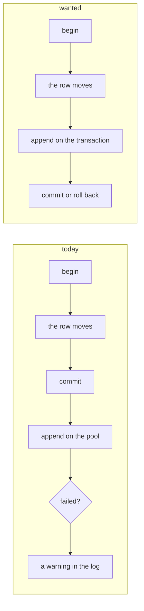

# Transactional audit events

## Overview

[[012-administration]] has no audit table. The record of what an
administrator did is the event log of [[010-events-and-reaper]], because
an administrative action is a thing that happened to a space and the
space's log is where things that happened to it are written. That part
shipped.

What did not ship is the property that makes the log a record rather than
a notification: an administrative mutation's event has to be appended
inside the mutation's own transaction, so the log cannot miss a
moderation and cannot record one that was rolled back. Today every append
runs after its mutation, on the pool's querier rather than the
transaction's, through a seam whose `Append` answers nothing and whose
implementation swallows a failure into a warning.

This spec is that property. It is criterion 8 of [[012-administration]],
split out on 2026-09-20 because the seam it changes is every write path
in the tree and not one.

## Design

### What the tree does now

`files.Ledger.Append` is declared as spec 010's `Log.Note` and not its
`Log.Append`: it takes a querier and answers nothing, and the comment
beside it says why, that an ordinary mutation has already happened when
its event is written. `internal/files/delete.go` trashes on
`s.db.Querier()` and appends after; `purge` opens a transaction for the
rows and appends outside it; `internal/shares` and `internal/workspaces`
append inside their transactions but through a seam that cannot fail
them. A crash between the two leaves a moderation nothing recorded, and
spec 012's Design paragraph said the opposite until this spec was split
out of it.

### The rule the seam has to carry

Two kinds of append, which is what makes this more than a signature
change.

| Append | Rule | Why |
|---|---|---|
| an ordinary mutation's | best effort, spec 010's `Note`: the operation already happened and an event is a notification about it | a log that could refuse a write would make the notification a dependency of the write |
| an administrative mutation's | inside the transaction, failing it | a record that may be dropped is not a record. This is the one exception spec 012 names |

Which one applies is not the handler's to decide either. What makes a
mutation administrative is what made its allow administrative, which the
decision path already knows and already marks: `auth.Administrative`
reads it off the request, and `internal/events` reads it to set
`detail.admin`. The same fact selects the append.

### What has to change

| Where | Change |
|---|---|
| `files.Ledger`, `shares.Ledger`, `workspaces.Ledger` | `Append` answers an error, so a caller inside a transaction can fail it |
| `internal/files` | `trash` opens a transaction; `purge`, `removeVersion`, the put, the move and the restore move their append inside the one they have |
| `internal/uploads` | the completion's append moves into the commit that writes the row, which already carries a hook for the session row |
| `internal/shares`, `internal/workspaces` | the appends already run inside a transaction; what changes is that a failure is carried out rather than swallowed |
| `cmd/arcad` | the three adapters choose `Log.Append` or `Log.Note` by the mark, rather than each being fixed at one of them |
| [[010-events-and-reaper]] | the best-effort rule gains its one stated exception, which that spec's prose already anticipates |

### The order a transaction writes in

The append goes last inside the transaction, after the rows it describes
and after the ledger's own delta. An event that named a row the same
transaction then failed to write would be the failure this spec exists to
prevent, in the other direction.

The bytes stay outside. Invariant 1 of [[001-architecture]] is that the
database commits before an object is dropped, and nothing here changes
it: what commits together is the row, the usage delta and the event.

## Not in this spec

The mark itself, which shipped with [[012-administration]]: the decision
path sets it and `internal/events` puts it on the row. The reaper's own
events, which belong to no caller and stay best effort. Any audit table;
there is still none, and the reason is [[012-administration]]'s.

## Acceptance criteria

| # | Criterion | Proved by |
|---|---|---|
| 1 | A moderation delete and its event commit together: a forced failure after the delete leaves neither | `internal/admin` test on a transaction that is made to fail at commit |
| 2 | An administrative append that cannot write refuses the mutation, and the caller is told rather than answered a success the log does not hold | `internal/files` test with the log's insert failed |
| 3 | An ordinary mutation's append stays best effort: a failed insert is a warning and the mutation still answers | `internal/events`' `TestNoteSwallowsAFailureAndAppendsOtherwise`, kept, plus one case per write path |
| 4 | Every write path's append runs on the transaction's querier and not on the pool's | a test over the tree, the way `TestEventDetailIsMetadataOnly` reads the writers |
| 5 | The order inside the transaction is rows, then the usage delta, then the event | the store tier against Postgres |
