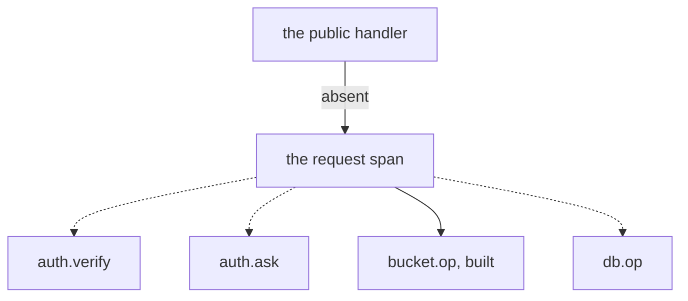

# Observability follow-ups

## Overview

[[018-observability]] shipped the metric table, the one registry, the
scrape endpoint, the request line, the alert rules and the exporter
bootstrap, and an installation exports to a collector by contract. What
it did not ship is the tracing half of the same spec and three smaller
things that each need a change somewhere else: in the shared package, in
another spec's ledger, or in a tier that runs against an installation.

This spec carries those, criterion by criterion, in the words spec 018
wrote them. Each section says what has to exist first, which is why each
was carried rather than built while 018 closed.

The one that matters most is the first. Arca creates no span for a
request, so `trace_id` is on every request line as an empty string: the
key is there, the value is not. A log line and a trace cannot find each
other in either direction, which is the whole reason spec 018 puts both
ids on the line.

## Current state

The parent of the first section is in the tree as of 2026-09-26. Each of
the two listeners is wrapped in `latere.ai/x/pkg/otel.Handler`
(`cmd/arcad/instrument.go`), outside the verifier, with the probes and the
scrape skipped. Every other request is one SERVER span and one measurement
of `http.server.request.duration`, both carrying the route as `http.route`,
and `bucket.<op>` is a child of that span. `trace_id` on the request line
now names a trace. `TestEveryRequestIsOneServerSpanAndOneMeasurementNamedByItsRoute`
and `TestABucketCallIsAChildOfItsRequestSpan` prove it.

It departs from the Design in where the name comes from. The Design reads
it from the observation the request line reads; the span reads it from the
router's table instead (`api.API.Route`). The span is named when it starts,
before the observation is filled, and a request the verifier refuses never
reaches the middleware that fills it, so the observation would name every
401 `unmatched`. The request line and `arca_requests_total` still read the
observation, so for a request refused before it is routed the two name it
differently.

It adds one thing the Design did not name: the span records `url.path`, and
a link route carries its token there, so the path a span records has the
token replaced by `{token}` (`api.API.SpanPath`), whether or not a row
serves the request.

`auth.verify`, `auth.ask`, `db.<op>` and the order assertions of criterion 3
remain, as do the other sections below.

## Design

### The request span and its children

Spec 018's Design says: one span per request, named by the route
pattern, with the request id, the trace id, the subject, the space id,
the plane and the object id as attributes, and four children in the
order a write reaches them.

What exists is `bucket.<op>`, opened by the decorator of
`internal/metrics`, and `otel.SetAttributes` in `internal/api`'s request
id middleware, which writes onto whatever span the context carries.
There is no such span: nothing wraps the public handler, so the
attribute call lands on a non-recording span and
`otel.TraceIDs` answers the empty string. No test asserts any span at
all, including `bucket.<op>`, which spec 018's state table read as
tested at the decorator and is not.

Four pieces, in the order they unblock each other.

1. **The parent.** `latere.ai/x/pkg/otel.Handler` is the shared
   package's server span, and `otel.WithRouteTemplate` takes the route
   from the request, which is the shape this surface needs: the route
   pattern is not known until the mux matches, and spec 018's own metric
   label is read from a context value a middleware behind the mux fills.
   The parent therefore takes its name from the same observation the
   request line reads, and nothing new has to be invented to name it.
2. **`auth.verify` and `auth.ask`**, inside [[006-identity]]'s two
   seams.
3. **`db.<op>`**, inside [[004-metadata-store]]'s querier, which has no
   timed wrapper yet; the same wrapper is where
   `arca_db_query_seconds` and `arca_db_conns` come from, so this item
   and those two rows of spec 018's metric table are one change.
4. **The order assertions**, on a write route of [[005-files]]: a put
   reads `auth.verify`, `auth.ask`, `bucket.put`, `db.insert`, and a
   delete reads `db.delete` before `bucket.delete`. The assertion is
   the order and not the presence, because the order is invariant 1 of
   [[001-architecture]] seen from the tracing side.

**Why it was split.** A parent span alone closes neither criterion and
changes what a live installation exports: the cutover of
[[019-migration-from-drive]] ran the evening before this spec was
written, and spans at `pkg/otel`'s default sampling would have started
leaving the process for no criterion's benefit. The children are in
three other packages, and the assertion the criteria are actually about
is the order across all four.

The cheapest first step is a recorded-span test over the bucket
decorator, which needs no production change. It makes
`go.opentelemetry.io/otel/sdk` a direct dependency of this module for
the test tree, which is why it was not slipped into spec 018's closing
commit.

### The redaction handler

Spec 018's Design puts redaction in one handler wrapping both paths of
`pkg/otel.Bootstrap`'s tee, so the local JSON handler and the OTLP
bridge see the same attributes: any key whose name is or contains
`token`, `secret`, `credential`, `signature`, `password`,
`Authorization` or `Proxy-Authorization` has its value replaced, and any
value that looks like a presigned URL is cut from `X-Amz-Signature=` to
the next separator.

`otel.Config` exposes the local handler alone, so a handler around both
paths is not reachable from outside the shared package. The structural
rule holds meanwhile and is what a test asserts: no attribute of the
request line is a token, a credential, a presigned URL or a path.

**Why it was split.** The handler belongs in `latere.ai/x/pkg/otel`,
which is a change in another repository, and a redaction handler this
repository wrapped around its own logger would cover the local path
only, which is the path that already holds.

### The label sweep

Spec 018's criterion 2 is over a whole conformance run: no label value
equals a path, an object name, a subject or a workspace slug the run
used. What holds today is the frame, where a label could carry one, and
a path no route registers is counted under `unmatched`.

[[017-conformance-suite]] is in the tree, so nothing blocks the sweep
any more. It is a case in that tier: run the suite against an
installation, scrape `/metrics`, and hold every label value of every
series against the fixture's paths, names, subjects and slugs.

**Why it was split.** It is a case of a tier that needs a running
installation, in the package another spec owns, and writing it is
neither reading a file nor a unit test.

### The reaper process's counters

`arcad reap` as a process of its own opens no listener, which is half of
spec 018's criterion 4 and holds. Its counters do not leave over OTLP,
because the scrape endpoint is `latere.ai/x/pkg/metrics`, a registry
that writes the Prometheus text format and reaches no exporter, and the
meter provider `pkg/otel` installs is a second pipeline with no bridge
between them. What the reap process does publish is its spans and its
log records, both carrying the trace id, and its per-run findings table
on standard output.

`deploy/base/reaper.yaml` is `replicas: 0`: the reconciler runs on the
API replicas by default, where its counters are scraped from
`/metrics` like every other series. So no installation loses a series
today, and an installation that moves the reaper into its own workload
is the one that would.

**Why it was split.** The bridge belongs in the shared package.
Duplicating spec 018's table onto OTel instruments would be a second
registry in this repository, which is what that spec exists to prevent.

### The stream log lines

Spec 018's criterion 8 is one log line per request, one per stream open
and close, none per part and none per presigned URL. The request half
holds. The stream halves need [[005-files]] to say where a stream opens
and closes: an inline read, a read answered as a redirect, and a
multipart part are three different things, and only one of them is a
stream this process carries bytes through.

**Why it was split.** Which read is a stream is a design decision in
another spec's package, and a line per read added to a live serving path
on the night of a cutover is the wrong order.

### `arca_stored_bytes`

The gauge is registered and reads zero. Spec 018's Design says it is the
reaper's sample summed over the installation and split by plane. The
ledger the reaper reads is `space_usage (owner, bytes)`, one total per
space with no plane in it, so a per-plane total is a sum over
`files.size_bytes` partitioned by whether the path sits under
`workspaces/`, plus the workspace objects: a scan of the object tables
per run and a new ledger read.

**Why it was split.** It is a change to [[010-events-and-reaper]]'s
ledger rather than to a metric's recording site. What an operator bills
and capacity-plans from is answered meanwhile per space by
[[012-administration]]'s overview and in aggregate by
`arca_space_usage_bytes`.

## Not in this spec

Everything [[018-observability]] shipped: the metric table and its one
registry, the scrape endpoint, the request line, the alert rules,
`tools/rules`, and the two endpoint variables. Dashboards. A sampling
policy beyond `pkg/otel`'s default.

## Acceptance criteria

Criteria 1 to 6 are the criteria [[018-observability]] carried here, in
that spec's own words, so nothing is lost in the move. Criterion 7 is
this spec's own.

| # | Criterion | Proved by |
|---|---|---|
| 1 | Over a full conformance run, no label value equals a path, an object name, a subject, or a workspace slug the run used | `TestLabelsAreBounded` against the run's fixture |
| 2 | `/metrics` is on the internal listener and not on the public one, and `arcad reap` opens no listener while its counters still arrive over OTLP | `TestMetricsListenerOnly`, `TestReapExportsOverOTLP` with an in-memory collector |
| 3 | A put produces one parent span named by the route with `auth.verify`, `auth.ask`, `bucket.put`, and `db.insert` in that order; a delete produces `db.delete` before `bucket.delete`; a presigned download produces no span for the transfer | `TestWriteSpanOrder`, `TestDeleteSpanOrder`, `TestRedirectHasNoTransferSpan` |
| 4 | Every request log line carries the request id and the trace id, and the same ids are on the request's spans | `TestLogLineCarriesTraceIDs` |
| 5 | A canary of each kind (a bearer, a link token, a bucket secret key, a presigned URL, an `Authorization` header) appears on neither path of the tee | `TestLogsRedact` |
| 6 | One log line per request, one per stream open and close, none per part and none per presigned URL | `TestLogVolume` |
| 7 | `arca_stored_bytes` carries the installation's bytes split by plane, sampled by the reaper, and a plane holding nothing reads zero rather than being absent | a reaper run over a fixture holding both planes |
