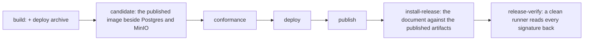

# Installation verification jobs

## Overview

`v0.1.7` published on 2026-09-19: both images built, signed and attested,
the kind stack green under the conformance suite, production deployed
behind an approval, and a GitHub release with four archives, the
checksums, the cosign bundle and three SPDX documents. What that run did
not do is read any of it back the way an operator would.

Three jobs of [[016-release-and-installation]]'s pipeline table were
never written, and one artifact of its table is never built. This spec is
those four things. It is split out of that spec on 2026-09-19 because
each is a job of its own rather than a step inside another, so adding
them later changes nothing already written, and because a release
pipeline that is already serving production is a bad place to add four
untested jobs in one evening.

## Design

### What is missing, and what each would have caught

| Missing | Proves | Would have caught |
|---|---|---|
| `candidate`, in `release.yml` between `build` and `conformance` | the pushed image starts beside a fresh Postgres and a fresh MinIO, `arcad migrate` applies every migration, `arcad check` passes, the probes answer, and `/version` equals the tag | an image that is wrong, read as an image that is wrong. Today that failure arrives from `conformance`, where it reads as the contract being wrong |
| `deploy-<tag>.tar.gz`, in `build` | `deploy/base` and `deploy/examples` with both image references rewritten to the tag | nothing on its own. It is the thing `install-release` walks, which is why the two arrive together and neither arrived alone |
| `install`, in `verify.yml` | `docs/install.md` walks green against a bare kind cluster on every push, with the image references overridden to the development image built earlier in the same run | a document that no longer matches the tree, on the push that broke it rather than on the tag |
| `install-release`, in `release.yml` after `publish` | the same document against the published artifacts alone, with no checkout on the path of any command, ending with the conformance suite | an operator's first installation failing on a step the maintainer's own checkout made work |
| `release-verify`, last | from a clean runner: `cosign verify` accepts both images, `cosign verify-blob` accepts `checksums.txt`, `sha256sum -c` passes over the downloaded archives, `gh attestation verify` accepts both images, and the release body equals the changelog section | a signature, a checksum or an attestation that is produced and not readable. The `v0.1.7` run produced all of them and read none of them back |

### The order

`candidate` goes in front of `conformance` rather than beside it, because
the question it answers is cheaper and narrower: an image that will not
start beside two containers will not start on a cluster either, and the
kind stack costs two minutes to learn the same thing less clearly.

`install-release` and `release-verify` go after `publish`, because both
read what the release page holds. A failure there does not unpublish
anything, and that is correct: the release exists and the run says it
cannot be installed or verified, which is the state an operator is in
anyway. The alternative, verifying before publishing, verifies artifacts
nobody can download.

### The rule the clean runner exists for

`release-verify` checks out nothing. Every command runs against what
`gh release download` and a registry give, with `cosign` and `gh` as the
only tools. That is the whole point: a signature that verifies against a
key material the checkout carries proves nothing an outside operator can
repeat. This is also why the job cannot be a step of `publish`, whose
runner has the tree and the build's own artifact directory on it.

### What this spec does not carry

The N-1 conformance run and the `conformance-external` job are adjacent
and are not here. Both are [[017-conformance-suite]]'s, which split them
into follow-ups of its own on the same day; the N-1 run is
[[024-conformance-against-a-published-release]]. What changed on
2026-09-19 is only their precondition: `v0.1.7` ships a `test/conformance`
package, so a next release has a previous suite to check out and a
consumer has a tagged package to import.

## Acceptance criteria

| # | Criterion | Proved by |
|---|---|---|
| 1 | The published image migrates, checks, and reports the tag against a fresh Postgres and MinIO | the `candidate` job |
| 2 | A tag produces `deploy-<tag>.tar.gz` holding `deploy/base` and `deploy/examples` with both image references rewritten to the tag, and not `deploy/prod` | the `build` job and a test over the rendered archive |
| 3 | `docs/install.md` walks green against a bare kind cluster on every push | the `install` job of `verify.yml` |
| 4 | `docs/install.md` walks green against the published artifacts on a tag, with no checkout on the path of any command, and ends with the conformance suite | the `install-release` job |
| 5 | From a clean runner, `cosign verify` accepts both images, `cosign verify-blob` accepts `checksums.txt`, `sha256sum -c` passes over the downloaded archives, `gh attestation verify` accepts both images, and the release body equals the CHANGELOG section | the `release-verify` job |
| 6 | A failure of `install-release` or `release-verify` fails the run and leaves the release published, because both read what an operator downloads | the job graph, held by a test over `release.yml` |
