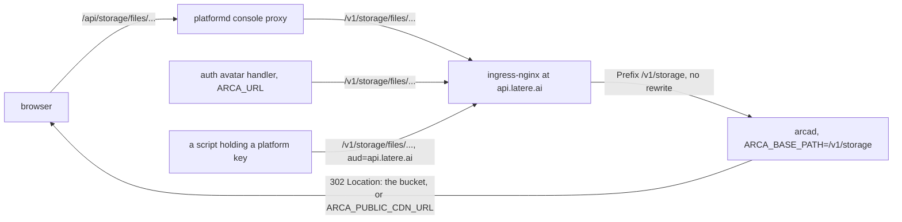

# Serving under the capability prefix

## Overview

### Scope

How `arcad` serves under `/v1/storage` at the platform origin while a
self-hosted installation keeps the root, where the second audience is
configured, and the one batch that moves Arca's two callers. It ends when
`api.latere.ai/v1/storage/...` answers every route the document declares, the
root of `/v1` answers none, and an `api.latere.ai` token reaches the surface.

### Problem

The family decided on 2026-09-20 that `api.latere.ai/v1` is partitioned by
capability, one prefix per core
(`decisions/2026-09-20-origin-capability-prefixes.md` in the family's specs
repository). Arca's prefix is `storage`. Today `deploy/prod/ingress.yaml`
claims eight `/v1` prefixes flat and `arcad` serves them at the paths
[[013-api]] writes. Both halves move: the Ingress claims one prefix, and the
routes answer under it.

Two things make this more than an Ingress edit. The served OpenAPI document
is built from the route table at start (`internal/api/api.go:206-212`), so
what it names and what the mux answers at cannot diverge. And `deploy/prod`
is derived: the Ingress prefixes come from the committed document
(`test/deploy/prod_test.go:157`), the probe rules from the smoke (`:86`).

Beside the routing, the origin closes a second door. `arcad` verifies one
audience, `arca` (`internal/config/config.go:210`,
`internal/auth/verifier.go:146`), while a personal access token and a platform
key are minted for `api.latere.ai`, so the key path into Arca is shut and the
console's is open (`ps-01-one-origin.md`, the audience gap).

## Design

### The request path

`/livez`, `/readyz`, `/version` and `/openapi.json` stay at the origin root,
their own rules of the same Ingress. They sit outside `/v1` on the listener
(`cmd/arcad/main.go:713-720`) and nothing about the prefix moves them.

### Option 1: how arcad serves under a base path

| Option | For | Against |
|---|---|---|
| A. ingress-nginx rewrites `/v1/storage/(.*)` to `/v1/$1`, and the core learns its public base for the URLs it writes | no routing code in the core; the Ingress carries the change | the served document breaks: its `paths` come from the route table and its `servers` from `ARCA_PUBLIC_URL` (`internal/api/api.go:209`, `internal/apidocs/apidocs.go:190`), and no `servers` value composes with `/v1/files/...` to reach `/v1/storage/files/...`. A rewrite annotation is a property of the Ingress object, so the probe rules would move to a second object to escape it. The core still needs its base for the link URL, so A costs the rewrite and the configuration both |
| B. the core mounts its surface under a configured base path, default `/v1`, and the Ingress forwards without rewrite | the document stays truthful with one knob: `servers` keeps naming the origin and `paths` carry the base, so `servers + paths` is the address. The self-hoster default is the root and nothing changes for them. The deploy test keeps deriving rather than reading a literal | the core owns a mount-point concept it did not have. An in-cluster caller must address the prefix too, the same as a caller at the origin |
| C. the route table is rewritten to `/v1/storage/...` unconditionally | the smallest diff | a self-hosted installation would serve `/v1/storage/files` under no origin that partitions anything, and [[017-conformance-suite]]'s published suite would stop running against the previous release ([[024-conformance-against-a-published-release]]) |

**Recommendation: B.** The invariant that decides it is [[013-api]]'s: the
document served is the surface registered, and the two cannot drift. A holds
it only by adding a second knob whose job is to undo the rewrite, which is
B's configuration plus an annotation. B also keeps `test/deploy/prod_test.go`
deriving the Ingress rather than holding a literal.

### The variable

`ARCA_BASE_PATH`, default `/v1`, the base every route is registered under;
`deploy/prod` sets `/v1/storage`. It joins [[002-repository-scaffold]]'s
table and is validated at load: it begins with `/`, carries no trailing
slash, and its first segment is `v1`, so [[013-api]]'s version contract
cannot be configured away.

It is its own variable and not the path component of `ARCA_PUBLIC_URL`, which
is the origin root: `arcad check` reads `/version` under it
(`internal/check/requirements.go:280`) and the smoke reads four paths the
Ingress claims at the root, so deriving the base would move the probes under
the prefix and fail both. It holds the whole base and not the capability
segment, because `/v1/storage` is the literal the Ingress rule, the proxy
target and the served document all carry.

### What changes in the core

| Where | Change |
|---|---|
| `internal/config/config.go` | `BasePath`, read from `ARCA_BASE_PATH`, defaulted and validated as above |
| `internal/api/api.go:164-193` | `Options.BasePath`; `mount` swaps each row's leading `/v1` for the base when it registers, and the guarded subtree becomes `base + "/"`. The three public link rows and `GET /openapi.json` keep their own registration shape |
| `internal/api/api.go:206-212` | `build` renders the same swap, so the served document names the paths the mux answers at |
| `tools/apidoc` | unchanged. The committed `api/openapi.yaml` is the default base, `/v1/...`, and names no server, which is the self-hoster's shape and the shape a consumer reads |
| `internal/shares/links.go:106` | the one path the core writes becomes `base + "/shares/links/" + token` |
| `cmd/arcad/main.go:744` | the start-up line names the base path, beside the deciding mode |

The two redirects are not on the list and are unchanged: a presigned read
answers a `Location` at the bucket endpoint (`internal/files/read.go:214`) and
a public object one at `ARCA_PUBLIC_CDN_URL` (`internal/files/read.go:135`).
Neither is built on `ARCA_PUBLIC_URL`, so neither carries the prefix.

A request under `/v1` but outside the base path reaches no pattern of the
public mux and takes a bare `net/http` 404 with no envelope. That is the
inverse of [[013-api]]'s subtree rule: 401 before 404 holds inside the
surface, and outside it there is no surface to protect.

### What changes around the core

| Where | Change |
|---|---|
| `deploy/prod/ingress.yaml` | one `/v1` rule, `/v1/storage`, `pathType: Prefix`, beside the four probe rules. Eight rules become one |
| `deploy/prod` | `ARCA_BASE_PATH: /v1/storage` on `arcad`. The reaper serves no surface and does not read it |
| `test/deploy/prod_test.go:157` | derives the claim from the overlay's `ARCA_BASE_PATH` and holds the document to it: every path of the committed document begins with `/v1/`, the Ingress claims exactly one `/v1` Prefix rule, and it equals the base path |
| `test/deploy/prod_test.go:86` | a smoked path that falls under a Prefix rule this Ingress claims is routed by that rule; Exact is required only of a smoked path outside every Prefix rule, which is what the four probes are |
| `test/conformance/conformance.go` | `Options.BasePath`, default `/v1`, applied at the one chokepoint the suite sends through (`test/conformance/client.go:93`). No case file changes, and a suite that sets nothing drives a root installation, so [[024-conformance-against-a-published-release]] keeps running the previous release's package |
| `internal/check` | the `public-url` requirement reports the base path beside the origin it read. It does not dial the prefix: that requirement passes on an unreachable address by design (`internal/check/requirements.go:284-287`), because the command runs beside the server as often as in front of it, so a dial there could not fail where the prefix could be wrong |
| `tools/smoke/release.sh` | one `check_status` for `/v1/storage/files/me/` expecting 401, which is where the question is answerable: the smoke runs from outside the cluster against the origin the deployment recorded, so a rollout that lands the image without the Ingress fails the release rather than the console |
| `docs/install.md`, `docs/operations.md` | the variable, with the root as the default an installer never sets |

### The amendment [[012-administration]] needs

Dated 2026-09-20, on the `check` requirement table: the `public-url` line
reports `ARCA_BASE_PATH` beside the origin. No requirement is added and the
count of five is unchanged, for the reason in the table above.

### Option 2: the two audiences

`arcad` reads one audience and passes one to a validator whose `Audiences`
field is already a set (`internal/auth/verifier.go:146`), so the question is
the variable's shape.

| Option | For | Against |
|---|---|---|
| a comma list in `ARCA_OIDC_AUDIENCE` | `ci-gate`'s identity rule reads exactly `ARCA_OIDC_AUDIENCE` for the core role and refuses only a value carrying an address (`ci-gate/internal/identity/deploy.go:42,68-71`), so `arca,api.latere.ai` passes as written. Cella already reads this shape, first entry primary (`cella/internal/config/identity.go:100-111`) | one variable means two things, a name and a set |
| a second variable, `ARCA_OIDC_AUDIENCES` | each variable means one thing | the gate reads no second name for a core and would report the base deployment as setting no audience at all. Fixing that is a change to another repository's rule for a shape nothing else in the family uses |

**Recommendation: the comma list.** The gate's rule is the discriminating
constraint, and the family already has one core reading this shape.

`ARCA_OIDC_AUDIENCE` becomes a list of distinct names, default `arca`. Three
manifests set it (`deploy/base/deployment.yaml:89`, `deploy/base/reaper.yaml:61`,
`deploy/bootstrap/migrate-job.yaml:62`); the prod overlay patches the `arcad`
Deployment alone, and the reaper and migrate job keeping `arca` is no gate
finding, because `ruleAudience` judges each container across its base and its
overlays. The first entry is the primary, what `Verifier.Audience()` keeps
returning and what the start-up line prints; `Verifier.Audiences()` is the
set verified against. Rule R4 is unchanged: it governs the workload
credentials a core mints and accepts back, and the second audience is the
platform origin in front of the core, not another core's name.

### The amendment [[006-identity]] needs

Dated 2026-09-20, under Verification. The `aud` row becomes: contains one of
`ARCA_OIDC_AUDIENCE`, a comma list, default `arca`, which the hosted
installation sets to `arca,api.latere.ai` because a platform key and a
personal access token are addressed to the origin (`open-cores.md`, amended
2026-09-20). The sentence under it, that each core accepts its own workload
credentials and no other core's, stays as it is, and the amendment says so.

### The conformance cases

They live in `internal/auth` and not in the portable suite: `Options.Token`
gives that suite a bearer for a subject and no control over its `aud`
(`test/conformance/conformance.go:60-63`), and a self-hoster's audience is
their own, so the suite stays audience-agnostic on purpose.

| Case | Asserts |
|---|---|
| `TestVerifierAcceptsEveryConfiguredAudience/own` | a token for `arca` reaches the handler |
| `TestVerifierAcceptsEveryConfiguredAudience/platform` | a token for `api.latere.ai` reaches the handler |
| `TestVerifierAcceptsEveryConfiguredAudience/third` | a token for a third name is a 401 with the package's reason |
| `TestServiceConformance` (`internal/auth/conformance_test.go:34`) | runs `authkitconformance.Run` once per configured audience as a subtest. `AdmitsOwnAudience` holds for each and `RefusesOtherAudience` holds for both, which needs no change in `pkg` and answers ps-01 criterion 8 |

### Option 3: the cutover batch

| Option | For | Against |
|---|---|---|
| both served for one release: the core mounts at the base path and at the root, the Ingress claims nine prefixes | no window where a caller is wrong | it is the compatibility window `decisions/2026-09-13-no-compatibility-windows.md` refuses, for a seam whose only two callers are in the family. It would also serve every route at two addresses, which one `servers` entry cannot describe |
| same-window cut | one shape everywhere, and the two callers move in the commit that moves the seam | storage calls fail at the origin between the arcad rollout and the two consumer releases |

**Recommendation: the same-window cut**, per the family decision. Nothing
outside the family calls these routes yet, which is why the move is taken now.

The order inside the window:

1. Arca releases. The rollout applies the Ingress and `ARCA_BASE_PATH` in one
   apply, and the smoke reads `/v1/storage/files/me/` for a 401, so an image
   and an Ingress that disagree fail the release.
2. platform releases. `internal/web/proxy.go:151` composes
   `target.Path + "/" + rest` and becomes `target.Path + "/" + service + "/"
   + rest`; `service` is the console's own key and is already `storage`
   (`internal/web/registry.go:11`), so the change is one segment and
   generalizes to every core. The registry's `Prefixes` list stays as the
   resources the section owns, `PLATFORM_API_ORIGIN_STORAGE` stays deleted.
3. auth releases. `internal/handler/avatar.go:111,178,226` compose
   `ARCA_URL + "/v1/storage/files/..."` and `.../v1/storage/shares/links`;
   `ARCA_URL` is the origin (auth `BOOTSTRAP.md:41`), so auth reaches Arca
   through the same Ingress as the console.

Between step 1 and step 3 a stale caller asking for `/v1/files/...` gets a
404 from ingress-nginx, not a 401 from `arcad`: the Ingress no longer claims
the prefix, so the request never reaches the core, and the rule that orders
401 before 404 governs only requests the core receives. It is a 404 and not a
catch-all's answer because `deploy/prod/ingress.yaml` claims no `/` rule at a
shared origin. The window is minutes, the shape of the Drive cutover's own
move ([[019-migration-from-drive]], the window table).

### Out of scope

- `/v1/repos` and every other core's prefix. Each is one small spec in that
  core's repository (ps-01).
- The authorizer deployment (`ps-11-authorizer-deployment.md`), which runs
  alongside so no core's deploy waits on a console release.
- Which resources exist under the prefix. `stars`, `trash` and the rest are
  [[005-files]]'s and [[013-api]]'s, moved here and reopened nowhere.
- The per-service hosts (ps-04) and the console's screens (ps-02).

## Acceptance criteria

| # | Criterion | How it is checked |
|---|---|---|
| 1 | Every path of the committed document answers under `/v1/storage/` at the origin, and no path of it answers at the root of `/v1` | the e2e tier drives an installation with `ARCA_BASE_PATH=/v1/storage` and asserts both, one request per path from the document; the release smoke reads one prefixed path for a 401 |
| 2 | The served document's `paths` are the patterns the mux registered, under the base path, and its `servers` names `ARCA_PUBLIC_URL` unchanged | a test over `GET /openapi.json` from a build with a base path set, compared against the route table |
| 3 | The production Ingress claims exactly one `/v1` Prefix rule, and it equals the overlay's `ARCA_BASE_PATH`; the probe paths keep their own rule types at the root, and a smoked path under a claimed Prefix rule is not required to be Exact | `test/deploy/prod_test.go`, deriving the base from the overlay and holding every document path to `/v1/`; `TestProdRoutesWhatTheSmokeReads`, amended |
| 4 | A self-hosted installation at the root passes the conformance suite with no option set, and the previous release's suite runs against this release's binary unchanged | `test/conformance` with `BasePath` unset; the N-1 job of [[024-conformance-against-a-published-release]] |
| 5 | A token addressed to `arca` and a token addressed to `api.latere.ai` both reach a handler, and a token addressed to a third name is a 401 | `TestVerifierAcceptsEveryConfiguredAudience/own`, `/platform`, `/third` |
| 6 | The family's audience suite passes for each configured audience | `TestServiceConformance`, one subtest per audience |
| 7 | `ARCA_OIDC_AUDIENCE` carrying `arca,api.latere.ai` passes the gate's identity rule | `lateregate` on the tree, which reads that one variable for the core role |
| 8 | The link URL a mint answers carries the base path, and the two redirects answer a `Location` at the bucket or at `ARCA_PUBLIC_CDN_URL`, unchanged | a unit test over `internal/shares` with a base path set, and the e2e redirect tests |
| 9 | A path under `/v1` outside the base path is a 404 with no envelope, and a path under the base path that no row registers is a 401 before it is a 404 | two cases in `internal/api` |
| 10 | `arcad check` reports the base path it serves under, and the release smoke proves the origin answers there | the `public-url` line of `internal/check`; the added `check_status` of `tools/smoke/release.sh` |
| 11 | The console proxies `/api/storage/...` to `/v1/storage/...` and auth's avatar handler writes under the prefix, released in the same window, and no flat prefix is addressed to the origin anywhere in the family | platform's proxy test and auth's avatar test name the prefix; one traced request each after the release; `git grep` over the three repositories |

## Dependencies

[[013-api]] owns the route table and the document this spec moves,
[[006-identity]] the verifier, [[012-administration]] the `check` table,
[[016-release-and-installation]] `deploy/` and the smoke, and
[[017-conformance-suite]] the portable suite that grows `BasePath`, which
[[024-conformance-against-a-published-release]] runs against the previous
release and the root default protects. [[001-architecture]] fixes the
audience the core answers to and [[003-object-store]] the presigned reads
this spec leaves alone. Outside the repository, ps-01 carries this leaf first
in its order, the capability prefix decision fixes `storage`, the
no-compatibility-windows decision fixes the batch, and `ci-gate`'s identity
rule constrains the audience variable, as it stands and with no change asked
of it.

## State on 2026-09-20

Built in the tree on 2026-09-20, ahead of the release that carries it. The
status is `testing`: every criterion but the last two is proved by a test
that runs in this repository, and the two that remain are proved at the
origin by the release and the two consumer releases of the same window.

### What was built

| Where | What |
|---|---|
| `internal/config` | `BasePath` from `ARCA_BASE_PATH`, default `/v1`, validated at load: rooted, no trailing slash, first segment `v1`. `OIDCAudiences` from `ARCA_OIDC_AUDIENCE` read as a comma list, the default the sole entry where it is unset |
| `internal/api` | `Options.BasePath` and `API.under`, the one swap of the leading `/v1`, read by `mount` for every pattern and by `build` for every path of the served document. The guarded subtree is `base + "/"`; `GET /openapi.json` keeps the root |
| `internal/auth` | `VerifierOptions.Audiences` and `auth.Options.Audiences`, a distinct list refused a repeat; `Verifier.Audiences()` is the set verified against and `Verifier.Audience()` the primary, the first entry |
| `internal/shares` | `Options.BasePath`; the URL a mint answers with is `base + "/shares/links/" + token` |
| `internal/check` | the `public-url` line names the base path beside the origin, and dials neither |
| `cmd/arcad` | one base path to the surface and to the shares service, and `base=` with `audience=`, the primary, on the start-up line beside the deciding mode |
| `test/conformance` | `Options.BasePath`, applied at the one chokepoint of `client.go` and where `surface.go` reads the served document. Unset drives a root installation |
| `deploy/prod` | `ingress.yaml` claims one `/v1/storage` Prefix rule beside the four probe rules, eight flat prefixes gone; `base-path.yaml` sets `ARCA_BASE_PATH`, `audience.yaml` sets `arca,api.latere.ai`, both on `arcad` alone |
| `tools/smoke/release.sh` | one `check_status` for `/v1/storage/files/me/` expecting 401, and the line about it in the evidence |
| docs | `ARCA_BASE_PATH` and the audience list in `docs/install.md`, the `check` line in `docs/operations.md`. `README.md` names no path and needed none |

The two redirects are untouched, as the design said: a presigned read answers
at the bucket endpoint and a public object at `ARCA_PUBLIC_CDN_URL`, neither
built on `ARCA_PUBLIC_URL`.

### What each criterion is proved by

| # | State | Proof |
|---|---|---|
| 1 | written, not run here | `TestE2EEveryDocumentedPathAnswersUnderTheBasePathAndNoneAtTheRoot` drives an installation with `ARCA_BASE_PATH=/v1/storage` and holds every path of the served document to answering under the base and to a bare 404 at the root. The e2e tier needs a database and a bucket and did not run on this machine |
| 2 | passing | `TestTheDocumentNamesThePathsTheMuxAnswersAt` in `internal/api`, over the bytes `GET /openapi.json` answers, with `servers` held to `ARCA_PUBLIC_URL` unchanged |
| 3 | passing | `TestProdClaimsOneV1PrefixAndItIsTheBasePathItServes` derives the claim from the overlay's `ARCA_BASE_PATH` and holds every document path to `/v1/`; `TestProdRoutesWhatTheSmokeReads` treats a smoked path under a claimed Prefix rule as routed by it |
| 4 | passing | `TestTheBasePathIsAppliedAtTheOneChokepoint` proves the default leaves every path where it is, so a suite that sets nothing drives a root installation |
| 5 | passing | `TestVerifierAcceptsEveryConfiguredAudience/own`, `/platform`, `/third` |
| 6 | passing | `TestServiceConformance`, one subtest per configured audience, the verifier built with the whole list each time |
| 7 | not run here | the gate is serial on this machine and the coordinator runs it. The variable carries no address of its own beyond the origin the overlay already names |
| 8 | passing | `TestTheLinkURLCarriesTheBasePath` in `internal/shares`, which drives the URL the mint answered as well as reading it. The redirects keep their own e2e tests, unchanged |
| 9 | passing | `TestAPathUnderV1OutsideTheBasePathIsAPlainNotFound` and `TestAPathUnderTheBasePathIsRefusedBeforeItIsNotFound` in `internal/api`, and the same pair through the binary in `TestTheStartLineNamesTheBasePathAndTheSurfaceIsThere` |
| 10 | half proved here | `TestThePublicURLLineReportsTheBasePath` in `internal/check`; the origin half is the release smoke, which runs after the rollout |
| 11 | waits for the release | platform and auth move in the same window, in the order the design names |

### What waits

- The release. Until it runs, the origin serves the flat prefixes and the
  smoke's prefixed check has never been answered by a live installation.
- platform and auth, in that order, inside the same window.
- One note for whoever runs the smoke by hand: its surface check names
  `/v1/storage/files/me/`, the hosted prefix, so an installation at the root
  of the version reads `/v1/files/me/` instead. `docs/install.md` says so
  with the one command that does it.

## Outcome

Released as v0.2.0 on 2026-09-20; the deploy and smoke job passed at
17:26 UTC and the origin answered the prefixed surface at 17:27 UTC.

| # | Criterion | Proof |
|---|---|---|
| 1 | every path answers under `/v1/storage/` and none at the root | `GET https://api.latere.ai/v1/storage/files/me/` 401 (the verifier's), `GET /v1/files/me/` 404 from ingress-nginx with no envelope, `GET /v1/storage/admin/overview` 401 |
| 3 | the Ingress claims one `/v1` prefix | live rules: `/v1/storage`, `/livez`, `/readyz`, `/openapi.json`, `/version` |
| 5, 7 | two audiences | both `arcad` and `arcad-reaper` run with `ARCA_OIDC_AUDIENCE=arca,api.latere.ai`; the key-path request with a PAT-minted `api.latere.ai` token is the maintainer's, recorded in the specs repo's window runbook |
| 10 | smoke | the release smoke printed the surface line; `GET /version` answers `v0.2.0` |
| 11 | the two callers moved in the window | platform v0.14.0 (18:25 UTC) proxies `/api/storage/...` to `/v1/storage/...`: a tokenless `GET /api/storage/shares/links/{token}/meta` through the console answers Arca's own `not_found` envelope; auth v0.39.0 (18:27 UTC) runs with `ARCA_URL=https://api.latere.ai/v1/storage` |

Between 17:27 and 18:25 UTC the console's storage screens answered 404
and between 17:27 and 18:27 UTC avatar uploads failed, the accepted
no-window gap.
