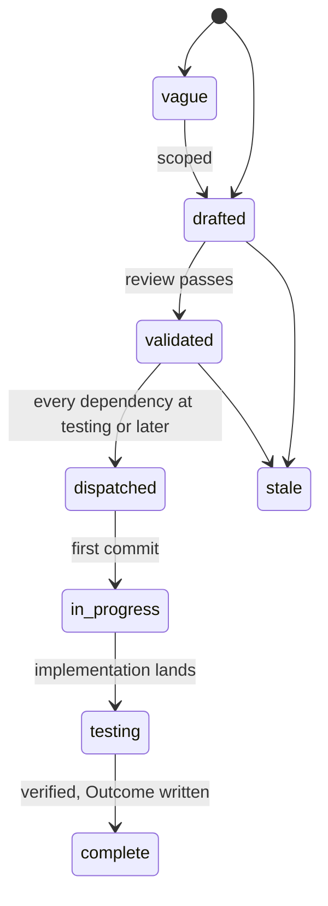

# Specs

Design specs for Arca, durable storage as an infrastructure component. One
spec covers one module. Each spec states the problem, the design with
enough precision to build from, and acceptance criteria that are testable
statements. Spec 001 fixes the architecture every other spec assumes; read
it first. Spec 013 is the contract a consumer codes against; it is the one
document a platform integrating Arca needs, and spec 017 is the suite that
proves an implementation serves it. Spec 002 is the configuration
reference: every `ARCA_*` variable is in its table, owned by it or listed
with its owner, and it owns the binary's subcommand table. Spec 019 is
the migration: how the code, the data, and the consumers arrive from the
service Arca replaces, and how that service is retired.

## Layout

Flat files `specs/NNN-name.md` in one number space with `track: core` in
the frontmatter. Numbers are stable identifiers and are never reused. Open
specs sit here and are the work queue. A terminal spec moves to
`specs/.archive/` keeping its number so `depends_on` paths keep resolving.

## Lifecycle

`in_progress` is written `in-progress` in the frontmatter. A spec at
`testing` moves to `complete` when every acceptance criterion has a
passing test in the tree and the Outcome records every divergence.

The dispatch gate is on the dependencies' state, not on `complete`: a
validated spec is dispatched when every spec in its `depends_on` is at
`testing` or later.

## Index

| Spec | Title | Status |
|---|---|---|
| [001](001-architecture.md) | Architecture: two stores, spaces and planes, packages, invariants | complete |
| [002](002-repository-scaffold.md) | Repository scaffold: module, binary, configuration, quality gate, image, workflow | complete |
| [003](003-object-store.md) | Object store: the bucket contract, keys, integrity, presigned reads, multipart | complete |
| [004](004-metadata-store.md) | Metadata store: the schema, migrations, transactions, the store interface | complete |
| [005](005-files.md) | Files: put, get, list, move, delete; versions, trash, stars | complete |
| [006](006-identity.md) | Identity: verification, the subject, the action vocabulary, the authorizer question, the owner policy | complete |
| [007](007-uploads.md) | Uploads: sessions, size classes, direct-to-bucket parts, integrity | complete |
| [008](008-shares-and-links.md) | Shares and links: grants and the permission ladder, public links, what a caller sees shared with them | complete |
| [009](009-workspaces.md) | Workspaces: durable subtrees, the writer lease, materialize and sync | complete |
| [010](010-events-and-reaper.md) | Events and the reaper: the ledger, the log, the reconciliation of the two stores | complete |
| 011 | Webhooks | retired 2026-09-18 before drafting closed; the number is not reused. Events are tailed by cursor, spec 010 |
| [012](012-administration.md) | Administration: the overview across spaces, the cross-space restore, the record of what was done, the `check` command | complete |
| [013](013-api.md) | API: routes, the error table, OpenAPI, the document served | complete |
| [014](014-test-stubs-and-tiers.md) | Test stubs and tiers: the unit tier, the store tier on MinIO and Postgres, the e2e tier | complete |
| [015](015-security-and-threat-model.md) | Security and threat model | testing |
| [016](016-release-and-installation.md) | Release and installation: images, binaries, deploy manifests, the operator's overlay | complete |
| [017](017-conformance-suite.md) | Conformance suite: the contract as an importable test package | complete |
| [018](018-observability.md) | Observability: traces, metrics, logs, the alert rules | testing |
| [019](019-migration-from-drive.md) | Migration from Drive: the order the code moves, the data, the consumers, the sunset, the archive | in-progress |
| [020](020-per-part-checksums.md) | Per-part checksums: a digest the client declares, the store verifies, and the completion carries | validated |
| [021](021-transactional-audit-events.md) | Transactional audit events: the append that commits with the mutation it records | validated |
| [022](022-api-response-validation.md) | API response validation: the e2e tier checked against the served OpenAPI document | validated |
| [023](023-merged-coverage-floor.md) | Merged coverage floor: the 90% bar judged over the unit, store and e2e profiles together | validated |
| [024](024-conformance-against-a-published-release.md) | N-1 conformance: the previous release's suite run against this release's binary | validated |
| [026](026-installation-verification-jobs.md) | Installation verification jobs: the candidate, the deploy archive, the install walk, and the clean-runner check of a published release | validated |

The order of building is the order of the numbers except where a spec's
`depends_on` says otherwise, and 019 runs alongside all of them: each
module arrives from the service Arca replaces, so 019 names, for every
spec above, what moves and what is left behind.
